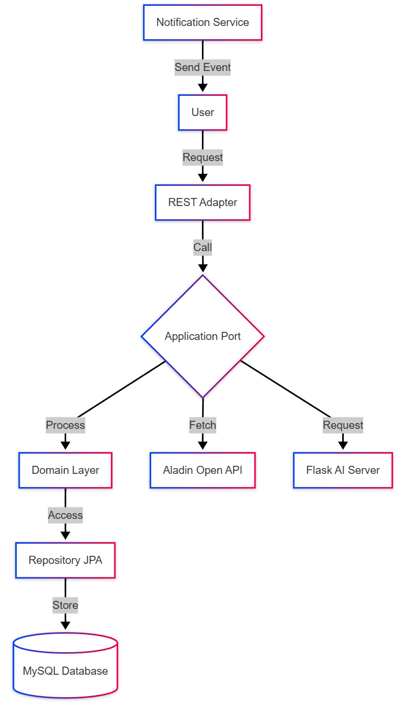
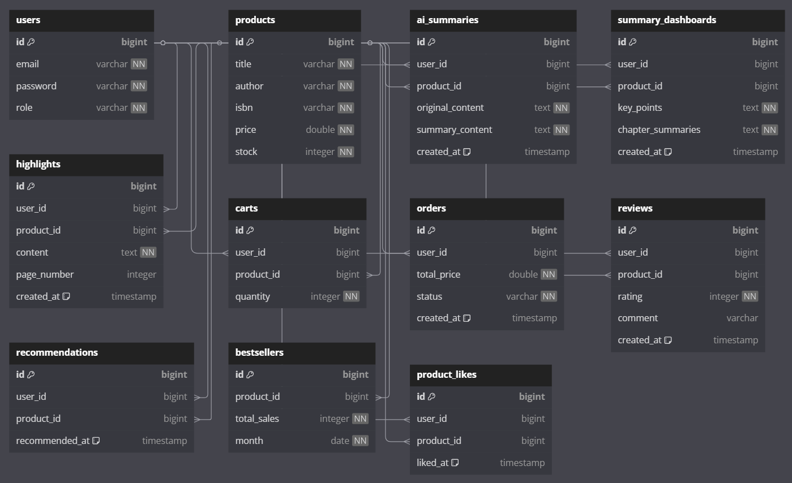
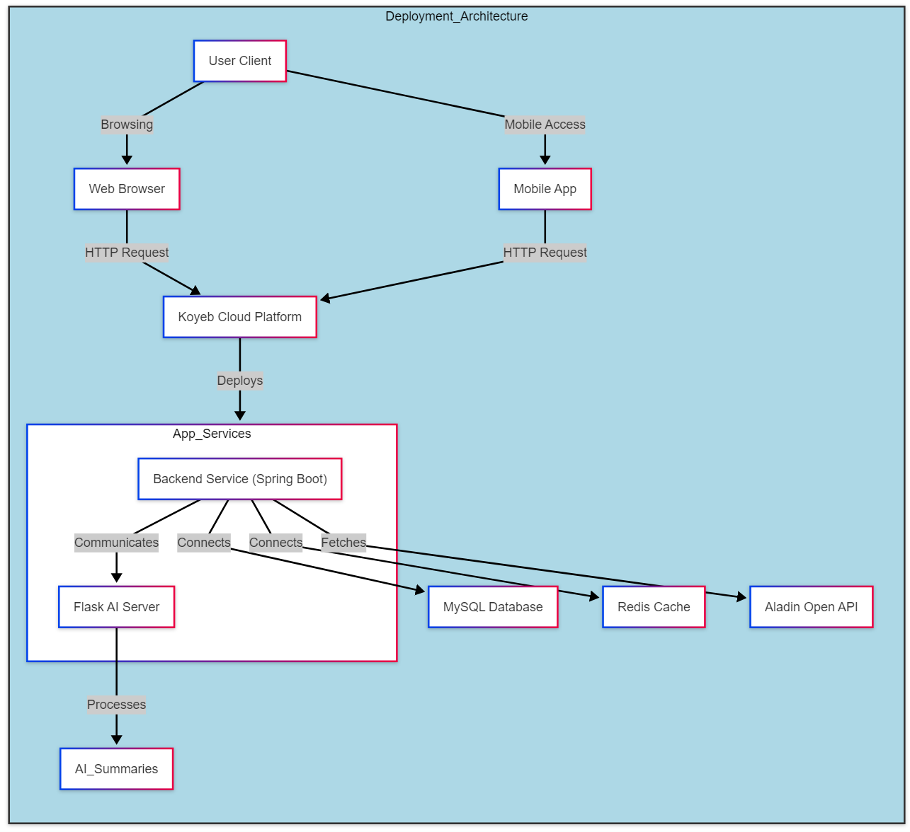

# 북썸(Booksum) - 바쁜 당신을 위한 AI 도서 요약 커머스 플랫폼

## "시간이 없어서 못 읽는다" 더 이상 핑계가 되지 않습니다.

북썸(Booksum)은 AI 기술로 도서의 핵심을 정확하게 파악하여, 바쁜 현대인의 효율적인 독서 생활을 지원합니다.

### 10분만에 읽는 AI 도서 요약

- 300페이지 도서도 10분 안에 핵심 내용 파악
- AI가 중요 포인트를 추출하여 제공
- 주요 인사이트를 한눈에 파악할 수 있는 요약 대시보드

### 똑똑한 독서 경험

- 요약본 기반으로 유사 도서 추천
- 내 독서 스타일에 맞는 맞춤형 요약 제공

### 효율적인 지식 관리

- 읽은 도서의 핵심 내용을 나만의 라이브러리에 저장
- 하이라이트한 문구 기능

### 시간 대비 최고의 효율

- 출퇴근 시간에 한 권씩, 하루 두 권의 도서 섭렵
- 회의 전 5분, 발표 전 10분으로 충분한 도서 내용 파악
- 월 100권의 도서를 읽는 효과, 하지만 필요한 건 당신의 10분

북썸은 단순한 도서 구매 플랫폼이 아닙니다.
더 이상 시간이 없다는 이유로 독서를 미루지 마세요.
AI 기술로 당신의 소중한 시간을 지키면서, 꼭 필요한 지식을 효율적으로 습득하세요.

---

**"하루 10분으로 시작하는 똑똑한 독서 생활, 북썸과 함께하세요"**

---

## 1. 프로젝트 개요

- **프로젝트명:** Booksum (북썸)
- **개발 기간:** 1개월 (2025년 2월 ~ 2025년 3월)
- **주요 기술 스택:** Spring Boot 3.3.8, Java 17, MySQL, JWT, Redis, AI 연동, Koyeb 배포
- **아키텍처:** 헥사고날 아키텍처 (Hexagonal Architecture) 적용

북썸(Booksum) 프로젝트는 비즈니스 로직과 인프라스트럭처를 분리하여 유지보수성과 확장성을 극대화하기 위해 헥사고날 아키텍처를 도입하였습니다.  
이를 통해 도메인 로직의 독립성을 유지하면서, 기술 스택 변경 및 새로운 기능 확장이 용이하도록 설계하였습니다.



---

## 2. 주요 기능

### 회원가입 및 로그인

- 사용자는 아이디(이메일)와 패스워드를 입력하여 회원가입할 수 있습니다.
- 아이디(이메일)는 고유해야 하며, 중복 가입이 불가능합니다.
- 로그인 시 JWT 토큰이 발급되며, 이를 이용해 인증이 필요한 API를 호출할 수 있습니다.
- 비밀번호는 Bcrypt 해싱을 사용하여 안전하게 저장됩니다.

### 상품 검색 및 장바구니 기능

- 로그인 여부와 관계없이 상품명, 저자, ISBN을 기준으로 검색할 수 있습니다.
- MySQL의 LIKE 연산을 활용한 부분 검색 기능을 지원하며, 검색 성능을 최적화하기 위해 상품명(title), ISBN 필드에 인덱스를 추가하였습니다.
- 로그인 상태에서만 장바구니에 접근할 수 있으며, 로그아웃 시 장바구니 데이터는 유지됩니다.
- 로그인한 사용자는 상품을 장바구니에 담을 수 있으며, 동일한 상품 추가 시 수량이 증가합니다.
- 장바구니 조회는 최신순 정렬 및 페이징 기능을 지원하며, 상품명, 가격, 수량, 합계 금액을 확인할 수 있습니다.
- 장바구니에서 개별 상품 삭제 및 전체 비우기 기능을 제공하며, 데이터 무결성을 유지하기 위해 트랜잭션을 적용하였습니다.

### AI 요약 및 추천 기능

- 사용자가 텍스트를 입력하면 AI가 요약된 내용을 반환합니다.
- Flask 기반 AI 요약 서버와 통신하여 NLP 모델을 활용한 텍스트 요약을 제공합니다.
- AI 요약 사용 시 히스토리를 저장하여 이후 다시 확인할 수 있습니다.
- AI 추천 시스템은 사용자의 검색 이력, 장바구니 데이터, 구매 데이터를 분석하여 연관 도서를 추천합니다. 사용자는 읽은 도서의 핵심 내용을 나만의 라이브러리에 저장할 수 있으며, 필요 시 다시 확인할 수
  있습니다.
- AI 추천된 상품은 추천 히스토리에 저장됩니다.

### 요약 대시보드 기능

- AI가 추출한 도서의 주요 인사이트를 시각화하여 제공
- 챕터별 핵심 내용을 한눈에 파악
- 사용자가 직접 하이라이트한 문구들을 모아서 확인
- 요약본 기반의 퀵 리뷰 기능
- 연관된 도서의 인사이트를 함께 제공하여 통합적 이해 지원

### 이달의 베스트셀러 및 이벤트 알림

- 매월 주문 데이터를 분석하여 베스트셀러 도서를 선정하고, 사용자에게 알림을 제공합니다.
- 관리자는 이벤트 및 프로모션 정보를 등록하고, 사용자에게 알림을 제공할 수 있습니다.
- 알림은 API를 통해 조회 가능하며, 향후 이메일/SMS 알림으로 확장할 계획입니다.

### 좋아요, 후기 및 하이라이트 기능

- 사용자는 도서 상세 페이지에서 좋아요를 남길 수 있으며, 좋아요한 도서는 마이페이지에서 확인할 수 있습니다.
- 후기를 작성하여 도서에 대한 평가를 남길 수 있으며, 평점(1~5점)과 댓글을 포함할 수 있습니다.
- 후기 작성 시 비속어나 부적절한 표현을 필터링하는 기능을 제공하며, AI 기반 필터링 기능을 도입할 예정입니다. 또한, 사용자는 하이라이트한 문구를 저장하여 중요한 내용을 쉽게 다시 확인할 수 있습니다.

---

## 3. 데이터베이스 설계

### 고려 사항

- **회원가입 및 로그인**: 사용자 테이블에 `email`, `password` 저장 (이메일은 고유해야 함)
- **연관 상품 추천**: AI 서버에서 사용자의 검색/구매 데이터를 분석하고 추천 결과 저장
- **좋아요 및 후기 관리**: 각 도서에 대해 사용자별 좋아요 및 후기 저장
- **이달의 베스트셀러**: 매월 주문 데이터를 집계하여 베스트셀러를 선정 후 알림 제공
- **장바구니 조회**: 최신순 정렬 및 페이징 기능 지원

### ERD



---

## 4. API 문서화

### API 문서 접근 방법

- Swagger UI: `http://localhost:8080/swagger-ui.html`
- OpenAPI 명세: `http://localhost:8080/v3/api-docs`

### 주요 API 상세

#### 1. 회원 관리

##### 회원가입 API

- **Endpoint**: `POST /api/users/signup`
- **설명**: 새로운 사용자를 등록합니다
- **Request Body**
  ```json
  {
    "email": "user@example.com",
    "password": "password123",
    "name": "홍길동"
  }
  ```
- **Response**
  ```json
  {
    "result": "SUCCESS",
    "message": "회원가입이 완료되었습니다",
    "data": {
      "userId": 1,
      "email": "user@example.com"
    }
  }
  ```

##### 로그인 API

- **Endpoint**: `POST /api/users/login`
- **설명**: 사용자 인증 및 JWT 토큰 발급
- **Request Body**
  ```json
  {
    "email": "user@example.com",
    "password": "password123"
  }
  ```
- **Response**
  ```json
  {
    "result": "SUCCESS",
    "message": "로그인 성공",
    "data": {
      "accessToken": "eyJhbGciOiJIUzI1NiJ9...",
      "refreshToken": "eyJhbGciOiJIUzI1NiJ9..."
    }
  }
  ```

#### 2. 상품 관리

##### 상품 검색 API

- **Endpoint**: `GET /api/products/search`
- **설명**: 키워드로 도서를 검색합니다
- **Parameters**:
    - `keyword` (필수): 검색어 (도서명, 저자명)
    - `page` (선택): 페이지 번호 (기본값: 0)
    - `size` (선택): 페이지당 결과 수 (기본값: 10)
- **Response**
  ```json
  {
    "result": "SUCCESS",
    "message": "검색 성공",
    "data": {
      "content": [
        {
          "id": 1,
          "title": "스프링 부트 실전",
          "author": "김개발",
          "price": 25000
        }
      ],
      "totalPages": 5,
      "totalElements": 42
    }
  }
  ```

#### 3. AI 기능

##### AI 요약 API

- **Endpoint**: `POST /api/ai/summary`
- **Security**: Bearer Token 필요
- **Request Body**
  ```json
  {
    "text": "요약할 텍스트 내용"
  }
  ```
- **Response**
  ```json
  {
    "result": "SUCCESS",
    "message": "요약 완료",
    "data": {
      "summary": "요약된 내용",
      "originalLength": 1000,
      "summaryLength": 200
    }
  }
  ```

#### 4. 요약 대시보드 API

##### 대시보드 조회 API

- **Endpoint**: `GET /api/dashboards/{productId}`
- **설명**: 특정 도서의 요약 대시보드 정보를 조회
- **Response**
  ```json
  {
    "result": "SUCCESS",
    "message": "대시보드 조회 성공",
    "data": {
      "keyPoints": ["주요 인사이트 1", "주요 인사이트 2"],
      "chapterSummaries": [
        {
          "chapter": 1,
          "title": "챕터 제목",
          "summary": "챕터 요약 내용"
        }
      ],
      "highlights": [
        {
          "content": "하이라이트 내용",
          "pageNumber": 42
        }
      ]
    }
  }
  ```

### 공통 사항

- **인증**: Bearer Token 방식의 JWT 인증 사용
- **에러 응답 형식**
  ```json
  {
    "result": "ERROR",
    "message": "에러 메시지",
    "data": null
  }
  ```
- **HTTP 상태 코드**
    - 200: 성공
    - 201: 생성 성공
    - 400: 잘못된 요청
    - 401: 인증 실패
    - 403: 권한 없음
    - 404: 리소스 없음
    - 500: 서버 에러

### API 버전 관리

- 현재 버전: v1
- 버전 변경 시 하위 호환성 유지
- 새로운 버전은 `/api/v2/...` 형식으로 제공

### 테스트 환경

- Local: `http://localhost:8080`

---

## 5. 보안 및 확장성 고려 사항

### 보안

- JWT 기반 인증을 적용하여 API 요청을 보호합니다.
- 입력값 유효성 검사를 수행하여 SQL 인젝션 및 XSS 공격을 방지합니다.

### 확장성

- AI 추천 시스템은 별도의 서버로 분리하여 확장 가능합니다.
- 도서 검색과 베스트셀러 알림은 캐시 서버(예: Redis)와 결합하여 읽기 트래픽을 분산합니다.

### 유지보수

- JPA 기반 설계로 데이터베이스 변경 시 최소한의 코드 수정으로 대응할 수 있습니다.
- 외부 API는 서비스 계층에 캡슐화하여 변경 및 교체가 용이합니다.

### 신뢰성

- 트랜잭션을 적용하여 주문 및 재고 관리의 데이터 무결성을 보장합니다.
- 결제 모듈과 연계 시 예외 처리를 강화하여 데이터 정확성을 유지합니다.

## 6. 트러블슈팅

주요 문제 해결 사례들은 아래 링크에서 확인할 수 있습니다.

ex)

1. [JPA N+1 문제 해결](https://wiki.booksum.com/troubleshooting/n-plus-one)
2. [대용량 데이터 처리 개선](https://wiki.booksum.com/troubleshooting/bulk-processing)
3. [동시성 이슈 해결](https://wiki.booksum.com/troubleshooting/concurrency)

더 많은 트러블슈팅 사례는 [블로그](https://wiki.booksum.com/troubleshooting)에서 확인할 수 있습니다.

## 7. 프로젝트 실행 방법

### 개발 환경 설정

```bash
# 1. JDK 17 설치 확인
java -version

# 2. MySQL 설치 및 데이터베이스 생성
mysql -u root -p
create database booksum_data;

# 3. Redis 설치 및 실행
brew install redis  # Mac OS
redis-server
```

### 프로젝트 실행

```bash
# 1. 프로젝트 클론
git clone https://github.com/yourusername/booksum.git
cd booksum

# 2. 환경변수 설정
cp .env.example .env
# .env 파일 수정

# 3. 빌드 및 실행
./gradlew build
./gradlew bootRun
```

### 테스트 실행

```bash
./gradlew test
```

## 8. 프로젝트 구조

```
src/
├── main/
│   ├── java/
│   │   └── com/
│   │       └── booksum/
│   │           ├── adapter/                   # 어댑터 계층: 외부 시스템과의 통신 담당
│   │           │   ├── in/                   # 인바운드 어댑터: 외부 요청 처리
│   │           │   │   ├── rest/            # REST 컨트롤러: API 엔드포인트
│   │           │   │   │   ├── auth/       # 인증 관련 컨트롤러
│   │           │   │   │   ├── book/       # 도서 관련 컨트롤러
│   │           │   │   │   ├── cart/       # 장바구니 컨트롤러
│   │           │   │   │   ├── order/      # 주문 컨트롤러
│   │           │   │   │   ├── summary/    # 요약 관련 컨트롤러
│   │           │   │   │   └── dashboard/  # 대시보드 컨트롤러
│   │           │   │   └── notification/    # 알림 처리기: 이벤트 알림 처리
│   │           │   └── out/                  # 아웃바운드 어댑터: 외부 시스템 호출
│   │           │       ├── persistence/     # JPA 레포지토리: 데이터베이스 연동
│   │           │       │   ├── user/       # 사용자 레포지토리
│   │           │       │   ├── book/       # 도서 레포지토리
│   │           │       │   ├── summary/    # 요약 레포지토리
│   │           │       │   ├── dashboard/  # 대시보드 레포지토리
│   │           │       │   └── highlight/  # 하이라이트 레포지토리
│   │           │       ├── openapi/         # 알라딘 API 클라이언트: 도서 정보 연동
│   │           │       └── ai/              # AI 서버 클라이언트: 요약 처리
│   │           ├── application/              # 애플리케이션 계층: 비즈니스 로직 처리
│   │           │   ├── port/                # 포트: 인터페이스 정의
│   │           │   │   ├── in/             # 입력 포트: 유스케이스 정의
│   │           │   │   │   ├── auth/      # 인증 유스케이스
│   │           │   │   │   ├── book/      # 도서 유스케이스
│   │           │   │   │   ├── summary/   # 요약 유스케이스
│   │           │   │   │   └── dashboard/ # 대시보드 유스케이스
│   │           │   │   └── out/            # 출력 포트: 외부 시스템 인터페이스
│   │           │   └── service/            # 서비스: 비즈니스 로직 구현
│   │           │       ├── auth/           # 인증 서비스
│   │           │       ├── book/           # 도서 서비스
│   │           │       ├── summary/        # 요약 서비스
│   │           │       └── dashboard/      # 대시보드 서비스
│   │           ├── domain/                   # 도메인 계층: 핵심 비즈니스 로직
│   │           │   ├── user/               # 사용자 도메인
│   │           │   ├── book/               # 도서 도메인
│   │           │   ├── cart/               # 장바구니 도메인
│   │           │   ├── order/              # 주문 도메인
│   │           │   ├── summary/            # 요약 도메인
│   │           │   ├── dashboard/          # 대시보드 도메인
│   │           │   └── highlight/          # 하이라이트 도메인
│   │           └── global/                   # 공통 설정
│   │               ├── config/             # 설정 클래스: 스프링 설정
│   │               ├── error/              # 에러 처리: 예외 처리
│   │               └── util/               # 유틸리티: 공통 기능
│   └── resources/                            # 리소스 파일
│       ├── application.yml                  # 애플리케이션 설정
│       └── data.sql                         # 초기 데이터
└── test/                                     # 테스트 코드
    └── java/
        └── com/
            └── booksum/
                ├── adapter/                 # 어댑터 계층 테스트
                ├── application/             # 애플리케이션 계층 테스트
                └── domain/                  # 도메인 계층 테스트
```

## 9. 라이선스

Copyright (c) 2025 Booksum. All rights reserved.

이 프로젝트는 개인 포트폴리오 용도로 제작되었습니다.

## 10. 배포 환경

### 배포 아키텍처



### 배포 환경

- **배포 플랫폼**: Koyeb
- **데이터베이스**: MySQL (Koyeb Managed Database)
- **캐시**: Redis (Koyeb Managed Redis)

### 배포 프로세스

1. GitHub Repository 연동

- Koyeb 대시보드에서 GitHub Repository 선택
- main 브랜치 자동 배포 설정

2. 환경 변수 설정
   ```
   SPRING_PROFILES_ACTIVE=prod
   DB_URL=${KOYEB_MYSQL_URL}
   DB_USERNAME=${KOYEB_MYSQL_USER}
   DB_PASSWORD=${KOYEB_MYSQL_PASSWORD}
   JWT_SECRET=${JWT_SECRET_KEY}
   ```

3. 자동 배포

- main 브랜치에 push 시 자동 배포
- Koyeb의 자동 빌드 및 배포 프로세스 활용

### 배포 URL

- https://booksum.koyeb.app

### 모니터링

- Koyeb 대시보드를 통한 서비스 상태 모니터링
- 애플리케이션 로그 실시간 확인