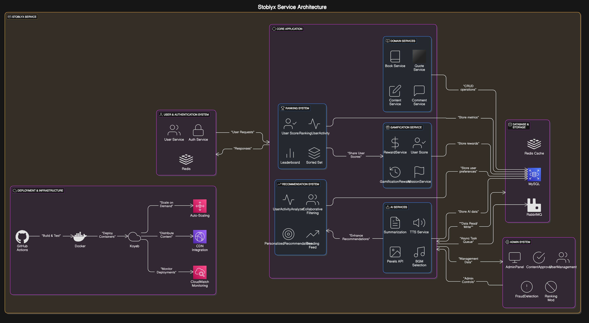
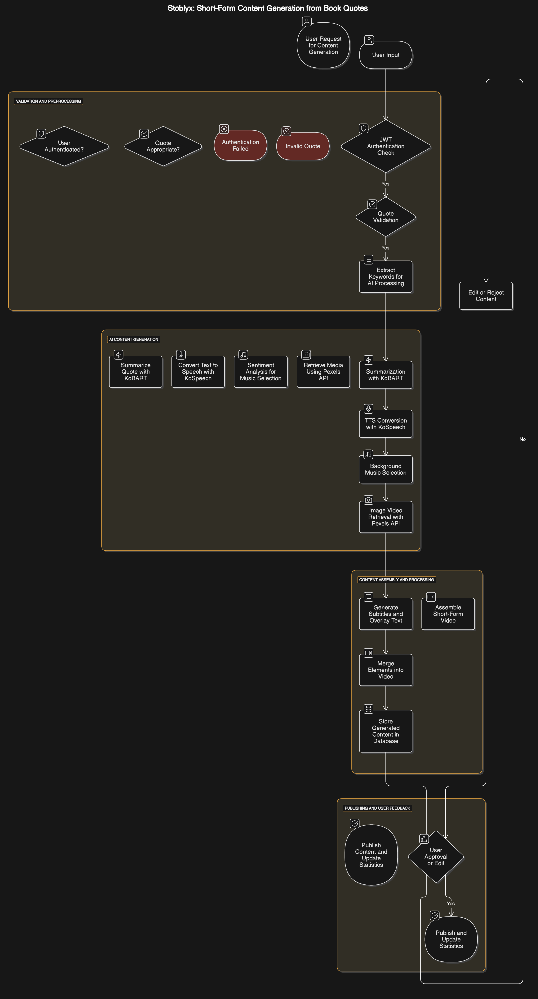
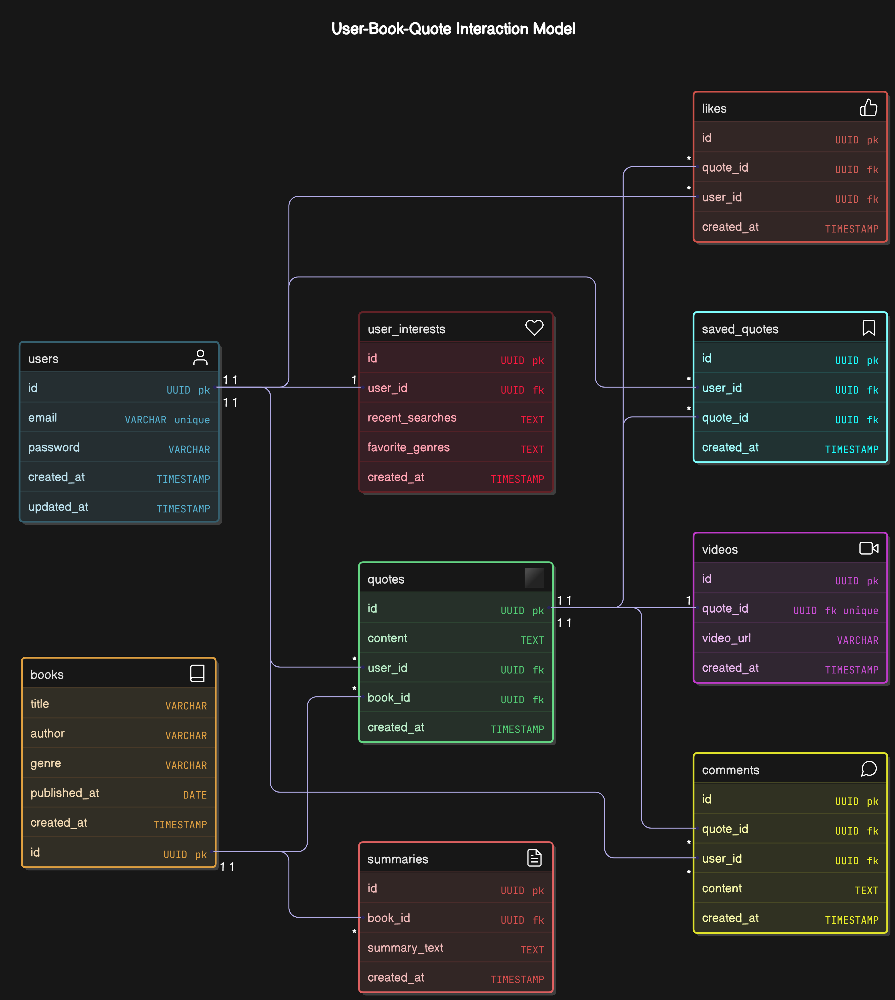
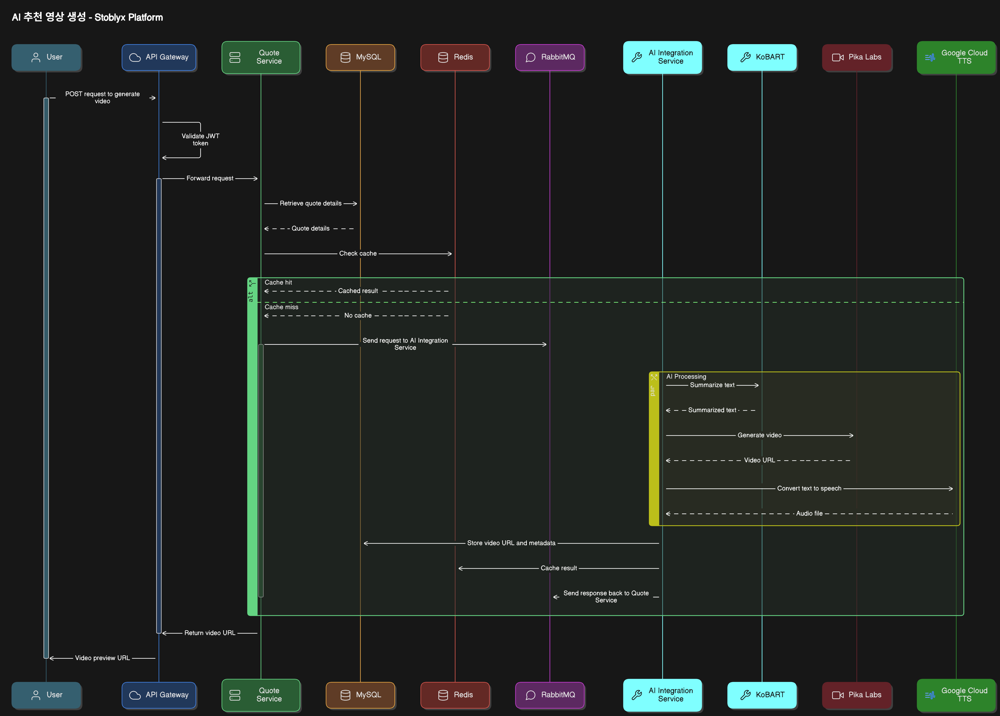

## 스토블릭스 (Stoblyx) - 이야기의 오벨리스크

### **Stoblyx = Story + Obelisk**

"책 속의 한 문장은 사라지지 않는다. 그것은 오벨리스크처럼 남아, 사람들에게 영감을 준다."

책 속 문장 하나하나가 디지털 기념비(Obelisk)처럼 기억되고, AI를 통해 숏폼 영상으로 재탄생하는 곳. 과거, 현재, 미래를 잇는 독서의 타임캡슐.

---

## 1. 프로젝트 개요

**프로젝트명:** 스토블릭스 (Stoblyx)  
**개발 기간:** 1개월 (2025년 2월 ~ 2025년 3월)

### 기술 스택

- **Backend:** Java 17, Spring Boot 3.3.9
- **Database:** MySQL 8.0.41
- **Cache:** Redis 7.0.15
- **Security:** JWT, Spring Security
- **AI Integration:**
    - KoBART (텍스트 요약)
    - TTS (텍스트-음성 변환) - Python 스크립트 연동을 통한 고품질 음성 생성
    - BGM 선택 (텍스트 감정 분석에 기반한 자동 배경음악 선택 시스템)
    - Pexels API (이미지/비디오 검색) - 키워드 기반, API 속도 제한 및 캐싱 최적화
- **Deployment:** Koyeb + GitHub Actions + Docker
- **모니터링:** Prometheus, Grafana

---

## 2. Why Stoblyx?

### 문제 인식

- MZ세대의 독서율 감소 및 숏폼 콘텐츠 소비 증가
- 책 속의 의미 있는 문장이 잊혀지는 현실

### 해결 방안

- AI 기술로 문장을 현대적 콘텐츠로 재해석
- 사용자 참여 유도를 위한 게이미피케이션 적용

### 기대 효과

- 독서 문화 활성화 및 세대 간 문화 격차 해소
- 지식 공유 플랫폼으로 성장

---

## 3. Stoblyx만의 차별점

### 1. AI 기반 문구 → 숏폼 슬라이드 이미지 변환

- 키워드 기반 문구 추출 및 자동 슬라이드 이미지 생성
- 이미지 요소: 책 표지, 문장, 배경 이미지, 자막, 감성 기반 BGM 적용
- 비동기 처리 및 폴백 전략으로 안정적인 서비스 제공

### 2. 검색어 기반 유저 추천

- 협업 필터링을 활용한 사용자 맞춤 추천 시스템
- 추천 기준: 최근 검색어, 좋아요/저장 데이터, 활동 패턴

### 3. 게이미피케이션 & 랭킹 시스템

| 랭크   | 조건                 |
|------|--------------------|
| 브론즈  | 기본 기능 사용 가능        |
| 실버   | 인기 문구 TOP 10 확인 가능 |
| 골드   | 100+ 좋아요 문구 저장 가능  |
| 플래티넘 | AI 추천 영상 제작 가능     |
| 다이아  | 콘텐츠 트렌드 피드 노출      |

#### 랭킹 산정 공식

```
점수 = (좋아요 × 2) + (저장수 × 3) + (댓글 × 1) - (신고수 × 5)
```

- **부정 행위 방지:** 동일 IP 다중 계정 차단 및 자동 계정 정지 정책 적용
- **랭킹 리셋 주기:** 매월 1일

---

## 4. 아키텍처 설계

### 시스템 구성 및 계층 설명

<details>
<summary>시스템 아키텍처 다이어그램</summary>
<div align="center">
  
</div>
</details>

#### 설명

- **Adapter Layer:** 외부 요청 처리 (REST API), AI 서비스 호출, 메시징 시스템 통합
- **Application Layer:** 비즈니스 유스케이스 처리 및 트랜잭션 관리
- **Domain Layer:** 핵심 도메인 로직 및 엔티티 관리
- **비동기 처리:** RabbitMQ를 통한 작업 큐 처리로 확장성과 안정성 확보

### 시스템 흐름도

<details>
<summary>시스템 흐름 다이어그램</summary>
<div align="center">
  
</div>
</details>

### AI 서비스 통합 아키텍처

- **헥사고날 아키텍처 기반 AI 서비스 통합**

    - 포트와 어댑터 패턴을 통한 외부 AI 서비스 연동
    - 도메인 로직과 AI 서비스 간의 느슨한 결합
    - 폴백 메커니즘을 통한 서비스 안정성 확보

- **AI 통합 컴포넌트**
    - `PexelsClient`: 키워드 기반 이미지/비디오 검색 및 결과 처리
    - `TTSClient`: 텍스트를 음성으로 변환하는 Python 스크립트 연동
    - `BGMClient`: 텍스트 감정 분석을 통한 BGM 선택 로직
    - `AIAdapter`: 외부 AI 서비스와의 통합 인터페이스

---

## 5. 주요 기능

### 회원 시스템

- JWT 기반 인증/인가
- Access/Refresh Token 분리 및 Redis 세션 관리
- BCrypt를 통한 비밀번호 안전 저장
- 세션 고정 공격 방지를 위한 Redis 설정 적용

### 문구 및 AI 추천 기능

- 문구 검색 및 AI 기반 영상 추천
- AI 요약 실패 시 폴백: "첫 문장 + 마지막 문장 조합" 제공
- Redis 캐싱 및 TTL 적용으로 빠른 응답 처리

### 커뮤니티 기능

- 좋아요, 댓글, 문구 저장 및 트렌드 피드 제공
- 북마크 기능을 통한 콘텐츠 저장 기능 구현

### AI 서비스 통합 기능

#### 1. Pexels API 연동

- **키워드 기반 이미지 검색:** 책 제목과 인용구를 결합한 검색어로 최적의 이미지 제공
- **키워드 기반 비디오 검색:** 숏폼에 적합한 세로형 비디오 검색 및 처리
- **API 속도 제한 대응:** 초당 요청 수 제한을 고려한 throttleRequest() 메커니즘 구현
- **응답 캐싱 시스템:** Redis 기반 캐싱으로 API 호출 최소화 (@Cacheable 적용)
- **오류 처리 및 폴백:** API 오류 발생 시 기본 이미지/비디오 제공으로 서비스 안정성 확보

#### 2. 감정 기반 BGM 선택 로직

- **텍스트 감정 분석 알고리즘:** 키워드 기반 감정 분석 시스템 구현
- **4가지 감정 분류:** happy, sad, calm, neutral 감정 인식 및 점수화
- **감정별 BGM 매핑:** 각 감정에 적합한 BGM 자동 선택
- **한국어/영어 키워드 지원:** 다국어 감정 키워드 인식 시스템

#### 3. 숏폼 콘텐츠 생성 파이프라인

- **비동기 처리:** @Async 어노테이션을 통한 백그라운드 콘텐츠 생성
- **통합 미디어 리소스:** 이미지, 비디오, 오디오, BGM, 자막을 포함한 종합 콘텐츠 생성
- **TTS(Text-to-Speech):** Python 스크립트 연동을 통한 고품질 음성 생성
- **자막 생성:** 인용구 내용 기반 자막 자동 생성
- **오류 처리 전략:** 각 단계별 오류 발생 시 적절한 폴백 메커니즘과 로깅 시스템

### 관리자 기능

#### 1. 콘텐츠 관리

- **콘텐츠 승인/반려 시스템:** 생성된 콘텐츠 검토 및 상태 관리 기능
- **콘텐츠 삭제 및 복구:** 부적절한 콘텐츠 관리 기능
- **콘텐츠 일괄 처리:** 다중 콘텐츠 상태 변경 기능

#### 2. 사용자 관리

- **사용자 정보 조회:** 전체 사용자 목록 및 상세 정보 조회 기능
- **권한 관리:** 사용자 역할(USER, ADMIN, EDITOR, WRITER) 관리 기능
- **활동 내역 조회:** 사용자별 활동 로그 확인 기능

#### 3. 통계 대시보드

- **콘텐츠 생성 현황:** 일별/주별/월별 콘텐츠 생성 통계
- **사용자 활동 분석:** 신규 가입, 로그인, 콘텐츠 생성 등의 활동 분석
- **시스템 리소스 모니터링:** CPU, 메모리, 디스크 사용량 실시간 모니터링

#### 4. 시스템 설정 관리

- **API 키 관리:** Pexels API 키 등 외부 서비스 연동 키 관리
- **리소스 경로 설정:** 미디어 파일 저장 경로 등 시스템 설정 관리
- **캐시 관리:** Redis 캐시 수동 갱신 및 TTL 설정 기능

#### 5. 로그 모니터링

- **오류 로그 실시간 조회:** 시스템 오류 실시간 모니터링
- **사용자 행동 로그 분석:** 사용자 활동 패턴 분석 도구
- **AI 서비스 통합 로그:** AI 서비스 응답 시간 및 성공률 모니터링

---

## 6. 데이터베이스 설계

### 주요 테이블 및 관계

<details>
<summary>ERD (Entity Relationship Diagram)</summary>
<div align="center">
  
</div>
</details>

### 공통 기본 클래스

- **BaseTimeEntity**

    - 모든 엔티티가 상속받는 시간 관련 기본 클래스
    - 필드
        - createdAt: LocalDateTime - 생성 시간, @Column(nullable = false, updatable = false)
        - modifiedAt: LocalDateTime - 수정 시간, @Column(nullable = false)
    - JPA의 @EntityListeners(AuditingEntityListener.class) 적용

- **BaseEntity**
    - BaseTimeEntity를 상속받는 공통 기본 클래스
    - 필드:
        - isDeleted: Boolean - 삭제 여부, @Column(nullable = false, default = false)
    - 메서드: delete(), restore(), isDeleted()

### 도메인 엔티티

- **User (사용자)**

    - 필드
        - id: Long - 기본키, @Id @GeneratedValue(strategy = GenerationType.IDENTITY)
        - username: String(50) - 사용자 아이디, @NotEmpty, @Column(unique = true)
        - password: String(255) - 암호화된 비밀번호, @NotEmpty
        - nickname: String(50) - 사용자 별명, @Column(unique = true)
        - email: String(100) - 이메일 주소, @Email, @Column(unique = true)
        - profileImageUrl: String(255) - 프로필 이미지 경로
        - role: UserRole - 사용자 권한 (ENUM)
        - accountStatus: String - 계정 상태 (ACTIVE, SUSPENDED, INACTIVE)
        - lastLoginAt: LocalDateTime - 마지막 로그인 시간
    - 상속: BaseEntity

- **UserRole (사용자 역할 - ENUM)**

    - USER: 일반 사용자
    - ADMIN: 관리자
    - EDITOR: 편집자
    - WRITER: 작가

- **Auth (인증 정보)**

    - 필드
        - id: Long - 기본키, @Id @GeneratedValue(strategy = GenerationType.IDENTITY)
        - refreshToken: String(255) - 리프레시 토큰
        - tokenType: String(20) - 토큰 타입, 기본값 "Bearer"
        - expiryDate: LocalDateTime - 만료 시간
        - lastUsedAt: LocalDateTime - 마지막 사용 시간
        - user: User - 연관된 사용자, @OneToOne, @JoinColumn
    - 상속: BaseEntity

- **UserInterest (사용자 관심사)**

    - 필드
        - id: Long - 기본키, @Id @GeneratedValue(strategy = GenerationType.IDENTITY)
        - interests: List<String> - 관심사 목록, @ElementCollection
        - user: User - 연관된 사용자, @OneToOne, @JoinColumn
    - 상속: BaseEntity

- **Book (도서)**

    - 필드
        - id: Long - 기본키, @Id @GeneratedValue(strategy = GenerationType.IDENTITY)
        - title: String(200) - 도서 제목, @NotEmpty
        - author: String(100) - 저자, @NotEmpty
        - isbn: String(20) - ISBN, @Column(unique = true)
        - description: String(2000) - 도서 설명
        - publisher: String(100) - 출판사
        - publishDate: LocalDate - 출판일
        - thumbnailUrl: String(500) - 썸네일 URL
        - genres: List<String> - 장르 목록, @ElementCollection
        - publicationYear: Integer - 출판 연도
        - totalPages: Integer - 총 페이지 수
        - avgReadingTime: Integer - 평균 독서 시간(분)
        - averageRating: Double - 평균 평점, default = 0.0
        - ratingCount: Integer - 평점 개수, default = 0
    - 상속: BaseEntity

- **BookInfo (도서 정보 - DTO)**

    - 필드
        - title: String - 도서 제목
        - author: String - 저자
        - isbn: String - ISBN
        - description: String - 도서 설명
        - publisher: String - 출판사
        - publishDate: LocalDate - 출판일
        - thumbnailUrl: String - 썸네일 URL
        - genres: List<String> - 장르 목록

- **Quote (문구)**

    - 필드
        - id: Long - 기본키, @Id @GeneratedValue(strategy = GenerationType.IDENTITY)
        - content: String(1000) - 문구 내용, @NotEmpty
        - page: Integer - 페이지 번호
        - memo: String(500) - 사용자 메모
        - likeCount: Integer - 좋아요 수, default = 0
        - saveCount: Integer - 저장 수, default = 0
        - user: User - 문구 등록자, @ManyToOne(fetch = FetchType.LAZY)
        - book: Book - 문구가 속한 책, @ManyToOne(fetch = FetchType.LAZY)
    - 상속: BaseEntity

- **QuoteSummary (문구 요약)**

    - 필드
        - id: Long - 기본키, @Id @GeneratedValue(strategy = GenerationType.IDENTITY)
        - content: String(1000) - 요약 내용, @NotEmpty
        - algorithm: String(50) - 사용된 알고리즘 (ex: "KoBART")
        - generatedAt: LocalDateTime - 생성 시간
        - quality: Double - 요약 품질 점수, default = 0.0
        - quote: Quote - 원본 문구, @OneToOne, @JoinColumn
    - 상속: BaseEntity

- **Summary (책 요약)**

    - 필드
        - id: Long - 기본키, @Id @GeneratedValue(strategy = GenerationType.IDENTITY)
        - content: String(5000) - 요약 내용, @NotEmpty
        - algorithm: String(50) - 사용된 알고리즘
        - generatedAt: LocalDateTime - 생성 시간
        - book: Book - 요약된 책, @ManyToOne(fetch = FetchType.LAZY)
    - 상속: BaseEntity

- **Comment (댓글)**

    - 필드
        - id: Long - 기본키, @Id @GeneratedValue(strategy = GenerationType.IDENTITY)
        - content: String(500) - 댓글 내용, @NotEmpty
        - likeCount: Integer - 좋아요 수, default = 0
        - user: User - 댓글 작성자, @ManyToOne(fetch = FetchType.LAZY)
        - quote: Quote - 연관된 문구, @ManyToOne(fetch = FetchType.LAZY)
    - 상속: BaseEntity

- **Like (좋아요)**

    - 복합키: @EmbeddedId
        - LikeId (userId: Long, quoteId: Long)
    - 필드
        - user: User - 좋아요한 사용자, @ManyToOne, @MapsId("userId")
        - quote: Quote - 좋아요된 문구, @ManyToOne, @MapsId("quoteId")
    - 상속: BaseEntity

- **ContentLike (콘텐츠 좋아요)**

    - 필드
        - id: Long - 기본키, @Id @GeneratedValue(strategy = GenerationType.IDENTITY)
        - user: User - 좋아요한 사용자, @ManyToOne(fetch = FetchType.LAZY)
        - content: ShortFormContent - 좋아요된 콘텐츠, @ManyToOne(fetch = FetchType.LAZY)
    - 상속: BaseEntity

- **SavedQuote (저장된 문구)**

    - 복합키: @EmbeddedId
        - SavedQuoteId (userId: Long, quoteId: Long)
    - 필드
        - note: String(255) - 사용자 노트
        - user: User - 저장한 사용자, @ManyToOne, @MapsId("userId")
        - quote: Quote - 저장된 문구, @ManyToOne, @MapsId("quoteId")
    - 상속: BaseEntity

- **Post (게시물)**

    - 필드
        - id: Long - 기본키, @Id @GeneratedValue(strategy = GenerationType.IDENTITY)
        - title: String(100) - 제목, @NotEmpty
        - content: String(5000) - 내용, @NotEmpty
        - viewCount: Integer - 조회수, default = 0
        - likeCount: Integer - 좋아요 수, default = 0
        - tags: List<String> - 태그 목록, @ElementCollection
        - user: User - 게시물 작성자, @ManyToOne(fetch = FetchType.LAZY)
    - 상속: BaseEntity

- **ShortFormContent (숏폼 콘텐츠)**

    - 필드
        - id: Long - 기본키, @Id @GeneratedValue(strategy = GenerationType.IDENTITY)
        - title: String(100) - 콘텐츠 제목, @NotEmpty
        - description: String(500) - 콘텐츠 설명
        - status: ContentStatus - 콘텐츠 상태 (ENUM)
        - viewCount: Integer - 조회수, default = 0
        - likeCount: Integer - 좋아요 수, default = 0
        - shareCount: Integer - 공유 수, default = 0
        - processingProgress: Integer - 생성 진행률, default = 0
        - generationStartedAt: LocalDateTime - 생성 시작 시간
        - generationCompletedAt: LocalDateTime - 생성 완료 시간
        - approvalStatus: ApprovalStatus - 승인 상태 (ENUM), default = PENDING
        - rejectionReason: String(500) - 반려 사유
        - adminId: Long - 처리한 관리자 ID
        - book: Book - 연관된 책, @ManyToOne(fetch = FetchType.LAZY)
        - quote: Quote - 연관된 문구, @ManyToOne(fetch = FetchType.LAZY)
    - 상속: BaseEntity

- **MediaResource (미디어 리소스)**

    - 필드
        - id: Long - 기본키, @Id @GeneratedValue(strategy = GenerationType.IDENTITY)
        - type: MediaType - 미디어 타입 (ENUM)
        - url: String(500) - 리소스 URL, @NotEmpty
        - thumbnailUrl: String(500) - 썸네일 URL
        - description: String(255) - 리소스 설명
        - duration: Integer - 미디어 길이(초)
        - size: Long - 파일 크기(바이트)
        - format: String(50) - 파일 형식(확장자)
        - width: Integer - 너비(픽셀)
        - height: Integer - 높이(픽셀)
        - emotion: String(50) - 감정 타입(BGM의 경우)
        - keywords: List<String> - 관련 키워드, @ElementCollection
        - sourceUrl: String(500) - 원본 소스 URL(Pexels 등)
        - sourceCredit: String(255) - 원본 제작자 정보
        - content: ShortFormContent - 연관된 콘텐츠, @ManyToOne(fetch = FetchType.LAZY)
    - 상속: BaseEntity

- **ContentBookmark (콘텐츠 북마크)**

    - 필드
        - id: Long - 기본키, @Id @GeneratedValue(strategy = GenerationType.IDENTITY)
        - user: User - 북마크한 사용자, @ManyToOne(fetch = FetchType.LAZY)
        - content: ShortFormContent - 북마크된 콘텐츠, @ManyToOne(fetch = FetchType.LAZY)
        - note: String(255) - 사용자 노트
    - 상속: BaseEntity

- **Search (검색 기록)**

    - 필드
        - id: Long - 기본키, @Id @GeneratedValue(strategy = GenerationType.IDENTITY)
        - keyword: String(100) - 검색어, @NotEmpty
        - resultCount: Integer - 검색 결과 수, default = 0
        - searchedAt: LocalDateTime - 검색 시간
        - user: User - 검색한 사용자, @ManyToOne(fetch = FetchType.LAZY)
    - 상속: BaseEntity

- **ContentInteraction (콘텐츠 상호작용)**

    - 필드
        - id: Long - 기본키, @Id @GeneratedValue(strategy = GenerationType.IDENTITY)
        - user: User - 상호작용한 사용자, @ManyToOne(fetch = FetchType.LAZY)
        - content: ShortFormContent - 대상 콘텐츠, @ManyToOne(fetch = FetchType.LAZY)
        - liked: boolean - 좋아요 여부
        - bookmarked: boolean - 북마크 여부
        - viewedAt: LocalDateTime - 조회 시간
    - 상속: BaseTimeEntity

### 열거형 (Enums)

- **ContentStatus (콘텐츠 상태)**

    - PROCESSING: 처리중
    - COMPLETED: 생성 완료
    - FAILED: 생성 실패
    - PUBLISHED: 공개됨

- **ContentType (콘텐츠 유형)**

    - VIDEO: 비디오
    - AUDIO: 오디오
    - IMAGE: 이미지
    - TEXT: 텍스트
    - MIXED: 혼합 형식

### 엔티티 관계도

#### 사용자 관련 관계

- **User ↔ Auth**: 사용자와 인증 정보 (1:1)
- **User ↔ UserInterest**: 사용자와 관심사 (1:1)
- **User ↔ Quote**: 사용자가 작성한 문구 (1:N)
- **User ↔ Comment**: 사용자가 작성한 댓글 (1:N)
- **User ↔ Like**: 사용자가 좋아요한 문구 (1:N)
- **User ↔ ContentLike**: 사용자가 좋아요한 콘텐츠 (1:N)
- **User ↔ SavedQuote**: 사용자가 저장한 문구 (1:N)
- **User ↔ Post**: 사용자가 작성한 게시물 (1:N)
- **User ↔ Search**: 사용자의 검색 기록 (1:N)
- **User ↔ ContentInteraction**: 사용자의 콘텐츠 상호작용 (1:N)

#### 도서 관련 관계

- **Book ↔ Quote**: 책에 포함된 문구 (1:N)
- **Book ↔ Summary**: 책의 요약 (1:N)
- **Book ↔ ShortFormContent**: 책 기반 숏폼 콘텐츠 (1:N)

#### 문구 관련 관계

- **Quote ↔ Comment**: 문구에 달린 댓글 (1:N)
- **Quote ↔ Like**: 문구에 대한 좋아요 (1:N)
- **Quote ↔ SavedQuote**: 저장된 문구 (1:N)
- **Quote ↔ ShortFormContent**: 문구 기반 숏폼 콘텐츠 (1:N)
- **Quote ↔ QuoteSummary**: 문구와 그 요약 (1:1)

#### 콘텐츠 관련 관계

- **ShortFormContent ↔ MediaResource**: 콘텐츠와 미디어 자원 (1:N)
- **ShortFormContent ↔ ContentLike**: 콘텐츠에 대한 좋아요 (1:N)
- **ShortFormContent ↔ ContentBookmark**: 콘텐츠에 대한 북마크 (1:N)
- **ShortFormContent ↔ ContentInteraction**: 콘텐츠 상호작용 (1:N)

---

## 7. API 문서

### 공통 사항

- **인증:** Bearer Token 방식 (JWT)
- **권한 요구사항:** 일부 엔드포인트는 인증 필요
- **에러 코드 및 메시지 예시**

```json
{
  "status": 403,
  "error": "Forbidden",
  "message": "접근 권한이 없습니다.",
  "timestamp": "2025-02-23T10:15:30Z"
}
```

### 시퀀스 다이어그램

<details>
<summary>API 시퀀스 다이어그램</summary>
<div align="center">
  
</div>
</details>

### AI 추천 영상 생성 API

**엔드포인트:** `/quotes/{id}/generate-video`  
**메서드:** POST  
**권한:** 인증 필요

#### 요청 예시

```json
{
  "style": "minimalist",
  "bgmType": "calm"
}
```

#### 응답 예시 (201 Created)

```json
{
  "videoId": "a1b2c3d4",
  "processingTime": 45,
  "previewUrl": "https://cdn.stoblyx.com/previews/a1b2c3d4.mp4"
}
```

---

## 8. 개발 환경 설정

### .env.example

```properties
# DB 설정
DB_URL=jdbc:mysql://localhost:3306/stoblyx
DB_USER=root
DB_PASS=encrypted_password
# JWT 설정
JWT_SECRET=your_256bit_secret
JWT_EXPIRATION=86400000  # 24시간
```

---

## 9. 보안 및 확장성 고려 사항

### 보안 강화 방안

- **입력값 검증:** Jakarta Bean Validation 적용
- **XSS 방지:** Lucy-XSS-Filter 사용
- **CSRF 보호:** Stateless 환경 대비 JWT 검증 강화
- **SQL Injection 방지:** JPA Parameter Binding 강제화
- **Redis 세션 보호:** 세션 고정 공격 방지를 위한 토큰 검증 추가

---

## 10. 트러블슈팅

### 문제: 텍스트 감정 분석의 정확도 향상

#### 해결책

- **키워드 기반 감정 분석 시스템 개선:** 한국어/영어 감정 키워드 데이터베이스 확장
- **가중치 시스템 도입:** 문맥에 따른 키워드 중요도 조정
- **기본 점수 시스템 구현:** 감정이 명확하지 않은 경우 'neutral' 감정 기본 점수 부여

---

## 11. 프로젝트 구조

헥사고날 아키텍처 (포트와 어댑터 아키텍처)

```plaintext
src/
├── main/
│   ├── java/com/j30n/stoblyx/
│   │   ├── adapter/                 # 어댑터 계층
│   │   │   ├── in/                  # 입력 어댑터
│   │   │   │   └── web/             # 웹 관련 입력 어댑터
│   │   │   │       ├── controller/  # REST 컨트롤러
│   │   │   │       └── dto/         # 데이터 전송 객체
│   │   │   └── out/                 # 출력 어댑터
│   │   │       └── persistence/     # 영속성 관련 어댑터
│   │   ├── application/             # 애플리케이션 계층
│   │   │   ├── port/                # 포트 인터페이스
│   │   │   │   ├── in/              # 입력 포트
│   │   │   │   └── out/             # 출력 포트
│   │   │   └── service/             # 서비스 구현체
│   │   ├── common/                  # 공통 유틸리티
│   │   │   ├── exception/           # 예외 클래스
│   │   │   └── response/            # 응답 관련 클래스
│   │   ├── config/                  # 설정 클래스
│   │   ├── domain/                  # 도메인 계층
│   │   │   ├── model/               # 도메인 모델
│   │   │   └── repository/          # 리포지토리 인터페이스
│   │   └── infrastructure/          # 인프라스트럭처 계층
│   │       ├── annotation/          # 커스텀 어노테이션
│   │       └── security/            # 보안 관련 클래스
│   └── resources/                   # 리소스 파일
│       ├── application.yml          # 애플리케이션 설정               # 정적 리소스
└── test/                            # 테스트 코드
```

### **헥사고날 아키텍처를 선택한 이유**

#### 1. **도메인 로직의 순수성 유지**

- 도메인 로직이 외부 의존성으로부터 독립적으로 유지됩니다
- 핵심 비즈니스 로직이 인프라스트럭처나 프레임워크에 의존하지 않습니다

#### 2. **포트와 어댑터를 통한 유연한 확장**

- 입력 포트(Inbound)와 출력 포트(Outbound)를 통해 시스템 간의 결합도를 낮춥니다
- 새로운 기능이나 외부 시스템 추가가 기존 코드에 영향을 미치지 않습니다

#### 3. **테스트 용이성**

- 도메인 로직을 외부 의존성 없이 단위 테스트할 수 있습니다
- 어댑터를 모킹하여 통합 테스트를 쉽게 구현할 수 있습니다

#### 4. **기술 독립성**

- 프레임워크나 데이터베이스 등 기술적 선택이 비즈니스 로직에 영향을 주지 않습니다
- 인프라스트럭처 계층의 변경이 도메인 로직에 영향을 미치지 않습니다

### **아키텍처 구조**

#### 1. **도메인 계층 (Domain Layer)**

- 비즈니스 엔티티와 로직을 포함
- 외부 의존성이 없는 순수한 도메인 모델
- 도메인 이벤트와 예외 정의

#### 2. **애플리케이션 계층 (Application Layer)**

- 유스케이스 구현
- 포트 인터페이스 정의 (입력/출력)
- 도메인 객체의 라이프사이클 관리

#### 3. **어댑터 계층 (Adapter Layer)**

- 입력 어댑터 (Inbound)
    - REST API 컨트롤러
    - 메시지 컨슈머
- 출력 어댑터 (Outbound)
    - 데이터베이스 리포지토리 구현
    - 외부 API 클라이언트

#### 4. **인프라스트럭처 계층 (Infrastructure Layer)**

- 기술적인 구현 제공
- 보안 설정
- 데이터베이스 설정
- 외부 서비스 통합

### **결론**

스토블릭스는 다양한 외부 시스템과의 통합이 필요한 서비스이므로

- 도메인 로직의 순수성을 유지하면서 유연한 확장이 가능한 헥사고날 아키텍처 채택
- 포트와 어댑터를 통한 명확한 의존성 관리
- 테스트 용이성과 유지보수성 확보
- 기술 스택 변경에 대한 유연성 확보

### **스토블릭스 프로젝트에서의 적합성**

#### 1. **다양한 외부 시스템 통합**

- Redis를 이용한 토큰 관리와 캐싱
- JWT 인증/인가 시스템
- Spring Security 기반의 보안 시스템
  → 어댑터 패턴을 통해 이러한 외부 시스템들과의 결합도를 낮추고 교체 용이성 확보

#### 2. **도메인 복잡성 관리**

- 책, 인용구, 댓글, 좋아요 등 다양한 도메인 개념 존재
- 각 도메인 간의 복잡한 상호작용 관리 필요
  → 도메인 계층의 독립성을 통해 복잡한 비즈니스 로직을 명확하게 관리

#### 3. **테스트 시나리오**

- 단위 테스트: 도메인 로직의 독립적 검증
- 통합 테스트: 외부 시스템과의 연동 검증
  → 계층 분리를 통해 각각의 테스트에 집중 가능

#### 4. **향후 확장성**

- 소셜 로그인 추가
- 외부 도서 API 연동
- 검색 엔진 도입
  → 새로운 어댑터 추가만으로 기능 확장 가능

이러한 이유로 헥사고날 아키텍처를 선택하였습니다.

---

## 12. 성능 최적화 및 모니터링

### 캐시 및 데이터 처리

| 전략           | 구현 방식                          | 적용 대상     |
|--------------|--------------------------------|-----------|
| Lazy Loading | `FetchType.LAZY` 설정            | 사용자-문구 관계 |
| Cache-Aside  | Redis `@Cacheable` + TTL(1시간)  | 인기 문구 조회  |
| Batch Insert | `hibernate.jdbc.batch_size=50` | 대량 댓글 입력  |

### 모니터링 도구 사용

- **Health Checks:** `/actuator/health`, Liveness/Readiness Probe 설정

---

## 13. 테스트 및 품질 관리

### 테스트 피라미드 및 커버리지 목표

- **목표:** 코드 커버리지 85% 이상

---

## 14. 배포 및 운영 전략

### Koyeb 배포 단계

1. GitHub 리포지토리 연결
2. Health Check: `/actuator/health` 및 Probe 설정
3. **롤백 전략:** 최신 안정 버전으로 즉시 롤백 지원

---

## 15. 개발자 노트

- **도전 과제**
    - AI API 통합 시 타임아웃 최소화
    - 텍스트 기반 감정 분석 정확도 향상
    - 비동기 콘텐츠 생성 시 상태 추적 메커니즘 구현
- **배운 점**
    - 헥사고날 아키텍처의 유지보수성 및 확장성 확보
    - API 속도 제한 대응을 위한 효과적인 전략
    - 캐싱 시스템을 통한 성능 최적화 방법
- **추후 계획**
    - 마이크로서비스 전환 및 기능 확장
    - 고급 감정 분석을 위한 머신러닝 모델 도입
    - 실시간 콘텐츠 생성 상태 알림 시스템 구현

---

## 16. 라이선스

이 프로젝트는 제 개인 포트폴리오 목적으로만 사용 가능하며, 모든 이용이 금지됩니다.  
CC BY-NC-ND 4.0 라이선스 적용  
© 2025 Stoblyx. All rights reserved.
