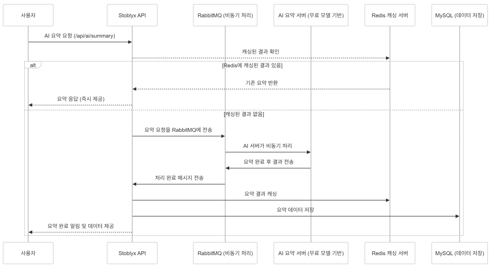
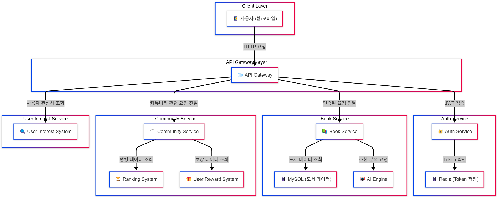
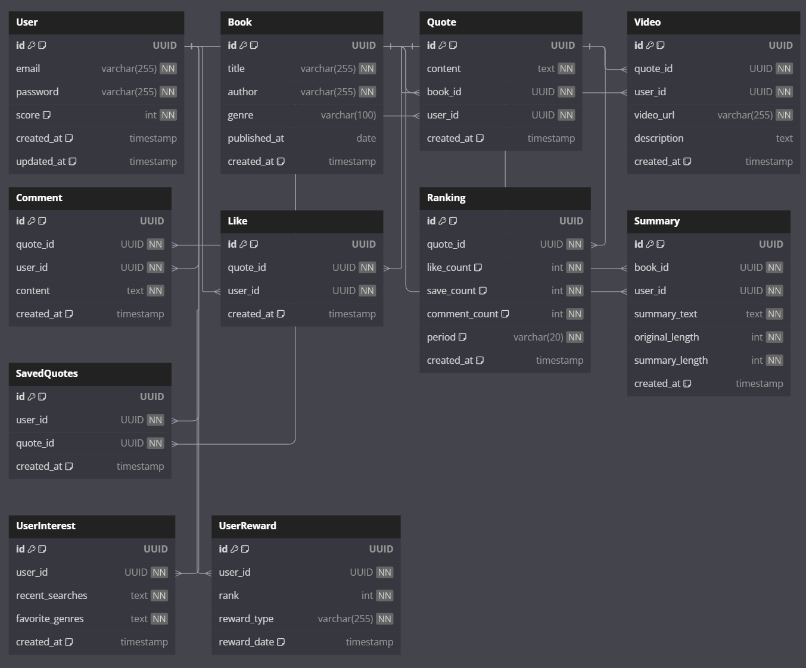
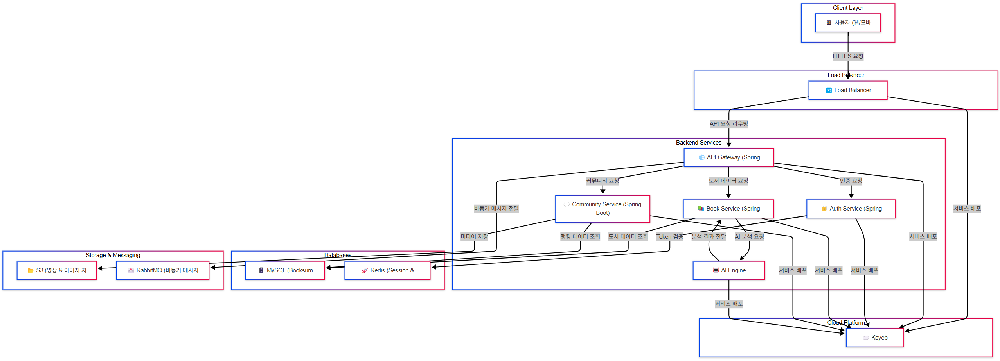

## 스토블릭스 (Stoblyx) - 이야기의 오벨리스크

### **Stoblyx = Story + Obelisk**

**"책 속의 한 문장은 사라지지 않는다. 그것은 오벨리스크처럼 남아, 사람들에게 영감을 준다."**

책 속 문장 하나하나가 디지털 기념비(Obelisk)처럼 기억되고, AI를 통해 숏폼 영상으로 재탄생하는 곳.

과거, 현재, 미래를 잇는 독서의 타임캡슐.

## 목차

1. [프로젝트 개요](#1-프로젝트-개요)
2. [Why Stoblyx?](#2-why-stoblyx)
3. [Stoblyx만의 차별점](#3-stoblyx만의-차별점)
4. [아키텍처 설계](#4-아키텍처-설계)
5. [주요 기능](#5-주요-기능)
6. [데이터베이스 설계](#6-데이터베이스-설계)
7. [API 문서](#7-api-문서)
8. [개발 환경 설정](#8-개발-환경-설정)
9. [보안 및 확장성 고려 사항](#9-보안-및-확장성-고려-사항)
10. [트러블슈팅](#10-트러블슈팅)
11. [프로젝트 구조](#11-프로젝트-구조)
12. [테스트](#12-테스트)
13. [성능 최적화](#13-성능-최적화)
14. [배포 환경](#14-배포-환경)
15. [개발자 노트](#15-개발자-노트)
16. [라이선스](#16-라이선스)

---

### 1. 프로젝트 개요

**프로젝트명:** 스토블릭스 (Stoblyx)

**개발 기간:** 1개월 (2025년 2월 ~ 2025년 3월)

**주요 기술 스택**

- Backend: Java 17, Spring Boot 3.4.2
- Database: MySQL 8.0.41
- Cache: Redis 7.0.15
- Security: JWT, Spring Security
- AI Integration
    - 텍스트 요약: KoBART (한국어 최적화 오픈소스 모델)
    - 영상 생성: Pika Labs (AI 기반 숏폼 영상 생성, 실시간 생성 X)
    - 음성 변환: Google Cloud TTS (텍스트 음성 변환, 실시간 생성 X)
- Deployment: Koyeb

**아키텍처:** 헥사고날 아키텍처 (Hexagonal Architecture / Ports and Adapters)

- 헥사고날 아키텍처 채택 이유
    - 도메인 로직의 독립성 보장
    - 외부 시스템과의 결합도 감소
    - 테스트 용이성 향상
    - 기술 스택 변경에 유연한 대응
    - 마이크로서비스 전환 용이성

### 시스템 흐름도



---

### 2. Why Stoblyx?

1. **문제 인식**
    - MZ세대의 독서 감소 현상
    - 숏폼 콘텐츠 선호도 증가
    - 의미있는 문장들이 잊혀지는 현실

2. **해결 방안**
    - 책 속 문장들을 현대적으로 재해석
    - AI 기술로 새로운 가치 창출
    - 게이미피케이션으로 참여 유도

3. **기대 효과**
    - 독서 문화 활성화
    - 세대간 문화 격차 해소
    - 지식 공유 플랫폼으로 성장

---

### 3. Stoblyx만의 차별점

#### 1. AI 기반 문구 → 숏폼 영상 변환 (자막 포함)

- 사용자가 검색한 **키워드를 기반으로 AI가 관련 유사한 것을 찾아 영상으로 변환**
- 영상에는 **책 표지, 주요 문장, AI가 선택한 배경 이미지, 자동 자막**이 포함됨
- 감성 분석 후 **사용자의 관심사에 맞는 BGM 자동 매칭**

**예시**

- 사용자가 "인생을 바꾸는 책" 검색
- AI가 관련된 \*\*책 속 문장과 최대한 유사한 것을 매칭
- **배경 이미지 + 텍스트 애니메이션 + 자막 + BGM** 자동 생성
- 숏폼 영상으로 제공

#### 2. 검색어 기반 유저 추천 (협업 필터링 매칭)

- 사용자가 특정 키워드(예: "철학", "자기계발", "소설") 검색 시, **비슷한 관심사를 가진 사용자 추천**
- 추천 기준
    - 최근 검색한 키워드
    - 좋아요/저장한 문구 데이터
    - 활동 패턴 (자주 보는 책 장르)

**예시**

1. 사용자가 "자기계발" 검색 → 관련 콘텐츠 표시
2. 같은 키워드에 관심 있는 사용자 리스트 추천

#### 3. 게이미피케이션 - 롤(LOL) 계급 기반 등급 시스템

- **활동에 따라 랭크 부여** (브론즈 → 실버 → 골드 → 플래티넘 → 다이아)
- **랭크에 따른 추가 기능 제공**

| 랭크       | 조건                    |
|----------|-----------------------|
| **브론즈**  | 기본 기능 사용 가능           |
| **실버**   | 인기 문구 TOP 10 확인 가능    |
| **골드**   | 좋아요 100+ 문구 보관함 사용 가능 |
| **플래티넘** | AI 추천 영상 제작 가능        |
| **다이아**  | 트렌드 피드에 본인 콘텐츠 노출     |

### 랭킹 보상 시스템

**보상 지급 대상:** **TOP 50 유저**

| 순위          | 보상 내용                           |
|-------------|---------------------------------|
| **1위~3위**   | AI 추천 문구 영상 커스텀 제작 + 독서 상품권 5만원 |
| **4위~10위**  | 독서 상품권 3만원                      |
| **11위~30위** | 전자책 쿠폰 2만원                      |
| **31위~50위** | 독서 포인트 1만점 (Stoblyx 내 사용 가능)    |

**랭킹 리셋 주기:** **매월 1일**

### 사용자 클릭 시 관심사 상세 보기

#### 사용자 관심사 조회 API

`GET /api/v1/users/{userId}/interests`

### 기술적 특징

1. **성능 최적화**

    - 다층 캐싱 전략 (Local, Redis)
    - 비동기 처리 (CompletableFuture)
    - 데이터베이스 인덱싱 최적화

2. **보안 강화**

    - JWT 기반 인증/인가
    - API 요청 Rate Limiting
    - XSS, CSRF 방어

3. **모니터링 및 운영**
    - 분산 로깅 (ELK Stack)
    - 성능 메트릭 수집 (Prometheus)
    - 실시간 알림 시스템

---

### 4. 아키텍처 설계

#### 아키텍처 특징

1. **모놀리식 아키텍처**
    - 단일 애플리케이션으로 구성
    - 향후 마이크로서비스 전환 고려한 설계(현실적으로 X)
    - 명확한 컴포넌트 분리

2. **헥사고날 아키텍처 적용**
    - 도메인 중심 설계
    - 포트와 어댑터 패턴 활용
    - 외부 시스템과의 결합도 최소화

   ```markdown
   핵심 계층
   - Domain Layer: 비즈니스 로직
   - Application Layer: 유스케이스
   - Adapter Layer: 외부 시스템 연동
   ```

#### 주요 컴포넌트

1. **사용자 관리**
    - 회원가입/로그인
    - JWT 기반 인증
    - 권한 관리

2. **게시글 관리**
    - 문구 CRUD
    - 검색 기능
    - 권한 처리

3. **AI 서비스 연동**
    - 외부 AI API 통합
    - 비동기 처리
    - 결과 캐싱

4. **랭킹/보상 시스템**
    - Redis 기반 랭킹
    - 자동 보상 지급
    - 활동 점수 계산

### 아키텍처 다이어그램



#### 1. Client Layer

- **사용자 인터페이스**
    - 웹 애플리케이션
    - 모바일 애플리케이션
- **통신 방식**: HTTP/HTTPS 프로토콜

#### 2. API Gateway Layer

- **API Gateway**
    - 모든 클라이언트 요청의 단일 진입점
    - 요청 라우팅 및 로드 밸런싱
    - 인증/인가 처리
    - 요청/응답 변환

#### 3. Service Layer

##### 3.1 User Interest Service

- **기능**: 사용자 관심사 분석 및 추천
- **주요 컴포넌트**: User Interest System
- **데이터 처리**: 사용자 행동 패턴 분석, 관심사 매칭
- **기술 스택**
    - Spring Boot
    - MySQL (사용자 관심사 데이터)
    - Redis (캐싱)

##### 3.2 Community Service

- **Ranking System**

    - 사용자 활동 점수 계산
    - 실시간 랭킹 업데이트
    - Redis 기반 랭킹 데이터 관리

- **User Reward System**
    - 보상 정책 관리
    - 자동 보상 지급
    - 보상 이력 추적

##### 3.3 Book Service

- **도서 데이터 관리**

    - MySQL 기반 도서 정보 저장
    - 도서 메타데이터 관리
    - 검색 기능 제공

- **AI Engine**
    - 텍스트 요약 (KoBART)
    - 영상 생성 (Pika Labs)
    - 음성 변환 (Google Cloud TTS)

##### 3.4 Auth Service

- **인증 관리**
    - JWT 기반 인증
    - Redis Token 저장소
    - 접근 권한 관리
    - 보안 정책 적용

#### 4. 서비스 간 통신

- **동기 통신**: REST API
- **비동기 통신**: 이벤트 기반 메시징 (RabbitMQ)
- **데이터 일관성**: Eventual Consistency 모델 적용

#### 5. 데이터 저장소

- **MySQL**: 도서 데이터, 사용자 데이터
- **Redis**
    - 토큰 저장
    - 랭킹 데이터
    - 캐시 데이터
- **Elasticsearch**: 전문 검색

#### 6. 모니터링 및 로깅

- **시스템 모니터링**: Prometheus + Grafana
- **로그 관리**: ELK Stack
- **성능 추적**: Spring Cloud Sleuth

### 5. 주요 기능

#### 회원가입 및 로그인

- **사용자 인증 및 권한 관리**

    - JWT 기반 인증 시스템
    - Access Token과 Refresh Token 분리 운영
    - Redis 기반의 토큰 관리

- **보안 정책**
    - Bcrypt를 통한 비밀번호 암호화
    - API Rate Limiting (Redis 기반)
    - JWT 블랙리스트 관리 (로그아웃, 토큰 무효화)

#### 게시글 관리 시스템

- **검색 기능**

    - 키워드 기반 전문 검색 (Elasticsearch)
    - 필터링 (카테고리, 날짜, 작성자 등)
    - 정렬 옵션 (최신순, 인기순, 관련도순)
    - 검색 결과 하이라이팅

- **게시글 CRUD**

    - 작성: 마크다운 에디터 지원
    - 조회: 페이징 처리된 목록 view
    - 수정: 작성자 본인만 가능
    - 삭제: 작성자 본인만 가능
    - 임시저장 기능

- **권한 관리**

    - 비로그인: 조회만 가능
    - 로그인: 작성 가능
    - 본인 게시글: 수정/삭제 가능
    - 관리자: 모든 권한
    - 부적절한 컨텐츠 신고 기능

- **부가 기능**
    - 게시글 좋아요/북마크
    - 댓글/대댓글
    - 게시글 공유
    - 조회수 통계
    - 인기글 알고리즘

#### 책 속 문구 검색 & AI 추천

- **검색 시스템**

    - Elasticsearch 기반 전문 검색
    - 문맥 기반 유사도 검색
    - 멀티필드 검색 지원 (제목, 저자, 내용)

- **캐싱 전략**
    - Redis 다층 캐싱
    - 캐시 무효화 정책

#### AI 요약 및 영상 추천 기능

- **비동기 처리 시스템**

- **메시지 큐 기반 처리**
    - RabbitMQ를 통한 비동기 작업 처리
    - 재시도 정책 구현

#### 독서 컬렉션 & 커뮤니티

- **실시간 상호작용**

    - WebSocket 기반 실시간 알림
    - SSE를 통한 실시간 업데이트

- **데이터 일관성**
    - 낙관적 락을 통한 동시성 제어
    - 트랜잭션 관리

#### 이달의 인기 문구 및 이벤트 알림

- **집계 처리**

    - 배치 처리를 통한 통계 집계
    - Redis 기반 실시간 카운터

- **알림 시스템**
    - 이메일, 푸시 알림 통합
    - 알림 설정 개인화

---

### 6. 데이터베이스 설계

#### 설계 원칙

1. **정규화 원칙**

    - 3NF까지 정규화 적용
    - 성능을 고려한 선택적 반정규화

2. **인덱스 전략**

    - 복합 인덱스 활용
    - 커버링 인덱스 구현

3. **파티셔닝 전략**
    - 시간 기반 파티셔닝 (로그, 이력 테이블)
    - 범위 파티셔닝 (대용량 데이터)

### ERD 다이어그램



### 성능 최적화

1. **쿼리 최적화**

    - 인덱스 활용 최적화
    - N+1 문제 해결을 위한 fetch join 사용

2. **캐시 전략**

    - 엔티티 캐시
    - 쿼리 캐시

3. **트랜잭션 관리**
    - 트랜잭션 격리 수준 최적화
    - 데드락 방지 전략

---

### 7. API 문서

### 공통 사항

#### API 버전 관리

- 모든 API는 `/api/v1`을 기본 경로로 사용
- 버전 변경 시 하위 호환성 유지
- 새로운 버전은 `/api/v2/...` 형식으로 제공

#### 인증

- Bearer Token 방식의 JWT 인증 사용
- Authorization 헤더에 토큰 포함

#### 엔티티 설계

#### 주요 엔티티 설계

#### **1. User (사용자)**

사용자는 Stoblyx 플랫폼을 이용하는 회원을 의미합니다. 이메일과 비밀번호를 사용하여 인증되며, 문구 저장, 좋아요, 댓글 작성 등의 활동을 수행할 수 있습니다.

**주요 속성**

- `id` (UUID, PK) - 사용자 고유 식별자
- `email` (VARCHAR(255), NN) - 사용자 이메일 (고유 값)
- `password` (VARCHAR(255), NN) - 암호화된 비밀번호
- `score` (INT, NN, default: 0) - 사용자 활동 점수 (랭킹 계산용)
- `created_at` (TIMESTAMP) - 계정 생성 날짜 및 시간
- `updated_at` (TIMESTAMP) - 계정 정보 업데이트 날짜 및 시간

---

#### **2. UserInterest (사용자 관심사)**

사용자의 최근 검색어 및 선호 장르를 저장하는 테이블

**주요 속성**

- `id` (UUID, PK) - 관심사 고유 식별자
- `user_id` (UUID, FK, NN) - 사용자 ID
- `recent_searches` (TEXT, NN) - 최근 검색어 목록
- `favorite_genres` (TEXT, NN) - 사용자의 선호 장르
- `created_at` (TIMESTAMP) - 관심사 저장 날짜
- ***

#### **3. UserReward (사용자 보상)**

랭킹 기반 보상 정보를 저장하는 테이블

**주요 속성**

- `id` (UUID, PK) - 보상 고유 식별자
- `user_id` (UUID, FK, NN) - 사용자 ID
- `rank` (INT, NN) - 사용자의 랭킹 위치
- `reward_type` (VARCHAR(255), NN) - 지급된 보상 유형
- `reward_date` (TIMESTAMP) - 보상 지급 날짜

---

#### **4. Ranking (랭킹)**

문구(Quote)의 인기도를 측정하는 엔티티

**주요 속성**

- `id` (UUID, PK) - 랭킹 고유 식별자
- `quote_id` (UUID, FK, NN) - 랭킹을 집계할 문구 ID
- `like_count` (INT, NN) - 해당 문구의 좋아요 수
- `save_count` (INT, NN) - 해당 문구의 저장 횟수
- `comment_count` (INT, NN) - 해당 문구의 댓글 수
- `period` (VARCHAR(20), NN) - 집계 기간 (예: "weekly", "monthly")
- `created_at` (TIMESTAMP) - 데이터 등록 날짜 및 시간

---

#### **5. Book (책)**

Book 엔티티는 저장된 문구(Quote)가 속한 책의 정보를 관리합니다.

**주요 속성**

- `id` (UUID, PK) - 책 고유 식별자
- `title` (VARCHAR(255), NN) - 책 제목
- `author` (VARCHAR(255), NN) - 저자
- `genre` (VARCHAR(100)) - 책 장르
- `published_at` (DATE) - 출판일
- `created_at` (TIMESTAMP) - 데이터 생성 날짜 및 시간

---

#### **6. Quote (문구)**

사용자가 저장한 책 속 문구를 관리하는 엔티티입니다. 특정 책(Book)에 속하며, 사용자(User)에 의해 추가됩니다.

**주요 속성**

- `id` (UUID, PK) - 문구 고유 식별자
- `content` (TEXT, NN) - 저장된 문구 내용
- `book_id` (UUID, FK, NN) - 해당 문구가 속한 책의 ID
- `user_id` (UUID, FK, NN) - 문구를 등록한 사용자 ID
- `created_at` (TIMESTAMP) - 문구 등록 날짜 및 시간

---

#### **7. Comment (댓글)**

Comment 엔티티는 특정 문구(Quote)에 대한 사용자 의견을 저장하는 역할을 합니다.

**주요 속성**

- `id` (UUID, PK) - 댓글 고유 식별자
- `quote_id` (UUID, FK, NN) - 해당 댓글이 속한 문구 ID
- `user_id` (UUID, FK, NN) - 댓글을 작성한 사용자 ID
- `content` (TEXT, NN) - 댓글 내용
- `created_at` (TIMESTAMP) - 댓글 작성 날짜 및 시간

---

#### **8. Like (좋아요)**

사용자가 특정 문구(Quote)에 대해 좋아요를 남길 수 있도록 관리하는 엔티티입니다.

**주요 속성**

- `id` (UUID, PK) - 좋아요 고유 식별자
- `quote_id` (UUID, FK, NN) - 좋아요를 누른 문구 ID
- `user_id` (UUID, FK, NN) - 좋아요를 누른 사용자 ID
- `created_at` (TIMESTAMP) - 좋아요 등록 날짜 및 시간

---

#### **9. SavedQuotes (저장한 문구)**

사용자가 관심 있는 문구를 저장할 수 있도록 관리하는 엔티티입니다.

**주요 속성**

- `id` (UUID, PK) - 저장한 문구 고유 식별자
- `user_id` (UUID, FK, NN) - 문구를 저장한 사용자 ID
- `quote_id` (UUID, FK, NN) - 저장된 문구 ID
- `created_at` (TIMESTAMP) - 저장된 날짜 및 시간

---

#### **10. Video (영상)**

문구(Quote)와 관련된 영상 정보를 저장하는 엔티티입니다.

**주요 속성**

- `id` (UUID, PK) - 영상 고유 식별자
- `quote_id` (UUID, FK, NN) - 연관된 문구 ID
- `user_id` (UUID, FK) - 영상을 등록한 사용자 ID (필요 시)
- `video_url` (VARCHAR(255), NN) - 영상 URL
- `description` (TEXT) - 영상 설명
- `created_at` (TIMESTAMP) - 등록 날짜 및 시간

---

#### **11. Summary (요약)**

책(Book)의 내용을 요약한 정보를 저장하는 엔티티입니다.

**주요 속성**

- `id` (UUID, PK) - 요약 고유 식별자
- `book_id` (UUID, FK, NN) - 요약된 책 ID
- `user_id` (UUID, FK) - 요약을 생성한 사용자 ID (필요 시)
- `summary_text` (TEXT, NN) - 요약 내용
- `original_length` (INT, NN) - 원본 텍스트 길이
- `summary_length` (INT, NN) - 요약된 텍스트 길이
- `created_at` (TIMESTAMP) - 요약 등록 날짜 및 시간

---

### **API 엔드포인트 상세 설명**

---

### **1. 랭킹 API**

#### **랭킹 조회**

- **Endpoint**: `GET /api/v1/users/ranking?limit=100`

  **사용자의 랭킹을 조회하는 API로, 상위 100명의 랭킹을 반환**

#### **사용자 관심사 조회**

- **Endpoint**: `GET /api/v1/users/{userId}/interests`

---

### **2. 인증 API**

#### **회원가입**

- **Endpoint**: `POST /api/v1/auth/register`

  사용자가 회원가입을 할 수 있도록 하는 API입니다. 사용자는 `username`, `email`, `password`를 입력하여 계정을 생성할 수 있습니다.

- **요청 (Request)**
    - `username` (문자열, 필수) - 사용자 이름
    - `email` (문자열, 필수) - 사용자 이메일
    - `password` (문자열, 필수) - 사용자 비밀번호
- **응답 (Response)**
    - `id` (UUID) - 생성된 사용자 고유 식별자
    - `username` (문자열) - 사용자 이름
    - `email` (문자열) - 사용자 이메일
    - `created_at` (타임스탬프) - 계정 생성 날짜 및 시간

#### **로그인**

- **Endpoint**: `POST /api/v1/auth/login`

  사용자가 로그인할 수 있도록 하는 API입니다. 로그인 성공 시 JWT 토큰이 반환됩니다.

- **요청 (Request)**
    - `email` (문자열, 필수) - 사용자 이메일
    - `password` (문자열, 필수) - 사용자 비밀번호
- **응답 (Response)**
    - `access_token` (문자열) - 인증된 사용자에게 부여되는 JWT 토큰
    - `expires_in` (정수) - 토큰 만료 시간

---

### **3. 문구(Quote) API**

#### **문구 목록 조회**

- **Endpoint**: `GET /api/v1/quotes`

  전체 문구 목록을 페이징하여 조회하는 API입니다. 사용자는 특정 페이지, 페이지 크기, 정렬 기준을 설정하여 요청할 수 있습니다.

- **요청 (Request)**
    - `page` (정수, 선택) - 페이지 번호 (기본값: 0)
    - `size` (정수, 선택) - 페이지 크기 (기본값: 20)
    - `sort` (문자열, 선택) - 정렬 기준 (예: `createdAt,desc`)
- **응답 (Response)**
    - `quotes` (배열) - 문구 목록
    - `totalElements` (정수) - 전체 문구 개수
    - `totalPages` (정수) - 전체 페이지 수

#### **문구 검색**

- **Endpoint**: `GET /api/v1/quotes/search`

  사용자가 특정 키워드를 입력하여 문구를 검색할 수 있도록 하는 API입니다.

- **요청 (Request)**
    - `keyword` (문자열, 필수) - 검색어
    - `page` (정수, 선택) - 페이지 번호
    - `size` (정수, 선택) - 페이지 크기
- **응답 (Response)**
    - `quotes` (배열) - 검색된 문구 목록
    - `totalElements` (정수) - 검색된 문구 개수

---

### **4. AI 추천 API**

#### **문구 기반 영상 추천**

- **Endpoint**: `GET /api/v1/quotes/{quoteId}/recommendations`

  특정 문구와 관련된 영상을 AI가 추천하여 제공하는 API입니다.

- **요청 (Request)**
    - `quoteId` (UUID, 필수) - 추천할 문구의 ID
- **응답 (Response)**
    - `videos` (배열) - 추천된 영상 목록
    - `video_url` (문자열) - 영상 URL
    - `description` (문자열) - 영상 설명

---

### **5. 커뮤니티 API**

#### **댓글 작성**

- **Endpoint**: `POST /api/v1/quotes/{quoteId}/comments`
  특정 문구에 대해 사용자가 댓글을 작성할 수 있도록 하는 API입니다.
- **요청 (Request)**
    - `quoteId` (UUID, 필수) - 댓글을 작성할 문구의 ID
    - `user_id` (UUID, 필수) - 댓글을 작성한 사용자 ID
    - `content` (문자열, 필수) - 댓글 내용
- **응답 (Response)**
    - `id` (UUID) - 생성된 댓글의 고유 식별자
    - `created_at` (타임스탬프) - 댓글 생성 날짜 및 시간

#### **좋아요 토글**

- **Endpoint**: `POST /api/v1/quotes/{quoteId}/likes`
  특정 문구에 대해 사용자가 좋아요를 누르거나 취소할 수 있도록 하는 API입니다.
- **요청 (Request)**
    - `quoteId` (UUID, 필수) - 좋아요를 누를 문구의 ID
    - `user_id` (UUID, 필수) - 좋아요를 누른 사용자 ID
- **응답 (Response)**
    - `status` (문자열) - "liked" 또는 "unliked" (좋아요 상태)

---

### **API 보안**

#### **1. Rate Limiting (요청 제한)**

    - 특정 시간 내에 동일한 IP 또는 사용자에 대해 과도한 API 요청을 방지하기 위한 제한 정책을 적용합니다.
    - 예: 1분에 100회 요청 제한 (초과 시 `429 Too Many Requests` 응답)

#### **2. 입력 값 검증**

    - 사용자의 입력 값이 올바른 형식인지 검증하여 SQL Injection, XSS 등의 보안 취약점을 방지합니다.
    - 예: 이메일 형식 검증, 비밀번호 길이 제한, 특수문자 허용 여부 설정

#### **3. CORS 설정**

    - 클라이언트에서 API에 접근할 수 있도록 Cross-Origin Resource Sharing(CORS) 정책을 설정합니다.
    - 예: 특정 도메인에서만 API 요청을 허용하거나, 모든 도메인에서 접근 가능하도록 설정 가능 (`Access-Control-Allow-Origin`)

---

### 8. 개발 환경 설정

1. **필수 요구사항**

    - JDK 17
    - MySQL 8.0.41
    - Redis 7.0.15

2. **환경변수 설정**

#### 로컬 개발 환경 구성

1. **데이터베이스 설정**

   ```sql
   CREATE DATABASE stoblyx_db;
   CREATE USER 'stoblyx'@'localhost' IDENTIFIED BY 'your_password';
   GRANT ALL PRIVILEGES ON stoblyx_data.* TO 'stoblyx'@'localhost';
   ```

2. **Redis 설정**

   ```bash
   # Mac OS
   brew install redis
   brew services start redis

   # Ubuntu
   sudo apt-get install redis-server
   sudo systemctl start redis
   ```

#### 애플리케이션 실행

1. **소스코드 클론**

   ```bash
   git clone https://github.com/yourusername/stoblyx.git
   cd stoblyx
   ```

2. **프로젝트 빌드**

   ```bash
   ./gradlew clean build
   ```

3. **애플리케이션 실행**
   ```bash
   ./gradlew bootRun
   ```

#### Docker 환경 실행

```bash
# Docker Compose로 실행
docker-compose up -d

# 개별 컨테이너 실행
docker run -d --name mysql -p 3306:3306 -e MYSQL_ROOT_PASSWORD=root mysql:8.0.41
docker run -d --name redis -p 6379:6379 redis:7.0.15
docker run -d --name stoblyx -p 8080:8080 stoblyx:latest
```

#### 테스트

```bash
# 전체 테스트 실행
./gradlew test

# 특정 테스트 실행
./gradlew test --tests "com.stoblyx.api.QuoteControllerTest"
```

#### API 문서 확인

- Swagger UI: `http://localhost:8080/swagger-ui.html`
- API 문서: `http://localhost:8080/v3/api-docs`

### 9. 보안 및 확장성 고려 사항

---

#### **1. 인증 및 인가**

- **개선 사항**
    - **JWT 서명 알고리즘 명시**
      ```markdown
      - JWT 서명 알고리즘으로 HMAC SHA256을 사용하여 토큰 무결성 보장
      ```
    - **RBAC 구현 예시 추가**
      ```markdown
      - 관리자 전용 API는 `@PreAuthorize("hasRole('ADMIN')")` 애노테이션으로 접근 제한
      ```

---

#### **2. JWT 토큰 관리**

- **개선 사항**
    - **Access Token 유효 기간 구체화**
      ```markdown
      - Access Token 유효 기간: 30분
      - Refresh Token 유효 기간: 7일
      ```
    - **로그아웃 시 Access Token 처리**
      ```markdown
      - 로그아웃 시 Access Token의 남은 유효 시간을 Redis에 저장하여 강제 만료 처리
      ```

---

#### **3. 데이터 암호화**

- **개선 사항**
    - **암호화 대상 필드 명시**
      ```markdown
      - 사용자 이메일: AES-256 암호화 적용
      - 프로필 정보: RSA를 이용한 암호화
      ```
    - **HTTPS 추가 설명**
      ```markdown
      - TLS 1.3 프로토콜 적용 및 Let's Encrypt 인증서 사용
      ```

---

#### **4. XSS 방지**

- **개선 사항**
    - **입력값 검증 예시**
      ```markdown
      - 사용자 입력값에 대해 정규식(`^[a-zA-Z0-9가-힣 ]*$`)으로 특수문자 필터링
      ```
    - **CSP 정책 명시**
      ```markdown
      - `Content-Security-Policy: default-src 'self'; script-src 'self' https://trusted-cdn.com`
      ```

---

#### **5. 캐시 계층**

- **개선 사항**
    - **TTL 구체화**
      ```markdown
      - 인기 문구 목록: 1시간
      - AI 추천 결과: 24시간
      ```
    - **캐시 전략 명시**
      ```markdown
      - Cache-Aside 전략 적용: 캐시 미스 시 DB 조회 후 결과 캐싱
      ```

---

#### **6. 비동기 처리**

- **개선 사항**
    - **메시지 큐 선택 이유**
      ```markdown
      - **RabbitMQ** 채택 이유: Lightweight하고 Spring AMQP와의 호환성 우수
      ```
    - **재시도 정책 추가**
      ```markdown
      - 작업 실패 시 최대 3회 재시도, 지수 백오프(Exponential Backoff) 적용
      ```

---

### 10. 트러블슈팅

ex)

#### 1. AI 모델 통합 지연

- **문제 상황**: KoBART 모델 로딩 시간이 길어 API 응답 지연
- **해결 방안**: 모델 초기화를 비동기로 처리하고, 추론 시 GPU 가속 활용

---

### 11. 프로젝트 구조

#### 헥사고날 아키텍처 (Hexagonal Architecture / Ports and Adapters)

```
src/
├── main/
│   ├── java/
│   │   └── com/
│   │       └── stoblyx/
│   │           ├── domain/                   # 도메인 계층 - 비즈니스 로직을 담당
│   │           │   ├── model/                # 도메인 모델 - 핵심 엔티티 및 값 객체 정의
│   │           │   │   ├── quote/            # 문구(Quote) 관련 도메인 모델
│   │           │   │   ├── user/             # 사용자(User) 관련 도메인 모델
│   │           │   │   ├── userinterest/     # 사용자 관심사 관련 도메인 모델 추가
│   │           │   │   ├── ranking/          # 사용자 랭킹 관련 도메인 모델 추가
│   │           │   │   ├── reward/           # 사용자 보상 관련 도메인 모델 추가
│   │           │   ├── port/                 # 포트 인터페이스 - 애플리케이션과 외부 시스템 간의 경계를 정의
│   │           │   │   ├── in/               # 인바운드 포트 - 클라이언트 요청을 처리하는 인터페이스 (API, 이벤트 등)
│   │           │   │   └── out/              # 아웃바운드 포트 - 데이터베이스, 외부 API와 상호작용하는 인터페이스
│   │           │   └── service/              # 도메인 서비스 - 도메인 간의 복잡한 비즈니스 로직 처리
│   │           │       ├── UserRankingService.java    # 랭킹 서비스 추가
│   │           │       ├── UserRewardService.java     # 보상 서비스 추가
│   │           │       ├── AITextSummaryService.java  # AI 요약 서비스 추가
│   │           ├── adapter/                 # 어댑터 계층 - 포트 인터페이스를 구현하여 실제 데이터 흐름을 처리
│   │           │   ├── in/                  # 인바운드 어댑터 - 클라이언트에서 들어오는 요청을 처리
│   │           │   │   ├── web/             # REST API 컨트롤러 - HTTP 요청을 처리하는 어댑터
│   │           │   │   └── event/           # 이벤트 핸들러 - 메시지 큐, 비동기 이벤트를 처리
│   │           │   │       ├── AITextSummaryEventListener.java  # 비동기 AI 요약 이벤트 리스너 추가
│   │           │   └── out/                  # 아웃바운드 어댑터 - 외부 시스템과 연동하는 구현체
│   │           │       ├── persistence/      # 데이터베이스 연동 (JPA Repository, DAO 등)
│   │           │       │   ├── UserInterestRepository.java  # 관심사 저장소 추가
│   │           │       │   ├── RankingRepository.java       # 랭킹 저장소 추가
│   │           │       │   ├── UserRewardRepository.java    # 보상 저장소 추가
│   │           │       ├── external/         # 외부 API 연동 (예: 무료 AI 요약 API, 도서 정보 API 등)
│   │           │       │   ├── AITextSummaryClient.java    # AI 요약 서비스 클라이언트 추가
│   │           └── common/                   # 공통 모듈 - 전역적으로 사용되는 유틸리티 및 설정
│   │               ├── config/               # 설정 관련 클래스 (예: Spring Security, JWT 설정 등)
│   │               ├── exception/            # 예외 처리 관련 클래스 (예: 글로벌 예외 핸들러)
│   │               └── util/                 # 공통적으로 사용되는 유틸리티 클래스 (예: 암호화, 날짜 변환)
│   └── resources/                            # 설정 및 정적 리소스 파일
│       ├── application.yml                   # 기본 환경 설정 파일
│       ├── application-local.yml             # 로컬 개발 환경용 설정 파일
│       └── application-prod.yml              # 운영 환경용 설정 파일
└── test/                                     # 테스트 코드 디렉터리
    └── java/
        └── com/
            └── stoblyx/
                ├── domain/                   # 도메인 계층 테스트 (비즈니스 로직 검증)
                ├── application/              # 애플리케이션 계층 테스트 (유스케이스 검증)
                ├── adapter/                  # 어댑터 계층 테스트 (API 및 외부 연동 테스트)

```

### **주요 컴포넌트 설명**

---

#### **1. 도메인 계층 (Domain Layer)**

- **개선 사항**
    - **Aggregate Root 명시**
      ```markdown
      - `User`와 `Quote`는 각각 Aggregate Root로, 하위 엔티티(예: `Comment`, `Like`)를 관리
      ```
    - **도메인 이벤트 예시**
      ```markdown
      - `QuoteCreatedEvent`: 문구 생성 시 이벤트 발행, 비동기 처리로 알림 전송
      ```

---

#### **2. 포트 인터페이스 (Port Interface)**

- **개선 사항**
    - **인바운드 포트 예시**
      ```markdown
      - `UserServicePort`: 사용자 관련 비즈니스 로직 인터페이스
      - `QuoteServicePort`: 문구 관련 비즈니스 로직 인터페이스
      ```
    - **아웃바운드 포트 예시**
      ```markdown
      - `UserRepositoryPort`: 사용자 데이터 조회 및 저장 인터페이스
      - `QuoteRepositoryPort`: 문구 데이터 조회 및 저장 인터페이스
      ```

---

#### **3. 어댑터 구현 (Adapter Implementation)**

- **개선 사항**
    - **인바운드 어댑터 예시**
      ```markdown
      - `UserController`: 사용자 관련 REST API 컨트롤러
      - `QuoteController`: 문구 관련 REST API 컨트롤러
      ```
    - **아웃바운드 어댑터 예시 추가**
      ```markdown
      - `JpaUserRepository`: JPA를 이용한 사용자 데이터 저장소 구현
      - `JpaQuoteRepository`: JPA를 이용한 문구 데이터 저장소 구현
      ```

---

#### **4. 공통 모듈 (Common Module)**

- **개선 사항**
    - **유틸리티 클래스 예시**
      ```markdown
      - `DateUtils`: 날짜 변환 및 계산 유틸리티
      - `EncryptionUtils`: AES-256 암호화 유틸리티
      ```
    - **예외 처리 예시**
      ```markdown
      - `GlobalExceptionHandler`: 전역 예외 처리 클래스
      - `CustomException`: 사용자 정의 예외 클래스
      ```

---

#### **5. 테스트 계층 (Test Layer)**

- **개선 사항**
    - **테스트 범위 명시**
      ```markdown
      - 도메인 계층 테스트: 비즈니스 로직 검증
      - 어댑터 계층 테스트: API 및 외부 연동 검증
      ```
    - **테스트 도구 예시**
      ```markdown
      - JUnit 5: 단위 테스트
      - Mockito: 모의 객체 생성
      ```

---

### 12. 테스트

#### 단위 테스트

- JUnit을 활용한 서비스 계층 테스트
- 주요 비즈니스 로직 검증

#### 통합 테스트

- API 엔드포인트 테스트
- 데이터베이스 연동 테스트

---

### 13. 성능 최적화

#### 캐싱 전략

- Redis를 활용한 기본적인 캐싱
- 자주 조회되는 데이터 캐싱

#### 인덱싱

- 주요 검색 필드 인덱스 적용
- 복합 인덱스 활용

### 14. 배포 환경

#### 배포 아키텍처



#### 배포 환경

- **배포 플랫폼**: Koyeb
- **데이터베이스**: MySQL 8.0.41
- **캐시**: Redis 7.0.15

#### 배포 프로세스

1. **GitHub Repository 연동**

- Koyeb 대시보드에서 GitHub Repository 선택
- `main` 브랜치 자동 배포 설정

2. **환경 변수 설정**

   ```bash
   SPRING_PROFILES_ACTIVE=prod
   DB_URL=${KOYEB_MYSQL_URL}
   DB_USERNAME=${KOYEB_MYSQL_USER}
   DB_PASSWORD=${KOYEB_MYSQL_PASSWORD}
   JWT_SECRET=${JWT_SECRET_KEY}
   ```

3. **자동 배포**

- `main` 브랜치에 push 시 자동 빌드 및 배포
- Koyeb 대시보드에서 빌드 상태 모니터링 가능

#### 배포 URL

ex) `https://stoblyx.koyeb.app`

#### 배포 모니터링

- Spring Actuator를 통한 기본 모니터링
- 로그 기록 및 관리

---

### 15. **개발자 노트**

**도전 과제**

- 헥사고날 아키텍처 적용 과정에서의 고민
- 성능 최적화를 위한 기술적 선택
- 확장성을 고려한 설계 결정

**배운 점**

- 클린 아키텍처의 실제 적용
- 도메인 주도 설계의 이해
- 성능과 확장성의 균형

---

### **16. 라이선스**

이 프로젝트는 **개인 포트폴리오 목적**으로 공개된 것으로, 다음과 같은 조건에 따라 사용할 수 있습니다.

#### **사용 가능**

- 개인 학습 및 참고 용도로 자유롭게 활용 가능
- 프로젝트 내용을 공유할 경우, 반드시 출처 명시

#### **제한 사항 (CC BY-NC-ND 4.0 적용)**

- **상업적 사용 불가**: 프로젝트의 일부 또는 전체를 상업적 용도로 사용할 수 없음
- **수정 및 배포 금지**: 코드를 수정하여 배포하거나, 별도의 프로젝트로 재사용할 수 없음
- **출처 명시 필수**: 원본을 유지하더라도 반드시 출처를 밝혀야 함

© 2025 Stoblyx.  
이 프로젝트는 [CC BY-NC-ND 4.0 라이선스](https://creativecommons.org/licenses/by-nc-nd/4.0/deed.ko)에 따라 보호됩니다.

