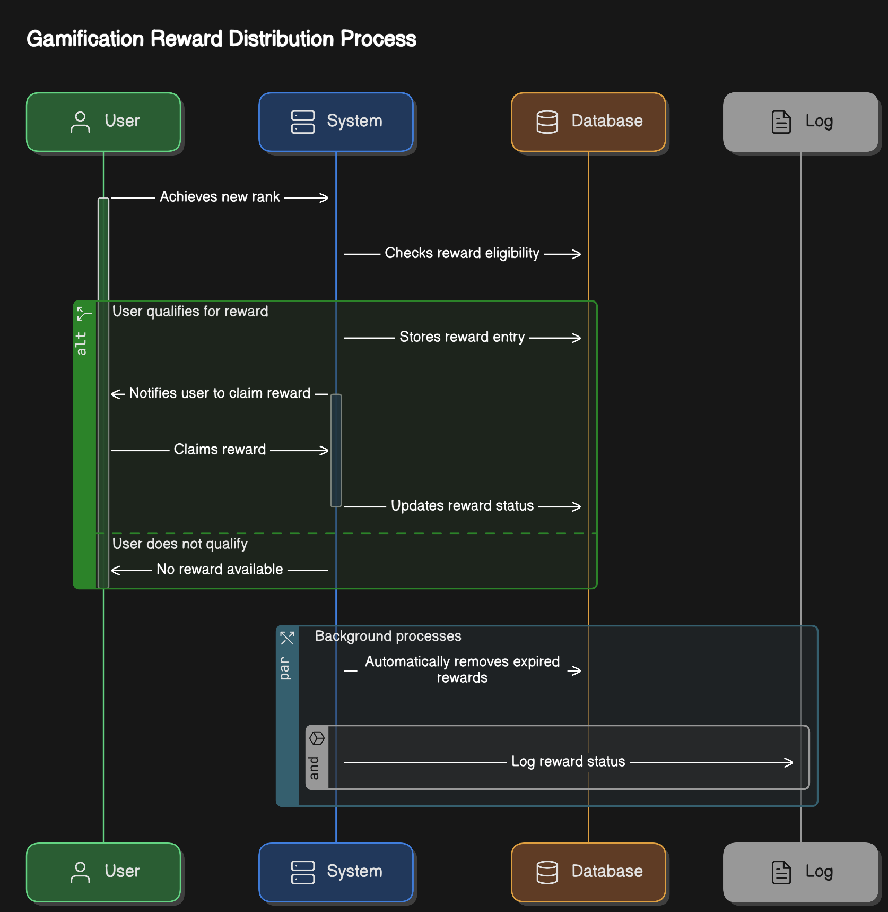

## 스토블릭스 (Stoblyx) - 이야기의 오벨리스크

### **Stoblyx = Story + Obelisk**

"책 속의 한 문장은 사라지지 않는다. 그것은 오벨리스크처럼 남아, 사람들에게 영감을 준다."

책 속 문장 하나하나가 디지털 기념비(Obelisk)처럼 기억되고, AI를 통해 숏폼 영상으로 재탄생하는 곳. 과거, 현재, 미래를 잇는 독서의 타임캡슐.


---

## 1. 프로젝트 개요

**프로젝트명:** 스토블릭스 (Stoblyx)  
**개발 기간:** 

### 기술 스택

#### Backend


#### Database


##### 데이터베이스 모델

데이터베이스는 사용자, 콘텐츠, 상호작용, 랭킹 시스템 등 다양한 도메인으로.구성된 총 30개 이상의 테이블을 포함합니다.

**주요 콘텐츠 관련 테이블**

- `book`: 도서 정보 (제목, 저자, ISBN, 출판사 등)
- `quotes`: 도서에서 발췌한 인용구
- `summaries`: 도서 요약 정보
- `quote_summaries`: 인용구에 대한 AI 생성 요약
- `SHORT_FORM_CONTENTS`: 숏폼 콘텐츠(비디오, 오디오 등)
- `media_resources`: 콘텐츠 관련 미디어 자원(비디오, 오디오 파일 등)

**사용자 관련 테이블**

- `users`: 사용자 계정 정보
- `user_interests`: 사용자 관심사
- `auth`: 인증 및 토큰 정보
- `user_similarities`: 사용자 간 유사도 정보

**상호작용 관련 테이블**

- `likes`: 인용구 좋아요 정보
- `comments`: 인용구 댓글
- `saved_quotes`: 저장된 인용구
- `CONTENT_INTERACTION`: 콘텐츠와의 상호작용 정보
- `content_comments`: 콘텐츠 댓글
- `content_likes`: 콘텐츠 좋아요
- `content_bookmarks`: 북마크된 콘텐츠

**게이미피케이션 & 랭킹 관련 테이블**

- `ranking_user_score`: 사용자 랭킹 점수 및 상태 정보
- `ranking_user_activity`: 사용자 활동 로그
- `ranking_leaderboard`: 리더보드 정보
- `ranking_badge`: 사용자 획득 가능 뱃지
- `ranking_achievement`: 사용자 업적 정보
- `gamification_rewards`: 게이미피케이션 보상 정보

**검색 & 기타 테이블**

- `search`: 사용자 검색 기록
- `search_term_profiles`: 검색어 프로필 정보
- `popular_search_terms`: 인기 검색어 정보
- `posts`: 사용자 포스트
- `system_settings`: 시스템 설정 정보

##### ER 다이어그램

<div align="center">
  
</div>

## 데이터베이스 설계

### 주요 테이블 및 관계

### 공통 기본 클래스

- **BaseTimeEntity**

  - 모든 엔티티가 상속받는 시간 관련 기본 클래스
  - 필드
    - created_at: TIMESTAMP - 생성 시간, @CreatedDate, @Column(updatable = false)
    - modified_at: TIMESTAMP - 수정 시간, @LastModifiedDate
  - JPA의 @EntityListeners(AuditingEntityListener.class) 적용

- **BaseEntity**
  - BaseTimeEntity을 확장한 공통 기본 클래스
  - 필드
    - is_deleted: BOOLEAN - 삭제 여부, @Column(nullable = false, default = false)
  - 메서드: delete(), restore(), isDeleted(), updateModifiedAt()

### 도메인 엔티티

- **User (사용자)**

  - 테이블: `users`
  - 필드
    - id: BIGINT - 기본키, @Id @GeneratedValue(strategy = GenerationType.IDENTITY)
    - username: VARCHAR(50) - 사용자 아이디, @NotEmpty, @Column(unique = true)
    - password: VARCHAR(255) - 암호화된 비밀번호, @NotEmpty, @JsonIgnore
    - nickname: VARCHAR(50) - 사용자 별명
    - email: VARCHAR(100) - 이메일 주소, @Email, @Column(unique = true)
    - profileImageUrl: VARCHAR(255) - 프로필 이미지 경로
    - role: VARCHAR(20) - 사용자 권한 (USER, ADMIN 등)
    - accountStatus: VARCHAR(20) - 계정 상태 (ACTIVE, SUSPENDED, INACTIVE)
    - lastLoginAt: TIMESTAMP - 마지막 로그인 시간
    - created_at: TIMESTAMP
    - modified_at: TIMESTAMP
    - is_deleted: BOOLEAN - 삭제 여부
  - 관계: searches, quotes, comments, likes, savedQuotes (OneToMany)
  - 관계: auth, userInterest (OneToOne)

- **Auth (인증 정보)**

  - 테이블: `auth`
  - 필드
    - id: BIGINT - 기본키, @Id @GeneratedValue(strategy = GenerationType.IDENTITY)
    - user_id: BIGINT - 사용자 ID
    - refreshToken: VARCHAR(255) - 리프레시 토큰
    - tokenType: VARCHAR(20) - 토큰 타입, 기본값 "Bearer"
    - expiryDate: TIMESTAMP - 만료 시간
    - lastUsedAt: TIMESTAMP - 마지막 사용 시간
    - created_at: TIMESTAMP
    - modified_at: TIMESTAMP
    - is_deleted: BOOLEAN - 삭제 여부

- **UserInterest (사용자 관심사)**

  - 테이블: `user_interests`
  - 필드
    - id: BIGINT - 기본키, @Id @GeneratedValue(strategy = GenerationType.IDENTITY)
    - user_id: BIGINT - 사용자 ID
    - interests: TEXT - 관심사 목록
    - created_at: TIMESTAMP
    - modified_at: TIMESTAMP
    - is_deleted: BOOLEAN - 삭제 여부

- **Book (도서)**

  - 테이블: `book`
  - 필드
    - id: BIGINT - 기본키, @Id @GeneratedValue(strategy = GenerationType.IDENTITY)
    - title: VARCHAR(255) - 도서 제목, @NotEmpty
    - author: VARCHAR(100) - 저자, @NotEmpty
    - isbn: VARCHAR(13) - ISBN
    - description: VARCHAR(2000) - 도서 설명
    - publisher: VARCHAR(100) - 출판사
    - publishDate: DATE - 출판일
    - thumbnailUrl: VARCHAR(255) - 썸네일 URL
    - publicationYear: INTEGER - 출판 연도
    - totalPages: INTEGER - 총 페이지 수
    - avgReadingTime: INTEGER - 평균 독서 시간(분)
    - averageRating: DOUBLE - 평균 평점, default = 0.0
    - ratingCount: INTEGER - 평점 개수, default = 0
    - popularity: INTEGER - 인기도, default = 0
    - created_at: TIMESTAMP
    - modified_at: TIMESTAMP
    - is_deleted: BOOLEAN - 삭제 여부

- **Quote (문구)**

  - 테이블: `quotes`
  - 필드
    - id: BIGINT - 기본키, @Id @GeneratedValue(strategy = GenerationType.IDENTITY)
    - content: TEXT - 문구 내용, @NotEmpty
    - page: INT - 페이지 번호
    - memo: TEXT - 사용자 메모
    - like_count: INTEGER - 좋아요 수, default = 0
    - save_count: INTEGER - 저장 수, default = 0
    - user_id: BIGINT - 문구 등록자
    - book_id: BIGINT - 문구가 속한 책
    - created_at: TIMESTAMP
    - modified_at: TIMESTAMP
    - is_deleted: BOOLEAN - 삭제 여부

- **QuoteSummary (문구 요약)**

  - 테이블: `quote_summaries`
  - 필드
    - id: BIGINT - 기본키, @Id @GeneratedValue(strategy = GenerationType.IDENTITY)
    - content: VARCHAR(1000) - 요약 내용, @NotEmpty
    - algorithm: VARCHAR(50) - 사용된 알고리즘 (ex: "GPT-4")
    - generatedAt: TIMESTAMP - 생성 시간
    - quality: DOUBLE - 요약 품질 점수, default = 0.0
    - quote_id: BIGINT - 원본 문구 ID
    - created_at: TIMESTAMP
    - modified_at: TIMESTAMP
    - is_deleted: BOOLEAN - 삭제 여부

- **Summary (책 요약)**

  - 테이블: `summaries`
  - 필드
    - id: BIGINT - 기본키, @Id @GeneratedValue(strategy = GenerationType.IDENTITY)
    - book_id: BIGINT - 요약된 책 ID
    - content: TEXT - 요약 내용, @NotEmpty
    - chapter: VARCHAR(100) - 챕터 정보
    - page: VARCHAR(50) - 페이지 정보
    - deleted: BOOLEAN - 삭제 여부, default = false
    - created_at: TIMESTAMP
    - modified_at: TIMESTAMP
    - is_deleted: BOOLEAN - 삭제 여부

- **Comment (댓글)**

  - 테이블: `comments`
  - 필드
    - id: BIGINT - 기본키, @Id @GeneratedValue(strategy = GenerationType.IDENTITY)
    - content: TEXT - 댓글 내용, @NotEmpty
    - user_id: BIGINT - 댓글 작성자
    - quote_id: BIGINT - 연관된 문구
    - created_at: TIMESTAMP
    - modified_at: TIMESTAMP
    - is_deleted: BOOLEAN - 삭제 여부

- **ContentComment (콘텐츠 댓글)**

  - 테이블: `content_comments`
  - 필드
    - id: BIGINT - 기본키, @Id @GeneratedValue(strategy = GenerationType.IDENTITY)
    - content: TEXT - 댓글 내용, @NotEmpty
    - user_id: BIGINT - 댓글 작성자
    - content_id: BIGINT - 연관된 콘텐츠
    - created_at: TIMESTAMP
    - modified_at: TIMESTAMP
    - is_deleted: BOOLEAN - 삭제 여부

- **Like (좋아요)**

  - 테이블: `likes`
  - 필드
    - id: BIGINT - 기본키, @Id @GeneratedValue(strategy = GenerationType.IDENTITY)
    - user_id: BIGINT - 좋아요한 사용자
    - quote_id: BIGINT - 좋아요된 문구
    - created_at: TIMESTAMP

- **ContentLike (콘텐츠 좋아요)**

  - 테이블: `content_likes`
  - 필드
    - id: BIGINT - 기본키, @Id @GeneratedValue(strategy = GenerationType.IDENTITY)
    - user_id: BIGINT - 좋아요한 사용자
    - content_id: BIGINT - 좋아요된 콘텐츠
    - created_at: TIMESTAMP
    - modified_at: TIMESTAMP
    - is_deleted: BOOLEAN - 삭제 여부

- **SavedQuote (저장된 문구)**

  - 테이블: `saved_quotes`
  - 필드
    - id: BIGINT - 기본키, @Id @GeneratedValue(strategy = GenerationType.IDENTITY)
    - user_id: BIGINT - 저장한 사용자
    - quote_id: BIGINT - 저장된 문구
    - created_at: TIMESTAMP

- **ContentBookmark (콘텐츠 북마크)**

  - 테이블: `content_bookmarks`
  - 필드
    - id: BIGINT - 기본키, @Id @GeneratedValue(strategy = GenerationType.IDENTITY)
    - user_id: BIGINT - 북마크한 사용자
    - content_id: BIGINT - 북마크된 콘텐츠
    - created_at: TIMESTAMP
    - modified_at: TIMESTAMP
    - is_deleted: BOOLEAN - 삭제 여부

- **Post (게시물)**

  - 테이블: `posts`
  - 필드
    - id: BIGINT - 기본키, @Id @GeneratedValue(strategy = GenerationType.IDENTITY)
    - title: VARCHAR(255) - 제목, @NotEmpty
    - content: TEXT - 내용, @NotEmpty
    - user_id: BIGINT - 게시물 작성자
    - post_type: VARCHAR(50) - 게시물 유형
    - view_count: INT - 조회수, default = 0
    - like_count: INT - 좋아요 수, default = 0
    - comment_count: INT - 댓글 수, default = 0
    - status: VARCHAR(20) - 게시물 상태
    - created_at: TIMESTAMP
    - modified_at: TIMESTAMP
    - is_deleted: BOOLEAN - 삭제 여부

- **ShortFormContent (숏폼 콘텐츠)**

  - 테이블: `SHORT_FORM_CONTENTS`
  - 필드
    - id: BIGINT - 기본키, @Id @GeneratedValue(strategy = GenerationType.IDENTITY)
    - title: VARCHAR(100) - 콘텐츠 제목, @NotEmpty
    - description: VARCHAR(1000) - 콘텐츠 설명
    - status: VARCHAR(20) - 콘텐츠 상태
    - contentType: VARCHAR(50) - 콘텐츠 유형
    - viewCount: INT - 조회수, default = 0
    - likeCount: INT - 좋아요 수, default = 0
    - shareCount: INT - 공유 수, default = 0
    - commentCount: INT - 댓글 수, default = 0
    - deleted: BOOLEAN - 삭제 여부, default = false
    - duration: INT - 콘텐츠 길이(초)
    - subtitles: TEXT - 자막 내용
    - videoUrl: TEXT - 비디오 URL
    - thumbnailUrl: TEXT - 썸네일 URL
    - audioUrl: TEXT - 오디오 URL
    - book_id: BIGINT - 연관된 책
    - quote_id: BIGINT - 연관된 문구
    - created_at: TIMESTAMP
    - modified_at: TIMESTAMP
    - is_deleted: BOOLEAN - 삭제 여부

- **MediaResource (미디어 리소스)**

  - 테이블: `media_resources`
  - 필드
    - id: BIGINT - 기본키, @Id @GeneratedValue(strategy = GenerationType.IDENTITY)
    - content_id: BIGINT - 연관된 콘텐츠 ID
    - type: VARCHAR(50) - 미디어 타입
    - url: TEXT - 리소스 URL, @NotEmpty
    - thumbnailUrl: VARCHAR(255) - 썸네일 URL
    - description: VARCHAR(1000) - 리소스 설명
    - duration: INT - 미디어 길이(초)
    - created_at: TIMESTAMP
    - modified_at: TIMESTAMP
    - is_deleted: BOOLEAN - 삭제 여부

- **Search (검색 기록)**

  - 테이블: `search`
  - 필드
    - id: BIGINT - 기본키, @Id @GeneratedValue(strategy = GenerationType.IDENTITY)
    - user_id: BIGINT - 검색한 사용자 ID
    - search_term: VARCHAR(255) - 검색어, @NotEmpty
    - search_type: VARCHAR(50) - 검색 유형
    - search_count: INT - 검색 횟수, default = 1
    - last_searched_at: TIMESTAMP - 마지막 검색 시간
    - created_at: TIMESTAMP
    - modified_at: TIMESTAMP
    - is_deleted: BOOLEAN - 삭제 여부

- **ContentInteraction (콘텐츠 상호작용)**

  - 테이블: `CONTENT_INTERACTION`
  - 필드
    - id: BIGINT - 기본키, @Id @GeneratedValue(strategy = GenerationType.IDENTITY)
    - user_id: BIGINT - 상호작용한 사용자
    - content_id: BIGINT - 대상 콘텐츠
    - liked: BOOLEAN - 좋아요 여부, default = false
    - bookmarked: BOOLEAN - 북마크 여부, default = false
    - viewedAt: TIMESTAMP - 조회 시간
    - created_at: TIMESTAMP
    - modified_at: TIMESTAMP
    - is_deleted: BOOLEAN - 삭제 여부

- **UserSimilarity (사용자 유사도)**

  - 테이블: `user_similarities`
  - 필드
    - id: BIGINT - 기본키, @Id @GeneratedValue(strategy = GenerationType.IDENTITY)
    - source_user_id: BIGINT - 소스 사용자 ID
    - target_user_id: BIGINT - 타겟 사용자 ID
    - similarity_score: DOUBLE - 유사도 점수
    - is_active: BOOLEAN - 활성화 여부, default = true
    - created_at: TIMESTAMP
    - modified_at: TIMESTAMP
    - is_deleted: BOOLEAN - 삭제 여부

- **SystemSetting (시스템 설정)**

  - 테이블: `system_settings`
  - 필드
    - id: BIGINT - 기본키, @Id @GeneratedValue(strategy = GenerationType.IDENTITY)
    - setting_key: VARCHAR(100) - 설정 키, @Column(unique = true)
    - setting_value: VARCHAR(1000) - 설정 값
    - description: VARCHAR(500) - 설정 설명
    - category: VARCHAR(50) - 설정 카테고리
    - is_encrypted: BOOLEAN - 암호화 여부, default = false
    - is_system_managed: BOOLEAN - 시스템 관리 여부, default = false
    - last_modified_by: BIGINT - 마지막 수정자 ID
    - default_value: VARCHAR(1000) - 기본값
    - validation_pattern: VARCHAR(255) - 유효성 검사 패턴
    - created_at: TIMESTAMP
    - modified_at: TIMESTAMP
    - is_deleted: BOOLEAN - 삭제 여부

- **SearchTermProfile (검색어 프로필)**

  - 테이블: `search_term_profiles`
  - 필드
    - id: BIGINT - 기본키, @Id @GeneratedValue(strategy = GenerationType.IDENTITY)
    - search_term: VARCHAR(255) - 검색어
    - search_count: INT - 검색 횟수, default = 0
    - user_demographic_data: TEXT - 사용자 인구통계 데이터
    - related_terms: TEXT - 관련 검색어
    - trend_data: TEXT - 트렌드 데이터
    - created_at: TIMESTAMP
    - modified_at: TIMESTAMP
    - is_deleted: BOOLEAN - 삭제 여부

- **RankingUserScore (사용자 랭킹 점수)**

  - 테이블: `ranking_user_score`
  - 필드
    - id: BIGINT - 기본키, @Id @GeneratedValue(strategy = GenerationType.IDENTITY)
    - user_id: BIGINT - 사용자 ID, @Column(nullable = false, unique = true)
    - current_score: INT - 현재 점수, @Column(nullable = false), default = 1000
    - previous_score: INT - 이전 점수
    - rank_type: VARCHAR(20) - 랭크 타입, @Enumerated(EnumType.STRING), @Column(nullable = false)
    - last_activity_date: TIMESTAMP - 마지막 활동 시간
    - created_at: TIMESTAMP - 생성 시간, @Column(nullable = false)
    - modified_at: TIMESTAMP - 수정 시간
    - suspicious_activity: BOOLEAN - 의심스러운 활동 여부, @Column(nullable = false), default = false
    - report_count: INT - 신고 횟수, @Column(nullable = false), default = 0
    - account_suspended: BOOLEAN - 계정 정지 여부, @Column(nullable = false), default = false
  - 메서드
    - updateScoreWithEWMA(int newActivityScore, double alpha): 가중 이동 평균 알고리즘을 적용하여 점수 업데이트
    - incrementReportCount(int suspensionThreshold): 신고 횟수 증가 및 계정 정지 여부 확인
    - decayScoreForInactivity(double decayFactor): 비활동 기간에 따른 점수 감소

- **RankingUserActivity (사용자 랭킹 활동)**

  - 테이블: `ranking_user_activity`
  - 필드
    - id: BIGINT - 기본키, @Id @GeneratedValue(strategy = GenerationType.IDENTITY)
    - user_id: BIGINT - 사용자 ID
    - activity_type: VARCHAR(50) - 활동 유형
    - points: INT - 점수
    - activity_date: TIMESTAMP - 활동 날짜
    - reference_id: BIGINT - 참조 ID
    - reference_type: VARCHAR(50) - 참조 타입
    - created_at: TIMESTAMP
    - modified_at: TIMESTAMP
    - is_deleted: BOOLEAN - 삭제 여부

- **RankingLeaderboard (랭킹 리더보드)**

  - 테이블: `ranking_leaderboard`
  - 필드
    - id: BIGINT - 기본키, @Id @GeneratedValue(strategy = GenerationType.IDENTITY)
    - user_id: BIGINT - 사용자 ID
    - username: VARCHAR(50) - 사용자명
    - score: INT - 점수
    - rank_type: VARCHAR(20) - 랭크 타입
    - leaderboard_type: VARCHAR(20) - 리더보드 타입
    - rank_position: INT - 순위
    - period_start_date: TIMESTAMP - 기간 시작일
    - period_end_date: TIMESTAMP - 기간 종료일
    - created_at: TIMESTAMP - 생성 날짜
    - updated_at: TIMESTAMP - 수정 날짜

- **RankingBadge (랭킹 뱃지)**

  - 테이블: `ranking_badge`
  - 필드
    - id: BIGINT - 기본키, @Id @GeneratedValue(strategy = GenerationType.IDENTITY)
    - name: VARCHAR(100) - 뱃지 이름
    - description: VARCHAR(500) - 뱃지 설명
    - image_url: VARCHAR(255) - 뱃지 이미지 URL
    - badge_type: VARCHAR(50) - 뱃지 타입
    - requirement_type: VARCHAR(50) - 획득 요구사항 타입
    - threshold_value: INT - 획득 임계값
    - points_awarded: INT - 보상 포인트, default = 0
    - created_at: TIMESTAMP
    - modified_at: TIMESTAMP
    - is_deleted: BOOLEAN - 삭제 여부

- **RankingAchievement (랭킹 업적)**

  - 테이블: `ranking_achievement`
  - 필드
    - id: BIGINT - 기본키, @Id @GeneratedValue(strategy = GenerationType.IDENTITY)
    - user_id: BIGINT - 사용자 ID
    - badge_id: BIGINT - 뱃지 ID
    - achieved_at: TIMESTAMP - 업적 달성 시간
    - created_at: TIMESTAMP
    - modified_at: TIMESTAMP
    - is_deleted: BOOLEAN - 삭제 여부

- **GamificationReward (게이미피케이션 보상)**

  - 테이블: `gamification_rewards`
  - 필드
    - id: BIGINT - 기본키, @Id @GeneratedValue(strategy = GenerationType.IDENTITY)
    - user_id: BIGINT - 사용자 ID
    - reward_type: VARCHAR(50) - 보상 유형
    - points: INT - 포인트, default = 0
    - description: VARCHAR(255) - 보상 설명
    - reference_id: BIGINT - 참조 ID
    - reference_type: VARCHAR(50) - 참조 타입
    - is_claimed: BOOLEAN - 지급 여부, default = false
    - expiry_date: TIMESTAMP - 만료 일시
    - created_at: TIMESTAMP
    - modified_at: TIMESTAMP
    - is_deleted: BOOLEAN - 삭제 여부

- **PopularSearchTerm (인기 검색어)**

  - 테이블: `popular_search_terms`
  - 필드
    - id: BIGINT - 기본키, @Id @GeneratedValue(strategy = GenerationType.IDENTITY)
    - search_term: VARCHAR(255) - 검색어
    - search_count: INT - 검색 횟수, default = 0
    - last_searched_at: TIMESTAMP - 마지막 검색 시간
    - period_type: VARCHAR(20) - 기간 타입
    - period_start: TIMESTAMP - 기간 시작일
    - period_end: TIMESTAMP - 기간 종료일
    - created_at: TIMESTAMP
    - modified_at: TIMESTAMP
    - is_deleted: BOOLEAN - 삭제 여부

### 열거형 (Enums)

- **ContentStatus (콘텐츠 상태)**

  - PROCESSING: 처리중
  - COMPLETED: 생성 완료
  - FAILED: 생성 실패
  - PUBLISHED: 공개됨

- **ContentType (콘텐츠 유형)**

  - VIDEO: 비디오
  - AUDIO: 오디오
  - IMAGE: 이미지
  - TEXT: 텍스트
  - MIXED: 혼합 형식

- **ActivityType (활동 유형)**

  - LIKE: 좋아요
  - SAVE: 저장
  - COMMENT: 댓글
  - REPORT: 신고
  - QUOTE_CREATE: 인용구 작성
  - CONTENT_LIKE: 콘텐츠 좋아요
  - COMMENT_CREATE: 댓글 작성

- **RankType (랭크 유형)**

  - BRONZE: 브론즈 (0 ~ 999점)
  - SILVER: 실버 (1000 ~ 1999점)
  - GOLD: 골드 (2000 ~ 2999점)
  - PLATINUM: 플래티넘 (3000 ~ 3999점)
  - DIAMOND: 다이아몬드 (4000점 이상)
  - 메서드: fromScore(int score) - 점수에 따른 랭크 타입 반환

- **RewardType (보상 유형)**

  - DAILY_LOGIN: 일일 로그인
  - ACHIEVEMENT: 업적 달성
  - BONUS_POINTS: 보너스 포인트
  - WEEKLY_EXPERIENCE: 주간 경험치
  - EVENT_INVITATION: 이벤트 초대권
  - ADMIN_RECOMMENDATION: 관리자 추천

- **SettingCategory (설정 카테고리)**
  - UPLOAD: 업로드 설정
  - API: API 설정
  - GENERAL: 일반 설정
  - SYSTEM: 시스템 설정
  - SECURITY: 보안 설정
  - USER: 사용자 설정
  - CONTENT: 콘텐츠 설정
  - RANKING: 랭킹 설정
  - CACHE: 캐시 설정
  - GAMIFICATION: 게이미피케이션 설정
  - NOTIFICATION: 알림 설정
  - STATISTICS: 통계 설정
  - ETC: 기타 설정

### 엔티티 관계도

#### 사용자 관련 관계

- **User ↔ Auth**: 사용자와 인증 정보 (1:1)
- **User ↔ UserInterest**: 사용자와 관심사 (1:1)
- **User ↔ Quote**: 사용자가 작성한 문구 (1:N)
- **User ↔ Comment**: 사용자가 작성한 댓글 (1:N)
- **User ↔ Like**: 사용자가 좋아요한 문구 (1:N)
- **User ↔ ContentLike**: 사용자가 좋아요한 콘텐츠 (1:N)
- **User ↔ SavedQuote**: 사용자가 저장한 문구 (1:N)
- **User ↔ ContentBookmark**: 사용자가 북마크한 콘텐츠 (1:N)
- **User ↔ Post**: 사용자가 작성한 게시물 (1:N)
- **User ↔ Search**: 사용자의 검색 기록 (1:N)
- **User ↔ ContentInteraction**: 사용자의 콘텐츠 상호작용 (1:N)
- **User ↔ UserSimilarity**: 사용자 간 유사도 (1:N, 양방향)
- **User ↔ RankingUserScore**: 사용자와 랭킹 점수 (1:1)
- **User ↔ RankingUserActivity**: 사용자와 랭킹 활동 (1:N)
- **User ↔ RankingAchievement**: 사용자와 뱃지 업적 (1:N)
- **User ↔ GamificationReward**: 사용자와 게이미피케이션 보상 (1:N)

#### 도서 관련 관계

- **Book ↔ Quote**: 책에 포함된 문구 (1:N)
- **Book ↔ Summary**: 책의 요약 (1:N)
- **Book ↔ ShortFormContent**: 책 기반 숏폼 콘텐츠 (1:N)

#### 문구 관련 관계

- **Quote ↔ Comment**: 문구에 달린 댓글 (1:N)
- **Quote ↔ Like**: 문구에 대한 좋아요 (1:N)
- **Quote ↔ SavedQuote**: 저장된 문구 (1:N)
- **Quote ↔ ShortFormContent**: 문구 기반 숏폼 콘텐츠 (1:N)
- **Quote ↔ QuoteSummary**: 문구와 그 요약 (1:N)

#### 콘텐츠 관련 관계

- **ShortFormContent ↔ MediaResource**: 콘텐츠와 미디어 자원 (1:N)
- **ShortFormContent ↔ ContentComment**: 콘텐츠와 댓글 (1:N)
- **ShortFormContent ↔ ContentLike**: 콘텐츠에 대한 좋아요 (1:N)
- **ShortFormContent ↔ ContentBookmark**: 콘텐츠에 대한 북마크 (1:N)
- **ShortFormContent ↔ ContentInteraction**: 콘텐츠 상호작용 (1:N)

#### 랭킹 및 게이미피케이션 관련 관계

- **RankingBadge ↔ RankingAchievement**: 뱃지와 사용자 업적 (1:N)
- **User ↔ RankingLeaderboard**: 사용자와 리더보드 항목 (1:N)
- **User ↔ RankingUserScore**: 사용자와 랭킹 점수 (1:1)
- **RankingUserScore ↔ RankType**: 사용자 점수와 랭크 타입 (N:1)

#### 검색 관련 관계

- **SearchTermProfile ↔ PopularSearchTerm**: 검색어 프로필과 인기 검색어 (N:M)

#### Security


#### CI/CD & Testing


#### Messaging & Async


#### AI Integration


#### Environment & Configuration


#### 테스트


#### Deployment


## 개발 도구


---

## 2. Why Stoblyx?

### 문제 인식

- MZ세대의 독서율 감소 현상
- 숏폼 콘텐츠 소비 증가 추세
- 기존 독서 플랫폼의 젊은 세대 유입 한계

### 해결 방안

- AI 기반 독서 콘텐츠의 숏폼 변환 기술 도입
- 게이미피케이션을 통한 독서 동기 부여
- 소셜 기능을 통한 독서 커뮤니티 형성

### 기대 효과

- 독서 문화의 디지털 전환 및 활성화
- 지식 공유 플랫폼으로서의 성장 가능성
- 세대 간 독서 격차 해소 및 독서 습관 형성

---

## 3. Stoblyx만의 차별점

### 1. AI 기반 문구 → 숏폼 슬라이드 이미지 및 영상 변환

- 키워드 기반 문구 추출 및 자동 슬라이드 이미지 및 영상 생성
- 이미지 요소: 책 표지, 문장, 배경 이미지, 자막, 감성 기반 BGM 적용
- 비동기 처리 및 폴백 전략으로 안정적인 서비스 제공

### 2. 검색어 기반 유저 추천

- 협업 필터링을 활용한 사용자 맞춤 추천 시스템
- 추천 기준: 최근 검색어, 좋아요/저장 데이터, 활동 패턴

### 3. 게이미피케이션 & 랭킹 시스템

| 랭크     | 조건                       | 혜택                                |
| -------- | -------------------------- | ----------------------------------- |
| 브론즈   | 기본 기능 사용 가능        | 일일 콘텐츠 생성 3회                |
| 실버     | 인기 문구 TOP 10 확인 가능 | 일일 콘텐츠 생성 5회, 프리미엄 BGM  |
| 골드     | 100+ 좋아요 문구 저장 가능 | 일일 콘텐츠 생성 10회, 고급 템플릿  |
| 플래티넘 | AI 추천 영상 제작 가능     | 무제한 콘텐츠 생성, 커스텀 워터마크 |
| 다이아   | 콘텐츠 트렌드 피드 노출    | 모든 혜택 + 콘텐츠 우선 노출        |

#### 랭킹 산정 공식

```
점수 = (좋아요 × 2) + (저장수 × 3) + (댓글 × 1) - (신고수 × 5)
```

#### 사용자 점수 계산 알고리즘 (EWMA)

```java
// 가중 이동 평균(EWMA) 알고리즘 적용
currentScore =(int)Math.

round(alpha *newActivityScore+(1-alpha) *currentScore);
```

- **알파값(α):** 0.2 (최근 활동에 20% 가중치 부여)
- **장점:** 점진적 점수 변화, 이상치 영향 최소화, 시계열 데이터 효과적 처리

#### 비활동 사용자 점수 감소

```java
// 비활동 사용자 점수 감소 알고리즘
currentScore =(int)Math.

round(currentScore *(1-decayFactor));
```

- **감소 계수:** 0.05 (7일마다 5% 감소)
- **목적:** 지속적 참여 유도, 랭킹 시스템 활성화, 공정한 경쟁 환경 조성

- **부정 행위 방지:** 동일 IP 다중 계정 차단 및 자동 계정 정지 정책 적용
- **랭킹 리셋 주기:** 매월 1일
- **의심스러운 활동 감지:** 점수 급증 시 자동 플래그 처리 (100점 이상 급증 시)
- **계정 정지 기능:** 신고 횟수가 임계값을 초과하면 자동 계정 정지

---

## 4. 아키텍처 설계

### 시스템 구성 및 계층 설명

<div align="center">
  
</div>

#### 설명

- **Adapter Layer:** 외부 요청 처리 (REST API), AI 서비스 호출, 메시징 시스템 통합
- **Application Layer:** 비즈니스 유스케이스 처리 및 트랜잭션 관리
- **Domain Layer:** 핵심 도메인 로직 및 엔티티 관리
- **비동기 처리:** @Async 어노테이션을 통한 백그라운드 처리로 확장성과 안정성 확보 (비동기 처리 위해 향후 RabbitMQ 구현 예정)

### 시스템 흐름도

<div align="center">
  
</div>

### AI 서비스 통합 아키텍처

- **헥사고날 아키텍처 기반 AI 서비스 통합**

  - 포트와 어댑터 패턴을 통한 외부 AI 서비스 연동
  - 도메인 로직과 AI 서비스 간의 느슨한 결합
  - 폴백 메커니즘을 통한 서비스 안정성 확보

- **AI 통합 컴포넌트**
  - `PexelsClient`: 키워드 기반 이미지/비디오 검색 및 결과 처리
  - `TTSClient`: 텍스트를 음성으로 변환하는 Python 스크립트 연동
  - `BGMClient`: 텍스트 감정 분석을 통한 BGM 선택 로직
  - `AIAdapter`: 외부 AI 서비스와의 통합 인터페이스

---

## 5. 주요 기능

### 회원 시스템

- JWT 기반 인증/인가
- Access/Refresh Token 분리 및 Redis 세션 관리
- BCrypt를 통한 비밀번호 안전 저장
- 세션 고정 공격 방지를 위한 Redis 설정 적용

### 문구 및 AI 추천 기능

- 문구 검색 및 AI 기반 영상 추천
- AI 요약 실패 시 폴백: "첫 문장 + 마지막 문장 조합" 제공
- Redis 캐싱 및 TTL 적용으로 빠른 응답 처리

### 커뮤니티 기능

- 좋아요, 댓글, 문구 저장 및 트렌드 피드 제공
- 북마크 기능을 통한 콘텐츠 저장 기능 구현

### 랭킹 및 게이미피케이션 기능

#### 1. 사용자 활동 점수 시스템

- **활동 점수 계산:** 사용자 활동(좋아요, 댓글, 저장, 콘텐츠 생성)에 따른 점수 부여
- **EWMA 알고리즘:** 최근 활동에 가중치를 부여하는 지수 가중 이동 평균 적용
- **점수 감소 메커니즘:** 비활동 사용자의 점수 자동 감소 (7일마다 5%)
- **랭크 타입 결정:** 점수 범위에 따른 5단계 랭크 자동 부여 (브론즈~다이아)
- **의심스러운 활동 감지:** 점수 급증 시 자동 플래그 처리 (100점 이상 급증 시)
- **계정 정지 기능:** 신고 횟수가 임계값을 초과하면 자동 계정 정지

#### 2. 실시간 리더보드

- **Redis Sorted Set:** O(log N) 시간 복잡도로 빠른 랭킹 업데이트
- **전체 랭킹:** 모든 사용자 대상 순위 제공
- **친구 랭킹:** 팔로우 중인 사용자 간 순위 제공
- **주간/월간 랭킹:** 기간별 활동 기준 순위 제공
- **랭킹 데이터 동기화:** 데이터베이스와 Redis 간 주기적 동기화로 데이터 일관성 유지

#### 3. 업적 및 보상 시스템

- **업적 달성:** 특정 활동 완료 시 뱃지 및 추가 점수 부여
- **레벨업 보상:** 랭크 상승 시 추가 기능 및 혜택 제공
- **일일 미션:** 매일 새로운 미션 제공으로 지속적 참여 유도

### AI 서비스 통합 기능

#### 1. Pexels API 연동

- **키워드 기반 이미지 검색:** 책 제목과 인용구를 결합한 검색어로 최적의 이미지 제공
- **키워드 기반 비디오 검색:** 숏폼에 적합한 세로형 비디오 검색 및 처리
- **API 속도 제한 대응:** 초당 요청 수 제한을 고려한 throttleRequest() 메커니즘 구현
- **응답 캐싱 시스템:** Redis 기반 캐싱으로 API 호출 최소화 (@Cacheable 적용)
- **오류 처리 및 폴백:** API 오류 발생 시 기본 이미지/비디오 제공으로 서비스 안정성 확보

#### 2. 감정 기반 BGM 선택 로직

- **텍스트 감정 분석 알고리즘:** 키워드 기반 감정 분석 시스템 구현
- **4가지 감정 분류:** happy, sad, calm, neutral 감정 인식 및 점수화
- **감정별 BGM 매핑:** 각 감정에 적합한 BGM 자동 선택
- **한국어/영어 키워드 지원:** 다국어 감정 키워드 인식 시스템

#### 3. 숏폼 콘텐츠 생성 파이프라인

- **비동기 처리:** @Async 어노테이션을 통한 백그라운드 콘텐츠 생성
- **통합 미디어 리소스:** 이미지, 비디오, 오디오, BGM, 자막을 포함한 종합 콘텐츠 생성
- **TTS(Text-to-Speech):** Python 스크립트 연동을 통한 고품질 음성 생성
- **자막 생성:** 인용구 내용 기반 자막 자동 생성
- **오류 처리 전략:** 각 단계별 오류 발생 시 적절한 폴백 메커니즘과 로깅 시스템

### 관리자 기능

#### 1. 콘텐츠 관리

- **콘텐츠 승인/반려 시스템:** 생성된 콘텐츠 검토 및 상태 관리 기능
- **콘텐츠 삭제 및 복구:** 부적절한 콘텐츠 관리 기능
- **콘텐츠 일괄 처리:** 다중 콘텐츠 상태 변경 기능
- **콘텐츠 필터링:** 키워드, 카테고리, 생성일 기준 필터링 기능

#### 2. 사용자 관리

- **사용자 정보 조회:** 전체 사용자 목록 및 상세 정보 조회 기능
- **권한 관리:** 사용자 역할(USER, ADMIN, EDITOR, WRITER) 관리 기능
- **활동 내역 조회:** 사용자별 활동 로그 확인 기능
- **계정 상태 관리:** 계정 활성화/비활성화/정지 처리 기능
- **랭킹 점수 수동 조정:** 부정 행위 사용자 점수 조정 기능

#### 3. 통계 대시보드

- **콘텐츠 생성 현황:** 일별/주별/월별 콘텐츠 생성 통계
- **사용자 활동 분석:** 신규 가입, 로그인, 콘텐츠 생성 등의 활동 분석
- **시스템 리소스 모니터링:** CPU, 메모리, 디스크 사용량 실시간 모니터링
- **랭킹 시스템 통계:** 랭크별 사용자 분포, 점수 분포, 활동 패턴 분석
- **이상 활동 탐지:** 비정상적인 점수 증가 패턴 모니터링 및 알림

#### 4. 시스템 설정 관리

- **API 키 관리:** Pexels API 키 등 외부 서비스 연동 키 관리
- **리소스 경로 설정:** 미디어 파일 저장 경로 등 시스템 설정 관리
- **캐시 관리:** Redis 캐시 수동 갱신 및 TTL 설정 기능
- **랭킹 시스템 설정:** 점수 계산 알고리즘 파라미터 조정 기능
- **게이미피케이션 설정:** 랭크별 혜택 및 조건 설정 기능
- **설정 일괄 관리:** 다중 설정 일괄 업데이트 기능
- **설정 내보내기/가져오기:** 시스템 설정 백업 및 복원 기능
- **카테고리별 설정 관리:** 설정을 카테고리별로 그룹화하여 관리

#### 5. 랭킹 사용자 점수 관리

- **사용자 점수 조회:** 개별 및 전체 사용자 점수 조회 기능
- **상위 랭킹 사용자 조회:** 최고 점수 사용자 목록 조회 기능
- **최근 점수 변경 내역 조회:** 사용자 점수 변동 이력 추적 기능
- **점수 수동 업데이트:** 관리자 권한으로 사용자 점수 조정 기능
- **점수 재계산:** 전체 사용자 점수 일괄 재계산 기능
- **의심 활동 모니터링:** 비정상적인 점수 증가 패턴 감지 기능
- **계정 정지/해제 관리:** 부정 행위 사용자 계정 관리 기능

#### 6. 로그 모니터링 (향후 구현 예정)

- **오류 로그 실시간 조회:** 시스템 오류 실시간 모니터링
- **사용자 행동 로그 분석:** 사용자 활동 패턴 분석 도구
- **AI 서비스 통합 로그:** AI 서비스 응답 시간 및 성공률 모니터링
- **랭킹 변동 로그:** 사용자 랭크 변경 및 점수 변동 이력 추적
- **의심 활동 로그:** 비정상적인 점수 증가 및 활동 패턴 로그

---

## 7. 시스템 프로세스 흐름도

### 사용자 인증 및 권한 부여 흐름

<div align="center">
  
</div>

#### 주요 프로세스

- 사용자 로그인 요청 및 인증
- JWT 액세스 및 리프레시 토큰 발급
- 토큰 검증 및 리소스 접근 권한 부여
- 토큰 만료 시 리프레시 토큰을 통한 재인증
- 보안 감사 및 로깅

### 사용자 콘텐츠 생성 및 승인 프로세스

<div align="center">
  
</div>

#### 주요 프로세스

- 사용자의 새 콘텐츠 제출
- 시스템의 콘텐츠 임시 저장 및 관리자 알림
- 관리자의 콘텐츠 승인 또는 거부
- 승인/거부에 따른 콘텐츠 상태 업데이트
- 사용자에게 결과 알림

### 검색 기록 기반 추천 프로세스

<div align="center">
  
</div>

#### 주요 프로세스

- 사용자의 도서 및 인용구 검색
- 검색 쿼리 로깅 및 저장
- 주기적인 검색 기록 분석
- 추천 엔진의 개인화된 추천 생성
- 사용자에게 맞춤형 추천 제공

### 협업 필터링 알고리즘 실행 시퀀스

<div align="center">
  
</div>

#### 주요 프로세스

- 사용자의 콘텐츠 상호작용(좋아요, 저장, 검색) 기록
- 사용자 간 유사성 점수 계산
- 사용자별 유사성 매트릭스 업데이트
- 유사 사용자 기반 도서 및 인용구 추천
- 지속적인 추천 업데이트

### 트렌딩 피드 요청 및 응답 시퀀스

<div align="center">
  
</div>

#### 주요 프로세스

- 사용자의 트렌딩 콘텐츠 요청
- 인기 콘텐츠(좋아요, 저장, 댓글 기준) 검색
- 참여도 점수 기반 콘텐츠 정렬
- 빠른 접근을 위한 인기 콘텐츠 캐싱
- 사용자에게 트렌딩 콘텐츠 제공

### 랭킹 시스템 업데이트 프로세스

<div align="center">
  
</div>

#### 주요 프로세스

- 사용자 활동(좋아요, 저장, 댓글) 기록
- EWMA 공식을 사용한 새로운 랭킹 점수 계산
- 랭크 변경 감지 및 사용자 알림
- 비활성 사용자 점수 주기적 감소
- 분석 데이터 업데이트

### 게이미피케이션 보상 배포 프로세스

<div align="center">
  
</div>

#### 주요 프로세스

- 사용자의 새 랭크 달성 감지
- 보상 자격 확인 및 처리
- 보상 정보 저장 및 사용자 알림
- 사용자의 보상 청구 및 상태 업데이트
- 만료된 보상 자동 제거 및 로깅

### 사용자 랭크 변경 알림 프로세스

<div align="center">
  
</div>

#### 주요 프로세스

- 시스템의 사용자 랭크 변경 감지
- 데이터베이스에서 랭크 변경 확인
- 알림 서비스를 통한 사용자 알림
- 보상 자격 확인 및 보상 배포 프로세스 시작
- 랭크 변경 이벤트 로깅

### 시스템 설정 관리 프로세스

<div align="center">
  
</div>

#### 주요 프로세스

- 관리자의 시스템 설정 요청 처리
- 설정 유효성 검증 및 카테고리 분류
- 설정 변경 이력 기록 및 추적
- 변경된 설정의 애플리케이션 적용
- 설정 백업 및 복원 메커니즘

### 랭킹 사용자 점수 관리 프로세스

<div align="center">
  
</div>

#### 주요 프로세스

- 사용자 활동 기반 점수 계산 (EWMA 알고리즘)
- 점수에 따른 랭크 타입 결정 및 변경
- 비활동 사용자 점수 자동 감소
- 의심스러운 활동 감지 및 플래그 처리
- 관리자의 수동 점수 조정 및 계정 정지 관리

### 랭킹 파라미터 설정 프로세스

<div align="center">
  
</div>

#### 주요 프로세스

- 관리자의 랭킹 파라미터 설정 요청
- 파라미터 유효성 검증 및 적용
- 변경된 파라미터에 따른 점수 재계산
- 랭크 분포 통계 업데이트
- 파라미터 변경 이력 기록 및 모니터링

---

## 8. API 문서

### 공통 사항

- **인증:** Bearer Token 방식 (JWT)
- **권한 요구사항:** 일부 엔드포인트는 인증 필요
- **에러 코드 및 메시지 예시**

```json
{
  "status": 403,
  "error": "Forbidden",
  "message": "접근 권한이 없습니다.",
  "timestamp": "2025-02-23T10:15:30Z"
}
```

### 주요 API 엔드포인트

#### 인증 API

- `POST /auth/signup` - 회원가입
- `POST /auth/login` - 로그인
- `POST /auth/refresh` - 토큰 갱신
- `POST /auth/logout` - 로그아웃

#### 사용자 API

- `GET /users/me` - 현재 사용자 정보 조회
- `PUT /users/me` - 사용자 정보 수정
- `DELETE /users/me` - 회원 탈퇴
- `POST /users/me/profile-image` - 프로필 이미지 업로드
- `GET /users/me/interests` - 사용자 관심사 조회
- `PUT /users/me/interests` - 사용자 관심사 수정

#### 책 API

- `GET /books` - 책 목록 조회
- `GET /books/{id}` - 책 상세 조회
- `POST /books` - 책 등록 (관리자)
- `PUT /books/{id}` - 책 정보 수정 (관리자)
- `DELETE /books/{id}` - 책 삭제 (관리자)

#### 문구 API

- `POST /quotes` - 문구 생성
- `GET /quotes/{id}` - 문구 조회
- `GET /quotes` - 문구 목록 조회
- `PUT /quotes/{id}` - 문구 수정
- `DELETE /quotes/{id}` - 문구 삭제
- `POST /quotes/{quoteId}/save` - 문구 저장
- `GET /quotes/saved` - 저장한 문구 목록 조회
- `GET /quotes/{id}/summary` - 문구 요약 조회

#### 좋아요 API

- `POST /likes/quotes/{quoteId}` - 문구 좋아요
- `DELETE /likes/quotes/{quoteId}` - 문구 좋아요 취소
- `GET /likes/quotes/{quoteId}/status` - 문구 좋아요 상태 조회
- `GET /likes/quotes/{quoteId}/count` - 문구 좋아요 수 조회

#### 콘텐츠 API

- `GET /contents/trending` - 트렌딩 콘텐츠 조회
- `GET /contents/recommended` - 추천 콘텐츠 조회
- `GET /contents/books/{bookId}` - 책별 콘텐츠 조회
- `GET /contents/search` - 콘텐츠 검색
- `GET /contents/{id}` - 콘텐츠 상세 조회
- `POST /contents/{id}/like` - 콘텐츠 좋아요 토글
- `POST /contents/{id}/bookmark` - 콘텐츠 북마크 토글
- `POST /contents/quotes/{quoteId}` - 문구로부터 콘텐츠 생성

#### 콘텐츠 댓글 API

- `POST /comments/contents/{contentId}` - 콘텐츠 댓글 작성
- `PUT /comments/{commentId}` - 콘텐츠 댓글 수정
- `DELETE /comments/{commentId}` - 콘텐츠 댓글 삭제
- `GET /comments/contents/{contentId}` - 콘텐츠 댓글 목록 조회

#### 검색 API

- `GET /search` - 통합 검색
- `GET /search/history/{userId}` - 검색 기록 조회
- `DELETE /search/history/{searchId}` - 검색 기록 삭제

#### 추천 API

- `GET /recommendations/users/{userId}` - 사용자 추천 목록 조회
- `GET /recommendations/popular-terms` - 인기 검색어 목록 조회

#### 관리자 설정 API

- `GET /admin/settings` - 모든 시스템 설정 조회
- `GET /admin/settings/category/{category}` - 카테고리별 시스템 설정 조회
- `GET /admin/settings/{key}` - 특정 키의 시스템 설정 조회
- `POST /admin/settings` - 시스템 설정 생성
- `PUT /admin/settings/{key}` - 시스템 설정 수정
- `DELETE /admin/settings/{key}` - 시스템 설정 삭제
- `GET /admin/settings/search` - 키 패턴으로 시스템 설정 검색
- `POST /admin/settings/{key}/reset` - 시스템 설정을 기본값으로 초기화
- `PUT /admin/settings/batch` - 시스템 설정 일괄 업데이트
- `GET /admin/settings/export` - 시스템 설정 내보내기
- `POST /admin/settings/import` - 시스템 설정 가져오기

#### 랭킹 API

- `GET /admin/ranking/users/{userId}/score` - 사용자 점수 조회
- `GET /admin/ranking/users/scores` - 모든 사용자 점수 조회
- `GET /admin/ranking/users/scores/top` - 상위 랭킹 사용자 조회
- `GET /admin/ranking/users/scores/recent-changes` - 최근 점수 변경 내역 조회
- `POST /admin/ranking/users/{userId}/score/update` - 사용자 점수 업데이트
- `POST /admin/ranking/users/scores/recalculate` - 모든 사용자 점수 재계산
- `GET /admin/ranking/suspicious` - 의심스러운 활동이 있는 사용자 목록 조회
- `POST /admin/ranking/users/{userId}/suspend` - 사용자 계정 정지
- `POST /admin/ranking/users/{userId}/unsuspend` - 사용자 계정 정지 해제

### AI 추천 영상 생성 API

**엔드포인트:** `/quotes/{id}/generate-video`  
**메서드:** POST  
**권한:** 인증 필요

#### 요청 예시

```json
{
  "style": "minimalist",
  "bgmType": "calm"
}
```

#### 응답 예시 (201 Created)

```json
{
  "videoId": "a1b2c3d4",
  "processingTime": 45,
  "previewUrl": "https://cdn.stoblyx.com/previews/a1b2c3d4.mp4"
}
```

---

## 9. 개발 환경 설정

### .env.example

```properties
# DB 설정
DB_HOST=localhost
DB_PORT=3306
DB_NAME=your_database_name
DB_USERNAME=your_username
DB_PASSWORD=your_password
# JWT 설정
JWT_SECRET=your_jwt_secret_key
JWT_EXPIRATION=86400
# Redis 설정
REDIS_HOST=localhost
REDIS_PORT=6379
# JPA 설정
JPA_DDL_AUTO=update
SHOW_SQL=true
# Pexels API 설정
PEXELS_API_KEY=your_pexels_api_key
# 랭킹 시스템 설정
RANKING_EWMA_ALPHA=0.2
RANKING_DECAY_FACTOR=0.05
RANKING_DECAY_DAYS=7
RANKING_SUSPICIOUS_THRESHOLD=100
RANKING_REPORT_THRESHOLD=5
```

### 테스트 환경 설정

```properties
# 테스트용 DB 설정
spring.datasource.url=jdbc:h2:mem:testdb
spring.datasource.driverClassName=org.h2.Driver
spring.datasource.username=sa
spring.datasource.password=
spring.jpa.database-platform=org.hibernate.dialect.H2Dialect

# 테스트용 Redis 설정
spring.redis.host=localhost
spring.redis.port=6379

# 테스트용 JWT 설정
jwt.secret=test_jwt_secret_key_for_unit_testing_purposes_only
jwt.expiration=3600

# 테스트용 랭킹 시스템 설정
ranking.ewma.alpha=0.2
ranking.decay.factor=0.05
ranking.decay.days=7
ranking.suspicious.threshold=100
ranking.report.threshold=5
```

---

## 10. 보안 및 확장성 고려 사항

### 보안 강화 방안

- **입력값 검증:** Jakarta Bean Validation 적용
- **XSS 방지:** Lucy-XSS-Filter 사용
- **CSRF 보호:** Stateless 환경 대비 JWT 검증 강화
- **SQL Injection 방지:** JPA Parameter Binding 강제화
- **Redis 세션 보호:** 세션 고정 공격 방지를 위한 토큰 검증 추가

---

## 11. 트러블슈팅

### 문제: 텍스트 감정 분석의 정확도 향상

#### 해결책

- **키워드 기반 감정 분석 시스템 개선:** 한국어/영어 감정 키워드 데이터베이스 확장
- **가중치 시스템 도입:** 문맥에 따른 키워드 중요도 조정
- **기본 점수 시스템 구현:** 감정이 명확하지 않은 경우 'neutral' 감정 기본 점수 부여

### 문제: 랭킹 시스템 데이터베이스 컬럼명 불일치

#### 해결책

- **데이터베이스 스키마 수정:** `updated_at` 컬럼을 `modified_at`으로 변경하여 일관성 유지
- **엔티티 클래스 수정:** 관련 필드명과 JPA 매핑 어노테이션 업데이트
- **리포지토리 쿼리 수정:** JPQL 쿼리에서 필드명 참조 업데이트
- **테스트 케이스 보강:** 변경된 스키마에 대한 테스트 케이스 추가

### 문제: REST Docs 테스트 실패

#### 해결책

- **relaxedResponseFields 적용:** 문서화되지 않은 필드가 있어도 테스트가 실패하지 않도록 설정
- **테스트 데이터와 검증 일치화:** 테스트 데이터와 검증 부분의 필드명 일치 확인
- **공통 유틸리티 클래스 활용:** `RestDocsUtils` 클래스를 통한 일관된 문서화 패턴 적용

---

## 12. 프로젝트 구조

헥사고날 아키텍처 (포트와 어댑터 아키텍처)

```plaintext
src/
├── main/
│   ├── java/com/j30n/stoblyx/
│   │   ├── adapter/                 # 어댑터 계층
│   │   │   ├── in/                  # 입력 어댑터
│   │   │   │   └── web/             # 웹 관련 입력 어댑터
│   │   │   │       ├── controller/  # REST 컨트롤러
│   │   │   │       └── dto/         # 데이터 전송 객체
│   │   │   └── out/                 # 출력 어댑터
│   │   │       └── persistence/     # 영속성 관련 어댑터
│   │   ├── application/             # 애플리케이션 계층
│   │   │   ├── port/                # 포트 인터페이스
│   │   │   │   ├── in/              # 입력 포트
│   │   │   │   └── out/             # 출력 포트
│   │   │   └── service/             # 서비스 구현체
│   │   ├── common/                  # 공통 유틸리티
│   │   │   ├── exception/           # 예외 클래스
│   │   │   └── response/            # 응답 관련 클래스
│   │   ├── config/                  # 설정 클래스
│   │   ├── domain/                  # 도메인 계층
│   │   ├── ├── enums/               # 열거형 클래스
│   │   │   ├── model/               # 도메인 모델
│   │   │   └── repository/          # 리포지토리 인터페이스
│   │   └── infrastructure/          # 인프라스트럭처 계층
│   │       ├── annotation/          # 커스텀 어노테이션
│   │       ├── config/              # 설정 클래스
│   │       └── security/            # 보안 관련 인프라
│   └── resources/
│       ├── bgm/                     # BGM 파일
└── test/                            # 테스트 코드
    └── java/com/j30n/stoblyx/
        ├── adapter/                 # 어댑터 테스트
        ├── application/             # 애플리케이션 테스트
        └── domain/                  # 도메인 테스트
```

### **헥사고날 아키텍처를 선택한 이유**

#### 1. **도메인 로직의 순수성 유지**

- 도메인 로직이 외부 의존성으로부터 독립적으로 유지됩니다
- 핵심 비즈니스 로직이 인프라스트럭처나 프레임워크에 의존하지 않습니다

#### 2. **포트와 어댑터를 통한 유연한 확장**

- 입력 포트(Inbound)와 출력 포트(Outbound)를 통해 시스템 간의 결합도를 낮춥니다
- 새로운 기능이나 외부 시스템 추가가 기존 코드에 영향을 미치지 않습니다

#### 3. **테스트 용이성**

- 도메인 로직을 외부 의존성 없이 단위 테스트할 수 있습니다
- 어댑터를 모킹하여 통합 테스트를 쉽게 구현할 수 있습니다

#### 4. **기술 독립성**

- 프레임워크나 데이터베이스 등 기술적 선택이 비즈니스 로직에 영향을 주지 않습니다
- 인프라스트럭처 계층의 변경이 도메인 로직에 영향을 미치지 않습니다

### **결론**

스토블릭스는 다양한 외부 시스템과의 통합이 필요한 서비스이므로

- 도메인 로직의 순수성을 유지하면서 유연한 확장이 가능한 헥사고날 아키텍처 채택
- 포트와 어댑터를 통한 명확한 의존성 관리
- 테스트 용이성과 유지보수성 확보
- 기술 스택 변경에 대한 유연성 확보

### **스토블릭스 프로젝트에서의 적합성**

#### 1. **다양한 외부 시스템 통합**

- Redis를 이용한 토큰 관리와 캐싱
- JWT 인증/인가 시스템
- Spring Security 기반의 보안 시스템
  → 어댑터 패턴을 통해 이러한 외부 시스템들과의 결합도를 낮추고 교체 용이성 확보

#### 2. **도메인 복잡성 관리**

- 책, 인용구, 댓글, 좋아요 등 다양한 도메인 개념 존재
- 각 도메인 간의 복잡한 상호작용 관리 필요
  → 도메인 계층의 독립성을 통해 복잡한 비즈니스 로직을 명확하게 관리

#### 3. **테스트 시나리오**

- 단위 테스트: 도메인 로직의 독립적 검증
- 통합 테스트: 외부 시스템과의 연동 검증
  → 계층 분리를 통해 각각의 테스트에 집중 가능

#### 4. **향후 확장성**

- 소셜 로그인 추가
- 외부 도서 API 연동
- 검색 엔진 도입
  → 새로운 어댑터 추가만으로 기능 확장 가능

이러한 이유로 헥사고날 아키텍처를 선택하였습니다.

---

## 13. 성능 최적화 및 모니터링

### 캐시 및 데이터 처리

| 전략         | 구현 방식                       | 적용 대상        |
| ------------ | ------------------------------- | ---------------- |
| Lazy Loading | `FetchType.LAZY` 설정           | 사용자-문구 관계 |
| Cache-Aside  | Redis `@Cacheable` + TTL(1시간) | 인기 문구 조회   |
| Batch Insert | `hibernate.jdbc.batch_size=50`  | 대량 댓글 입력   |

### 모니터링 도구 사용

- **Health Checks:** `/actuator/health`, Liveness/Readiness Probe 설정

---

## 14. 성능 최적화

1. 캐싱 전략

- Redis 캐싱: 인기 콘텐츠, 추천 결과, 랭킹 데이터 캐싱
- @Cacheable 적용: 자주 접근하는 데이터에 Spring Cache 적용
- 캐시 무효화 전략: 데이터 변경 시 자동 캐시 갱신

2. 데이터베이스 최적화

- 인덱싱: 자주 조회되는 필드에 인덱스 적용
- 페이징 처리: 대용량 데이터 조회 시 페이징 적용
- N+1 문제 해결: @EntityGraph 사용으로 연관 엔티티 조회 최적화
- 배치 처리: 대량 데이터 처리 시 배치 작업으로 성능 향상

3. API 요청 제한

- Rate Limiting: 사용자별 API 요청 제한 구현
- Throttling: 외부 API 호출 시 요청 제한 준수 (throttleRequest 메서드)

4. 테스트 최적화

- 테스트 격리: 각 테스트 케이스 간 독립성 보장
- 테스트 데이터 관리: 테스트용 데이터 팩토리 패턴 적용
- 통합 테스트 효율화: Spring Boot Test Slice 어노테이션 활용
- 테스트 문서화: Spring REST Docs를 통한 API 문서 자동화

---

## 15. 배포 및 운영 전략

### Koyeb 배포 단계

1. GitHub 리포지토리 연결
2. Health Check: `/actuator/health` 및 Probe 설정
3. **롤백 전략:** 최신 안정 버전으로 즉시 롤백 지원

---

## 16. 개발자 노트

- **도전 과제**
  - AI API 통합 시 타임아웃 최소화
  - 텍스트 기반 감정 분석 정확도 향상
  - 비동기 콘텐츠 생성 시 상태 추적 메커니즘 구현
- **배운 점**
  - 헥사고날 아키텍처의 유지보수성 및 확장성 확보
  - API 속도 제한 대응을 위한 효과적인 전략
  - 캐싱 시스템을 통한 성능 최적화 방법
- **추후 계획**
  - 마이크로서비스 전환 및 기능 확장
  - 고급 감정 분석을 위한 머신러닝 모델 도입
  - 실시간 콘텐츠 생성 상태 알림 시스템 구현

---

## 17. 기여 가이드라인

- 코드 기여 방법
  - 이슈 생성 또는 기존 이슈 선택
  - 포크 및 브랜치 생성
  - 코드 작성 및 테스트
  - 풀 리퀘스트 제출
- 코드 스타일
  - Google Java Style Guide 준수
  - 메서드 및 클래스에 JavaDoc 주석 작성
  - 테스트 코드 포함

## 18. 연락처

- 프로젝트 관련 문의는 아래 연락처로 부탁드립니다.
- 이메일: domyoung.jeon@gmail.com

## 19. 감사의 글

이 프로젝트는 다음과 같은 오픈소스 프로젝트와 리소스의 도움을 받았습니다.

- Spring Boot 및 관련 프로젝트
- KoBART, KoGPT, pyttsx3 등의 한국어 AI 모델
- Pexels API

## 20. 라이선스

[](https://creativecommons.org/licenses/by-nc-nd/4.0/)

이 라이센스는 다음을 의미합니다.

- **저작자 표시(BY)**: 원저작자를 반드시 표시해야 합니다.
- **비영리(NC)**: 상업적 목적으로 사용할 수 없습니다.
- **변경 금지(ND)**: 원본을 수정하거나 2차적 저작물을 만들 수 없습니다.

자세한 내용은 [LICENSE.md](LICENSE.md) 파일을 참조하세요.


