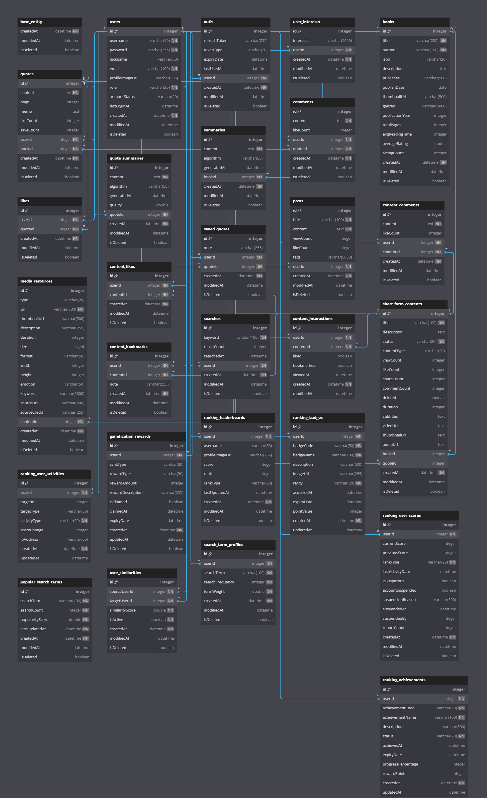
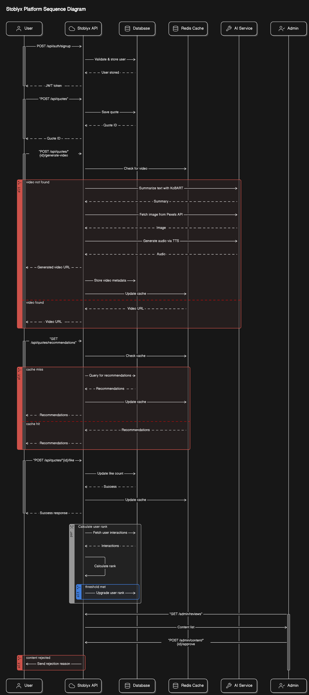

## 스토블릭스 (Stoblyx) - 이야기의 오벨리스크

### **Stoblyx = Story + Obelisk**

"책 속의 한 문장은 사라지지 않는다. 그것은 오벨리스크처럼 남아, 사람들에게 영감을 준다."

책 속 문장 하나하나가 디지털 기념비(Obelisk)처럼 기억되고, AI를 통해 숏폼 영상으로 재탄생하는 곳. 과거, 현재, 미래를 잇는 독서의 타임캡슐.

---

## 목차

1. @프로젝트 개요
2. @Why Stoblyx?
3. @Stoblyx만의 차별점
4. @아키텍처 설계
5. @주요 기능
6. @데이터베이스 설계
7. @API 문서
8. @개발 환경 설정
9. @보안 및 확장성 고려 사항
10. @트러블슈팅
11. @프로젝트 구조
12. @테스트 및 품질 관리
13. @성능 최적화 및 모니터링
14. @배포 및 운영 전략
15. @개발자 노트
16. @라이선스

---

## 1. 프로젝트 개요

**프로젝트명:** 스토블릭스 (Stoblyx)  
**개발 기간:** 1개월 (2025년 2월 ~ 2025년 3월)

### 기술 스택

- **Backend:** Java 17, Spring Boot 3.3.9
- **Database:** MySQL 8.0.41
- **Cache:** Redis 7.0.15
- **Security:** JWT, Spring Security
- **AI Integration:**
  - KoBART (텍스트 요약)
  - TTS (텍스트-음성 변환)
  - BGM 선택 (감정에 따른 배경음악)
  - Pexels API (이미지/비디오 검색)
- **Deployment:** Koyeb + GitHub Actions + Docker
- **모니터링:** Prometheus, Grafana

---

## 2. Why Stoblyx?

### 문제 인식

- MZ세대의 독서율 감소 및 숏폼 콘텐츠 소비 증가
- 책 속의 의미 있는 문장이 잊혀지는 현실

### 해결 방안

- AI 기술로 문장을 현대적 콘텐츠로 재해석
- 사용자 참여 유도를 위한 게이미피케이션 적용

### 기대 효과

- 독서 문화 활성화 및 세대 간 문화 격차 해소
- 지식 공유 플랫폼으로 성장

---

## 3. Stoblyx만의 차별점

### 1. AI 기반 문구 → 숏폼 영상 변환

- 키워드 기반 문구 추출 및 자동 영상 생성
- 영상 요소: 책 표지, 문장, 배경 이미지, 자막, 감성 기반 BGM 적용
- 비동기 처리 및 폴백 전략으로 안정적인 서비스 제공

### 2. 검색어 기반 유저 추천

- 협업 필터링을 활용한 사용자 맞춤 추천 시스템
- 추천 기준: 최근 검색어, 좋아요/저장 데이터, 활동 패턴

### 3. 게이미피케이션 & 랭킹 시스템

| 랭크     | 조건                       |
| -------- | -------------------------- |
| 브론즈   | 기본 기능 사용 가능        |
| 실버     | 인기 문구 TOP 10 확인 가능 |
| 골드     | 100+ 좋아요 문구 저장 가능 |
| 플래티넘 | AI 추천 영상 제작 가능     |
| 다이아   | 콘텐츠 트렌드 피드 노출    |

#### 랭킹 산정 공식

```
점수 = (좋아요 × 2) + (저장수 × 3) + (댓글 × 1) - (신고수 × 5)
```

- **부정 행위 방지:** 동일 IP 다중 계정 차단 및 자동 계정 정지 정책 적용
- **랭킹 리셋 주기:** 매월 1일

---

## 4. 아키텍처 설계

### 시스템 구성 및 계층 설명

<details>
<summary>시스템 아키텍처 다이어그램</summary>
<div align="center">
  
</div>
</details>

#### 설명

- **Adapter Layer:** 외부 요청 처리 (REST API), AI 서비스 호출, 메시징 시스템 통합
- **Application Layer:** 비즈니스 유스케이스 처리 및 트랜잭션 관리
- **Domain Layer:** 핵심 도메인 로직 및 엔티티 관리
- **비동기 처리:** RabbitMQ를 통한 작업 큐 처리로 확장성과 안정성 확보

### 시스템 흐름도

<details>
<summary>시스템 흐름 다이어그램</summary>
<div align="center">
  
</div>
</details>

---

## 5. 주요 기능

### 회원 시스템

- JWT 기반 인증/인가
- Access/Refresh Token 분리 및 Redis 세션 관리
- BCrypt를 통한 비밀번호 안전 저장
- 세션 고정 공격 방지를 위한 Redis 설정 적용

### 문구 및 AI 추천 기능

- 문구 검색 및 AI 기반 영상 추천
- AI 요약 실패 시 폴백: "첫 문장 + 마지막 문장 조합" 제공
- Redis 캐싱 및 TTL 적용으로 빠른 응답 처리

### 커뮤니티 기능

- 좋아요, 댓글, 문구 저장 및 트렌드 피드 제공
- 신고 기능 및 자동 임시 정지 기능 포함

---

## 6. 데이터베이스 설계

### 주요 테이블 및 관계

<details>
<summary>ERD (Entity Relationship Diagram)</summary>
<div align="center">
  
</div>
</details>

- **User (사용자)**

  - 기본 정보: id, username, password, nickname, email
  - 권한 관리: role (USER, ADMIN)
  - 계정 상태: createdAt, updatedAt, lastLoginAt, active
  - 보안: failedLoginAttempts, accountLocked

- **Book (도서)**

  - 기본 정보: id, title, author, isbn, description
  - 출판 정보: publisher, publishDate
  - 분류: genres (List)
  - 상태 관리: createdAt, updatedAt, deleted

- **Quote (문구)**

  - 기본 정보: id, content, page, chapter
  - 연관 관계: userId, bookId
  - 메타 데이터: memo, likeCount
  - 상태 관리: createdAt, updatedAt, deleted

- **Comment (댓글)**

  - 기본 정보: id, content
  - 연관 관계: userId, quoteId
  - 상태 관리: createdAt, updatedAt, deleted

- **Like (좋아요)**

  - 기본 정보: id
  - 연관 관계: userId, quoteId
  - 상태 관리: createdAt

- **SavedQuotes (저장된 문구)**

  - 기본 정보: id, memo
  - 연관 관계: userId, quoteId
  - 상태 관리: createdAt, updatedAt

- **UserInterest (사용자 관심사)**

  - 기본 정보: id, interests (List)
  - 연관 관계: userId
  - 상태 관리: createdAt, updatedAt

- **Summary (요약)**

  - 기본 정보: id, content
  - 연관 관계: bookId
  - 상태 관리: createdAt, updatedAt

- **ShortFormContent (숏폼 콘텐츠)**

  - 기본 정보: id, title, content, mediaUrl
  - 연관 관계: quoteId
  - 메타 데이터: status, viewCount
  - 상태 관리: createdAt, updatedAt

- **ContentInteraction (콘텐츠 상호작용)**

  - 기본 정보: id, type
  - 연관 관계: userId, contentId
  - 상태 관리: createdAt

- **ContentComment (콘텐츠 댓글)**

  - 기본 정보: id, content
  - 연관 관계: userId, contentId
  - 상태 관리: createdAt, updatedAt

- **Post (게시물)**
  - 기본 정보: id, title, content
  - 연관 관계: userId
  - 메타 데이터: viewCount, likeCount
  - 상태 관리: createdAt, updatedAt, deleted

### 열거형 (Enums)

- **ContentStatus (콘텐츠 상태)**

  - DRAFT: 임시저장
  - PENDING: 검토중
  - PUBLISHED: 발행됨
  - REJECTED: 거부됨

- **Role (역할)**

  - USER: 일반 사용자
  - ADMIN: 관리자

- **UserRole (사용자 역할)**
  - USER: 일반 사용자
  - ADMIN: 관리자

#### 관계 설명

- **User 관련**

  - User ↔ Quote: 사용자별 작성 문구 관리 (1:N)
  - User ↔ Comment: 사용자별 작성 댓글 관리 (1:N)
  - User ↔ Like: 사용자별 좋아요 관리 (1:N)
  - User ↔ SavedQuotes: 사용자별 저장 문구 관리 (1:N)
  - User ↔ UserInterest: 사용자별 관심사 관리 (1:1)
  - User ↔ Post: 사용자별 게시물 관리 (1:N)
  - User ↔ ContentInteraction: 사용자별 콘텐츠 상호작용 (1:N)
  - User ↔ ContentComment: 사용자별 콘텐츠 댓글 (1:N)

- **Book 관련**

  - Book ↔ Quote: 책별 문구 관리 (1:N)
  - Book ↔ Summary: 책별 요약 관리 (1:1)

- **Quote 관련**

  - Quote ↔ Comment: 문구별 댓글 관리 (1:N)
  - Quote ↔ Like: 문구별 좋아요 관리 (1:N)
  - Quote ↔ SavedQuotes: 문구별 저장 관리 (1:N)
  - Quote ↔ ShortFormContent: 문구별 숏폼 콘텐츠 (1:N)

- **ShortFormContent 관련**
  - ShortFormContent ↔ ContentInteraction: 콘텐츠별 상호작용 (1:N)
  - ShortFormContent ↔ ContentComment: 콘텐츠별 댓글 (1:N)

---

## 7. API 문서

### 공통 사항

- **인증:** Bearer Token 방식 (JWT)
- **권한 요구사항:** 일부 엔드포인트는 인증 필요 (표기됨)
- **에러 코드 및 메시지 예시:**

```json
{
  "status": 403,
  "error": "Forbidden",
  "message": "접근 권한이 없습니다.",
  "timestamp": "2025-02-23T10:15:30Z"
}
```

### 시퀀스 다이어그램

<details>
<summary>API 시퀀스 다이어그램</summary>
<div align="center">
  
</div>
</details>

### AI 추천 영상 생성 API

**엔드포인트:** `/quotes/{id}/generate-video`  
**메서드:** POST  
**권한:** 인증 필요

#### 요청 예시

```json
{
  "style": "minimalist",
  "bgmType": "calm"
}
```

#### 응답 예시 (201 Created)

```json
{
  "videoId": "a1b2c3d4",
  "processingTime": 45,
  "previewUrl": "https://cdn.stoblyx.com/previews/a1b2c3d4.mp4"
}
```

---

## 8. 개발 환경 설정

### .env.example

```properties
# DB 설정
DB_URL=jdbc:mysql://localhost:3306/stoblyx
DB_USER=root
DB_PASS=encrypted_password
# JWT 설정
JWT_SECRET=your_256bit_secret
JWT_EXPIRATION=86400000  # 24시간
```

---

## 9. 보안 및 확장성 고려 사항

### 보안 강화 방안

- **입력값 검증:** Jakarta Bean Validation 적용
- **XSS 방지:** Lucy-XSS-Filter 사용
- **CSRF 보호:** Stateless 환경 대비 JWT 검증 강화
- **SQL Injection 방지:** JPA Parameter Binding 강제화
- **Redis 세션 보호:** 세션 고정 공격 방지를 위한 토큰 검증 추가

---

## 10. 트러블슈팅

### 문제: AI 영상 생성 API 타임아웃 (30초 초과)

#### 해결책

---

## 11. 프로젝트 구조

헥사고날 아키텍처 (포트와 어댑터 아키텍처)

```plaintext
src/
├── main/
│   ├── java/com/j30n/stoblyx/
│   │   ├── adapter/                 # 어댑터 계층
│   │   │   ├── in/                  # 입력 어댑터
│   │   │   │   └── web/             # 웹 관련 입력 어댑터
│   │   │   │       ├── controller/  # REST 컨트롤러
│   │   │   │       └── dto/         # 데이터 전송 객체
│   │   │   └── out/                 # 출력 어댑터
│   │   │       └── persistence/     # 영속성 관련 어댑터
│   │   ├── application/             # 애플리케이션 계층
│   │   │   ├── port/                # 포트 인터페이스
│   │   │   │   ├── in/              # 입력 포트
│   │   │   │   └── out/             # 출력 포트
│   │   │   └── service/             # 서비스 구현체
│   │   ├── common/                  # 공통 유틸리티
│   │   │   ├── exception/           # 예외 클래스
│   │   │   └── response/            # 응답 관련 클래스
│   │   ├── config/                  # 설정 클래스
│   │   ├── domain/                  # 도메인 계층
│   │   │   ├── model/               # 도메인 모델
│   │   │   └── repository/          # 리포지토리 인터페이스
│   │   └── infrastructure/          # 인프라스트럭처 계층
│   │       ├── annotation/          # 커스텀 어노테이션
│   │       └── security/            # 보안 관련 클래스
│   └── resources/                   # 리소스 파일
│       ├── application.yml          # 애플리케이션 설정
│       └── static/                  # 정적 리소스
└── test/                            # 테스트 코드
```

### **헥사고날 아키텍처를 선택한 이유**

#### 1. **도메인 로직의 순수성 유지**

- 도메인 로직이 외부 의존성으로부터 독립적으로 유지됩니다
- 핵심 비즈니스 로직이 인프라스트럭처나 프레임워크에 의존하지 않습니다

#### 2. **포트와 어댑터를 통한 유연한 확장**

- 입력 포트(Inbound)와 출력 포트(Outbound)를 통해 시스템 간의 결합도를 낮춥니다
- 새로운 기능이나 외부 시스템 추가가 기존 코드에 영향을 미치지 않습니다

#### 3. **테스트 용이성**

- 도메인 로직을 외부 의존성 없이 단위 테스트할 수 있습니다
- 어댑터를 모킹하여 통합 테스트를 쉽게 구현할 수 있습니다

#### 4. **기술 독립성**

- 프레임워크나 데이터베이스 등 기술적 선택이 비즈니스 로직에 영향을 주지 않습니다
- 인프라스트럭처 계층의 변경이 도메인 로직에 영향을 미치지 않습니다

### **아키텍처 구조**

#### 1. **도메인 계층 (Domain Layer)**

- 비즈니스 엔티티와 로직을 포함
- 외부 의존성이 없는 순수한 도메인 모델
- 도메인 이벤트와 예외 정의

#### 2. **애플리케이션 계층 (Application Layer)**

- 유스케이스 구현
- 포트 인터페이스 정의 (입력/출력)
- 도메인 객체의 라이프사이클 관리

#### 3. **어댑터 계층 (Adapter Layer)**

- 입력 어댑터 (Inbound)
  - REST API 컨트롤러
  - 메시지 컨슈머
- 출력 어댑터 (Outbound)
  - 데이터베이스 리포지토리 구현
  - 외부 API 클라이언트

#### 4. **인프라스트럭처 계층 (Infrastructure Layer)**

- 기술적인 구현 제공
- 보안 설정
- 데이터베이스 설정
- 외부 서비스 통합

### **결론**

스토블릭스는 다양한 외부 시스템과의 통합이 필요한 서비스이므로

- 도메인 로직의 순수성을 유지하면서 유연한 확장이 가능한 헥사고날 아키텍처 채택
- 포트와 어댑터를 통한 명확한 의존성 관리
- 테스트 용이성과 유지보수성 확보
- 기술 스택 변경에 대한 유연성 확보

### **스토블릭스 프로젝트에서의 적합성**

#### 1. **다양한 외부 시스템 통합**

- Redis를 이용한 토큰 관리와 캐싱
- JWT 인증/인가 시스템
- Spring Security 기반의 보안 시스템
  → 어댑터 패턴을 통해 이러한 외부 시스템들과의 결합도를 낮추고 교체 용이성 확보

#### 2. **도메인 복잡성 관리**

- 책, 인용구, 댓글, 좋아요 등 다양한 도메인 개념 존재
- 각 도메인 간의 복잡한 상호작용 관리 필요
  → 도메인 계층의 독립성을 통해 복잡한 비즈니스 로직을 명확하게 관리

#### 3. **테스트 시나리오**

- 단위 테스트: 도메인 로직의 독립적 검증
- 통합 테스트: 외부 시스템과의 연동 검증
  → 계층 분리를 통해 각각의 테스트에 집중 가능

#### 4. **향후 확장성**

- 소셜 로그인 추가
- 외부 도서 API 연동
- 검색 엔진 도입
  → 새로운 어댑터 추가만으로 기능 확장 가능

이러한 이유로 헥사고날 아키텍처를 선택하였습니다.

---

## 12. 성능 최적화 및 모니터링

### 캐시 및 데이터 처리

| 전략         | 구현 방식                       | 적용 대상        |
| ------------ | ------------------------------- | ---------------- |
| Lazy Loading | `FetchType.LAZY` 설정           | 사용자-문구 관계 |
| Cache-Aside  | Redis `@Cacheable` + TTL(1시간) | 인기 문구 조회   |
| Batch Insert | `hibernate.jdbc.batch_size=50`  | 대량 댓글 입력   |

### 모니터링 도구 사용

- **Prometheus:** 서버 및 애플리케이션 메트릭 수집
- **Grafana:** 대시보드 시각화 및 경고 설정
- **Health Checks:** `/actuator/health`, Liveness/Readiness Probe 설정

---

## 13. 테스트 및 품질 관리

### 테스트 피라미드 및 커버리지 목표

- **목표:** 코드 커버리지 85% 이상

---

## 14. 배포 및 운영 전략

### Koyeb 배포 단계

1. GitHub 리포지토리 연결
2. Health Check: `/actuator/health` 및 Probe 설정
3. **롤백 전략:** 최신 안정 버전으로 즉시 롤백 지원

---

## 14. 개발자 노트

- **도전 과제:** AI API 통합 시 타임아웃 최소화
- **배운 점:** 헥사고날 아키텍처의 유지보수성 및 확장성 확보
- **추후 계획:** 마이크로서비스 전환 및 기능 확장

---

## 15. 라이선스

이 프로젝트는 제 개인 포트폴리오 목적으로만 사용 가능하며, 모든 이용이 금지됩니다.  
CC BY-NC-ND 4.0 라이선스 적용  
© 2025 Stoblyx. All rights reserved.
