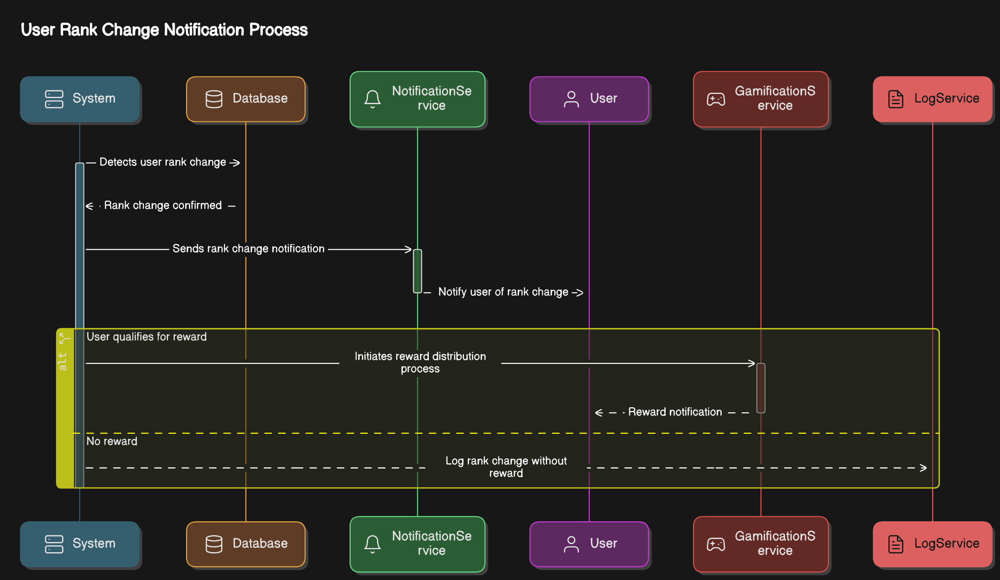
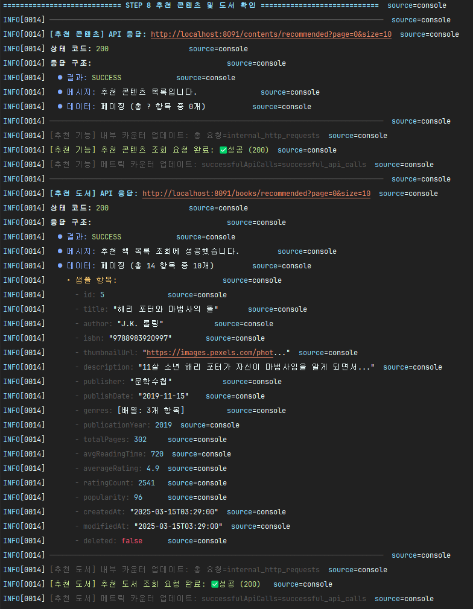

## 스토블릭스 (Stoblyx) - 이야기의 오벨리스크

<div align="center">
  
</div>

Stoblyx는 책의 핵심 내용을 AI 기반으로 요약해 숏폼 콘텐츠로 이미지와 영상으로 제공하는 서비스입니다.

KoBART 모델을 활용하여 책의 핵심 내용을 요약하고, 사용자에게 시각적 경험을 제공합니다.

### **Stoblyx = Story + Obelisk**

"책 속의 한 문장은 사라지지 않는다. 그것은 오벨리스크처럼 남아, 사람들에게 영감을 준다."

책 속 문장 하나하나가 디지털 기념비(Obelisk)처럼 기억되고, AI를 통해 숏폼으로 재탄생하는 곳.


---

## 1. 프로젝트 개요

**프로젝트명:** 스토블릭스 (Stoblyx)  
**개발 기간:** 

## 2. Why Stoblyx?

### 문제 인식

- MZ세대의 독서율 감소 현상
- 숏폼 콘텐츠 소비 증가 추세
- 기존 독서 플랫폼의 젊은 세대 유입 한계

### 해결 방안

- 검색 기반 도서 정보 제공 및 다양한 콘텐츠 경험
- 책 내용 관련 이미지/영상 제공으로 몰입감 증대
- 게이미피케이션을 통한 독서 동기 부여

### 기대 효과

- 독서 문화의 디지털 전환 및 활성화
- 지식 공유 플랫폼으로서의 성장 가능성
- 세대 간 독서 격차 해소 및 독서 습관 형성

---

## 3. Stoblyx만의 차별점

### 1. 검색부터 멀티미디어 경험까지 통합 서비스

- 알라딘 API 연동을 통한 도서 정보 및 표지 제공
- 책 내용을 KoBART 모델로 요약하여 핵심 정보 제공
- Pexels API 연동으로 관련 이미지 제공
- 비동기 처리 및 폴백 전략으로 안정적인 서비스 제공

### 2. 사용자 활동 기반 콘텐츠 추천

- 사용자 활동 데이터 기반 기본 추천 시스템
- 추천 기준: 좋아요/저장 데이터, 인기도 점수
- 랭킹 시스템을 통한 사용자 참여 유도

## 4. 기술 스택

STOBLYX 프로젝트는 안정성, 확장성 및 유지보수성을 고려하여 다음과 같은 기술 스택을 선택했습니다. 각 기술은 특정 문제 영역을 해결하기 위해 신중하게 선택되었습니다.

#### Backend

> Java 17과 Spring Boot 3.3.9를 선택한 이유는 강력한 타입 안정성, 풍부한 라이브러리, 그리고 확장 가능한 엔터프라이즈급 애플리케이션 개발에 적합하기 때문입니다. 특히 Spring
> MVC와 Spring Data JPA는 RESTful API 구현과 데이터베이스 접근을 단순화합니다.


#### Database

> MySQL을 주 데이터베이스로 정했습니다. JPA는 객체-관계 매핑을 간소화하고 데이터베이스 독립적인 코드 작성을 가능하게 합니다.


#### Security

> 보안은 최우선 과제입니다. JWT 기반 인증과 Spring Security를 사용하여 안전한 API 접근과 사용자 인증을 구현했습니다.


#### Messaging & Async

> 사용자 요청에 대한 응답 시간을 최소화하고, 시스템 부하를 분산시킵니다.


#### AI Integration

> AI 기술은 독서 경험을 향상시키는 핵심 요소입니다. KoBART와 Hugging Face 모델을 활용하여 한국어 자연어 처리를 구현하고, 멀티미디어 콘텐츠 통합을 위해 다양한 API를 활용합니다.


#### Algorithms & Data Science

> 사용자 경험 개인화와 콘텐츠 추천을 위해 다양한 알고리즘을 구현했습니다. EWMA는 사용자 활동 점수를 계산하고, 협업 필터링은 맞춤형 추천을 제공하며, 페이지랭크 변형은 검색 및 콘텐츠 인기도
> 측정에 활용됩니다.


#### Environment & Configuration

> 개발 및 운영 환경 설정을 위해 Spring dotenv와 Jakarta Validation을 활용합니다. 이를 통해 환경별 설정을 쉽게 관리하고, 입력 데이터 유효성을 검증합니다.


#### 테스트

> 철저한 테스트를 위해 JUnit, Mockito, H2 테스트 데이터베이스를 사용하고, K6를 통해 성능 및 사용자 흐름 테스트를 수행합니다. 이를 통해 코드 품질과 시스템 안정성을 보장합니다.


#### Deployment

> Docker를 통해 애플리케이션을 컨테이너화하고, Koyeb을 통해 클라우드 환경에 배포합니다. 이를 통해 확장성과 이식성을 확보하고, 배포 프로세스를 단순화합니다.


#### 개발 도구


---

## 4. 아키텍처 설계

### 시스템 구성 및 계층 설명

<div align="center">
  
</div>

#### 설명

- **Adapter Layer:** 외부 요청 처리 (REST API), AI 서비스 호출, 메시징 시스템 통합
- **Application Layer:** 비즈니스 유스케이스 처리 및 트랜잭션 관리
- **Domain Layer:** 핵심 도메인 로직 및 엔티티 관리
- **비동기 처리:** @Async 어노테이션을 통한 백그라운드 처리로 확장성과 안정성 확보 (비동기 처리 위해 향후 RabbitMQ 구현 예정)

### 시스템 흐름도

<div align="center">
  
</div>

### AI 서비스 통합 아키텍처

- **헥사고날 아키텍처 기반 AI 서비스 통합**

  - 포트와 어댑터 패턴을 통한 외부 AI 서비스 연동
  - 도메인 로직과 AI 서비스 간의 느슨한 결합
  - 폴백 메커니즘을 통한 서비스 안정성 확보

- **AI 통합 컴포넌트**
  - `PexelsClient`: 키워드 기반 이미지/비디오 검색 및 결과 처리
  - `TTSClient`: 텍스트를 음성으로 변환하는 Python 스크립트 연동(구현 예정)
  - `BGMClient`: 텍스트 감정 분석을 통한 BGM 선택 로직
  - `AIAdapter`: 외부 AI 서비스와의 통합 인터페이스

---

#### 5. 데이터베이스 모델

데이터베이스는 사용자, 콘텐츠, 상호작용, 랭킹 시스템 등 다양한 도메인으로.구성된 테이블을 포함합니다.

**주요 콘텐츠 관련 테이블**

- `books`: 도서 정보 (제목, 저자, ISBN, 출판사 등)
- `quotes`: 도서에서 발췌한 인용구
- `summaries`: 도서 요약 정보
- `quote_summaries`: 인용구에 대한 AI 생성 요약
- `SHORT_FORM_CONTENTS`: 숏폼 콘텐츠(비디오, 오디오 등)
- `media_resources`: 콘텐츠 관련 미디어 자원(비디오, 오디오 파일 등)

**사용자 관련 테이블**

- `users`: 사용자 계정 정보
- `user_interests`: 사용자 관심사
- `auth`: 인증 및 토큰 정보
- `user_similarities`: 사용자 간 유사도 정보

**상호작용 관련 테이블**

- `likes`: 인용구 좋아요 정보
- `comments`: 인용구 댓글
- `saved_quotes`: 저장된 인용구
- `CONTENT_INTERACTION`: 콘텐츠와의 상호작용 정보
- `content_comments`: 콘텐츠 댓글
- `content_likes`: 콘텐츠 좋아요
- `content_bookmarks`: 북마크된 콘텐츠

**게이미피케이션 & 랭킹 관련 테이블**

- `ranking_user_score`: 사용자 랭킹 점수 및 상태 정보
- `ranking_user_activity`: 사용자 활동 로그
- `ranking_leaderboard`: 리더보드 정보
- `ranking_badge`: 사용자 획득 가능 뱃지
- `ranking_achievement`: 사용자 업적 정보
- `gamification_rewards`: 게이미피케이션 보상 정보

**검색 & 기타 테이블**

- `search`: 사용자 검색 기록
- `search_term_profiles`: 검색어 프로필 정보
- `popular_search_terms`: 인기 검색어 정보
- `posts`: 사용자 포스트
- `system_settings`: 시스템 설정 정보

#### ERD 다이어그램

<div align="center">
  

  
</div>

## 6. 데이터베이스 설계

### 주요 테이블 및 관계

## 도메인 엔티티

### **BaseTimeEntity**

- 설명: 모든 엔티티가 상속받는 시간 관련 기본 클래스입니다.
- 주요 필드
  - `created_at`: TIMESTAMP - 생성 시간, @CreatedDate 어노테이션으로 자동 관리
  - `modified_at`: TIMESTAMP - 수정 시간, @LastModifiedDate 어노테이션으로 자동 관리
- JPA의 @EntityListeners(AuditingEntityListener.class) 적용

### **BaseEntity**

- 설명: BaseTimeEntity를 확장한 공통 기본 클래스입니다.
- 주요 필드
  - `is_deleted`: BOOLEAN - 삭제 여부 (논리적 삭제 지원)
- 주요 메서드
  - `delete()`: 논리적 삭제 처리
  - `restore()`: 논리적 삭제 복구
  - `isDeleted()`: 삭제 상태 확인
  - `updateModifiedAt()`: 수정 시간 갱신

### **User (사용자)**

- 테이블: `users`
- 설명: 사용자 계정 및 인증 정보를 저장합니다.
- 주요 필드
  - `id`: BIGINT - 사용자 고유 식별자 (PK)
  - `username`: VARCHAR(50) - 사용자 이름, 로그인 시 사용 (NOT NULL, UNIQUE)
  - `password`: VARCHAR(255) - 암호화된 비밀번호 (NOT NULL)
  - `nickname`: VARCHAR(50) - 화면에 표시되는 닉네임
  - `email`: VARCHAR(100) - 이메일 주소 (NOT NULL, UNIQUE)
  - `role`: VARCHAR(20) - 사용자 권한 (USER, EDITOR, WRITER, ADMIN) (NOT NULL)
  - `accountStatus`: VARCHAR(20) - 계정 상태 (ACTIVE, SUSPENDED, DELETED) (DEFAULT 'ACTIVE')
  - `profileImageUrl`: VARCHAR(255) - 프로필 이미지 URL
  - `lastLoginAt`: TIMESTAMP - 마지막 로그인 시간
- 제약조건
  - 사용자 이름과 이메일은 고유해야 함 (uk_username, uk_email)

### **UserInterest (사용자 관심사)**

- 테이블: `user_interests`
- 설명: 사용자의 관심 분야 정보를 저장합니다. 개인화된 추천에 활용됩니다.
- 주요 필드
  - `id`: BIGINT - 고유 식별자 (PK)
  - `user_id`: BIGINT - 사용자 ID (FK, NOT NULL)
  - `interests`: TEXT - 관심사 목록
- 관계
  - User(1) ↔ UserInterest(1) (일대일)
- 제약조건
  - user_id는 고유해야 함 (uk_user_interests)
  - users 테이블의 id를 참조 (fk_user_interests_user)

### **Auth (인증)**

- 테이블: `auth`
- 설명: 사용자 인증 관련 데이터(JWT 토큰 등)를 저장합니다.
- 주요 필드
  - `id`: BIGINT - 고유 식별자 (PK)
  - `user_id`: BIGINT - 사용자 ID (FK, NOT NULL)
  - `refreshToken`: VARCHAR(255) - JWT 리프레시 토큰
  - `tokenType`: VARCHAR(20) - 토큰 유형 (NOT NULL)
  - `expiryDate`: TIMESTAMP - 토큰 만료 일시 (NOT NULL)
  - `lastUsedAt`: TIMESTAMP - 마지막 사용 시간
- 관계
  - User(1) ↔ Auth(1) (일대일)
- 제약조건
  - user_id는 고유해야 함 (uk_auth_user)
  - users 테이블의 id를 참조 (fk_auth_user)

### **Book (책)**

- 테이블: `books`
- 설명: 책 정보를 저장합니다. 외부 API 또는 관리자가 등록합니다.
- 주요 필드
  - `id`: BIGINT - 책 고유 식별자 (PK)
  - `title`: VARCHAR(255) - 책 제목 (NOT NULL)
  - `author`: VARCHAR(100) - 저자명 (NOT NULL)
  - `isbn`: VARCHAR(13) - ISBN 코드
  - `isbn13`: VARCHAR(13) - ISBN-13 코드
  - `description`: VARCHAR(2000) - 책 설명
  - `publisher`: VARCHAR(100) - 출판사
  - `publishDate`: DATE - 출판일
  - `thumbnailUrl`: VARCHAR(255) - 책 표지 썸네일 URL
  - `cover`: VARCHAR(255) - 커버 이미지 URL
  - `publicationYear`: INTEGER - 출판 연도
  - `totalPages`: INTEGER - 총 페이지 수
  - `avgReadingTime`: INTEGER - 평균 읽기 시간(분)
  - `averageRating`: DOUBLE - 평균 평점
  - `ratingCount`: INTEGER - 평점 수
  - `popularity`: INTEGER - 인기도 (DEFAULT 0)
  - `priceStandard`: INTEGER - 정가
  - `priceSales`: INTEGER - 판매가
  - `categoryId`: VARCHAR(50) - 카테고리 ID
  - `categoryName`: VARCHAR(255) - 카테고리 이름
- 관계
  - Book(1) ↔ BookGenre(N) (일대다)
  - Book(1) ↔ Quote(N) (일대다)
  - Book(1) ↔ ShortFormContent(N) (일대다)
  - Book(1) ↔ Summary(N) (일대다)
  - Book(1) ↔ BookMedia(N) (일대다)

### **BookGenre (책 장르)**

- 테이블: `book_genres`
- 설명: 책과 장르 간의 다대다 관계를 관리합니다.
- 주요 필드
  - `book_id`: BIGINT - 책 ID (FK, NOT NULL)
  - `genre`: VARCHAR(100) - 장르명 (NOT NULL)
- 관계
  - Book(1) ↔ BookGenre(N) (일대다)
- 제약조건
  - book_id와 genre의 조합은 고유함 (복합 PK)
  - books 테이블의 id를 참조 (fk_book_genres_book)

### **Quote (문구)**

- 테이블: `quotes`
- 설명: 책에서 추출한 인용구 또는 문구를 저장합니다.
- 주요 필드
  - `id`: BIGINT - 문구 고유 식별자 (PK)
  - `content`: TEXT - 문구 내용 (NOT NULL)
  - `page`: INT - 페이지 번호
  - `memo`: TEXT - 사용자 메모
  - `like_count`: INTEGER - 좋아요 수 (DEFAULT 0)
  - `save_count`: INTEGER - 저장 수 (DEFAULT 0)
  - `user_id`: BIGINT - 문구를 등록한 사용자 ID (FK, NOT NULL)
  - `book_id`: BIGINT - 출처 책 ID (FK, NOT NULL)
- 관계
  - User(1) ↔ Quote(N) (일대다)
  - Book(1) ↔ Quote(N) (일대다)
  - Quote(1) ↔ Like(N) (일대다)
  - Quote(1) ↔ SavedQuote(N) (일대다)
  - Quote(1) ↔ Comment(N) (일대다)
  - Quote(1) ↔ QuoteSummary(N) (일대다)
  - Quote(1) ↔ ShortFormContent(N) (일대다)
- 제약조건
  - users 테이블의 id를 참조 (fk_quotes_user)
  - books 테이블의 id를 참조 (fk_quotes_book)

### **Comment (댓글)**

- 테이블: `comments`
- 설명: 문구에 대한 사용자 댓글을 저장합니다.
- 주요 필드
  - `id`: BIGINT - 댓글 고유 식별자 (PK)
  - `content`: TEXT - 댓글 내용 (NOT NULL)
  - `user_id`: BIGINT - 작성자 ID (FK, NOT NULL)
  - `quote_id`: BIGINT - 문구 ID (FK, NOT NULL)
- 관계
  - User(1) ↔ Comment(N) (일대다)
  - Quote(1) ↔ Comment(N) (일대다)
- 제약조건
  - users 테이블의 id를 참조 (fk_comments_user)
  - quotes 테이블의 id를 참조 (fk_comments_quote)

### **Like (좋아요)**

- 테이블: `likes`
- 설명: 사용자가 문구에 표시한 좋아요 정보를 저장합니다.
- 주요 필드
  - `id`: BIGINT - 좋아요 고유 식별자 (PK)
  - `user_id`: BIGINT - 사용자 ID (FK, NOT NULL)
  - `quote_id`: BIGINT - 문구 ID (FK, NOT NULL)
- 관계
  - User(1) ↔ Like(N) (일대다)
  - Quote(1) ↔ Like(N) (일대다)
- 제약조건
  - user_id와 quote_id의 조합은 고유함 (uk_likes)
  - users 테이블의 id를 참조 (fk_likes_user)
  - quotes 테이블의 id를 참조 (fk_likes_quote)

### **SavedQuote (저장된 문구)**

- 테이블: `saved_quotes`
- 설명: 사용자가 저장한 문구 정보를 관리합니다.
- 주요 필드
  - `id`: BIGINT - 저장 기록 고유 식별자 (PK)
  - `user_id`: BIGINT - 사용자 ID (FK, NOT NULL)
  - `quote_id`: BIGINT - 문구 ID (FK, NOT NULL)
  - `note`: VARCHAR(255) - 저장 시 추가한 메모
- 관계
  - User(1) ↔ SavedQuote(N) (일대다)
  - Quote(1) ↔ SavedQuote(N) (일대다)
- 제약조건
  - user_id와 quote_id의 조합은 고유함 (uk_saved_quotes)
  - users 테이블의 id를 참조 (fk_saved_quotes_user)
  - quotes 테이블의 id를 참조 (fk_saved_quotes_quote)

### **QuoteSummary (문구 요약)**

- 테이블: `quote_summaries`
- 설명: 문구에 대한 AI 생성 요약을 저장합니다.
- 주요 필드
  - `id`: BIGINT - 요약 고유 식별자 (PK)
  - `content`: VARCHAR(1000) - 요약 내용 (NOT NULL)
  - `algorithm`: VARCHAR(50) - 사용된 알고리즘 정보
  - `generatedAt`: TIMESTAMP - 생성 시간
  - `quality`: DOUBLE - 요약 품질 점수 (DEFAULT 0.0)
  - `quote_id`: BIGINT - 원본 문구 ID (FK, NOT NULL)
- 관계
  - Quote(1) ↔ QuoteSummary(N) (일대다)
- 제약조건
  - quotes 테이블의 id를 참조 (fk_quote_summaries_quote)

### **ShortFormContent (숏폼 콘텐츠)**

- 테이블: `SHORT_FORM_CONTENTS`
- 설명: AI로 생성된 숏폼 콘텐츠 정보를 저장합니다.
- 주요 필드
  - `id`: BIGINT - 콘텐츠 고유 식별자 (PK)
  - `title`: VARCHAR(100) - 콘텐츠 제목 (NOT NULL)
  - `description`: VARCHAR(1000) - 콘텐츠 설명
  - `status`: VARCHAR(20) - 콘텐츠 상태 (DRAFT, PUBLISHED, REMOVED) (NOT NULL)
  - `duration`: INT - 재생 시간(초)
  - `viewCount`: INT - 조회수 (DEFAULT 0)
  - `likeCount`: INT - 좋아요 수 (DEFAULT 0)
  - `shareCount`: INT - 공유 수 (DEFAULT 0)
  - `commentCount`: INT - 댓글 수 (DEFAULT 0)
  - `contentType`: VARCHAR(50) - 콘텐츠 유형
  - `subtitles`: TEXT - 자막
  - `videoUrl`: TEXT - 비디오 URL
  - `thumbnailUrl`: TEXT - 썸네일 URL
  - `audioUrl`: TEXT - 오디오 URL
  - `book_id`: BIGINT - 연관된 책 ID (FK)
  - `quote_id`: BIGINT - 연관된 문구 ID (FK)
- 관계
  - Book(1) ↔ ShortFormContent(N) (일대다)
  - Quote(1) ↔ ShortFormContent(N) (일대다)
  - ShortFormContent(1) ↔ ContentInteraction(N) (일대다)
  - ShortFormContent(1) ↔ ContentComment(N) (일대다)
  - ShortFormContent(1) ↔ MediaResource(N) (일대다)
  - ShortFormContent(1) ↔ ContentLike(N) (일대다)
  - ShortFormContent(1) ↔ ContentBookmark(N) (일대다)
- 제약조건
  - books 테이블의 id를 참조 (fk_short_form_contents_book)
  - quotes 테이블의 id를 참조 (fk_short_form_contents_quote)

### **ContentInteraction (콘텐츠 상호작용)**

- 테이블: `CONTENT_INTERACTION`
- 설명: 사용자와 콘텐츠 간의 상호작용 정보를 저장합니다.
- 주요 필드
  - `id`: BIGINT - 상호작용 고유 식별자 (PK)
  - `user_id`: BIGINT - 사용자 ID (FK, NOT NULL)
  - `content_id`: BIGINT - 콘텐츠 ID (FK, NOT NULL)
  - `liked`: BOOLEAN - 좋아요 여부 (DEFAULT FALSE)
  - `bookmarked`: BOOLEAN - 북마크 여부 (DEFAULT FALSE)
  - `viewedAt`: TIMESTAMP - 조회 시간
- 관계
  - User(1) ↔ ContentInteraction(N) (일대다)
  - ShortFormContent(1) ↔ ContentInteraction(N) (일대다)
- 제약조건
  - user_id와 content_id의 조합은 고유함 (uk_content_interactions)
  - users 테이블의 id를 참조 (fk_content_interactions_user)
  - SHORT_FORM_CONTENTS 테이블의 id를 참조 (fk_content_interactions_content)

### **ContentComment (콘텐츠 댓글)**

- 테이블: `content_comments`
- 설명: 숏폼 콘텐츠에 대한 사용자 댓글을 저장합니다.
- 주요 필드
  - `id`: BIGINT - 댓글 고유 식별자 (PK)
  - `content`: TEXT - 댓글 내용 (NOT NULL)
  - `user_id`: BIGINT - 작성자 ID (FK, NOT NULL)
  - `content_id`: BIGINT - 콘텐츠 ID (FK, NOT NULL)
- 관계
  - User(1) ↔ ContentComment(N) (일대다)
  - ShortFormContent(1) ↔ ContentComment(N) (일대다)
- 제약조건
  - users 테이블의 id를 참조 (fk_content_comments_user)
  - SHORT_FORM_CONTENTS 테이블의 id를 참조 (fk_content_comments_content)

### **MediaResource (미디어 리소스)**

- 테이블: `media_resources`
- 설명: 콘텐츠에 사용되는 미디어 리소스 정보를 저장합니다.
- 주요 필드
  - `id`: BIGINT - 리소스 고유 식별자 (PK)
  - `content_id`: BIGINT - 연관된 콘텐츠 ID (FK, NOT NULL)
  - `type`: VARCHAR(50) - 미디어 유형 (IMAGE, VIDEO, AUDIO) (NOT NULL)
  - `url`: TEXT - 리소스 URL (NOT NULL)
  - `thumbnailUrl`: VARCHAR(255) - 썸네일 URL
  - `description`: VARCHAR(1000) - 미디어 설명
  - `duration`: INT - 미디어 재생 시간(초)
- 관계
  - ShortFormContent(1) ↔ MediaResource(N) (일대다)
- 제약조건
  - SHORT_FORM_CONTENTS 테이블의 id를 참조 (fk_media_resources_content)

### **UserSimilarity (사용자 유사도)**

- 테이블: `user_similarities`
- 설명: 사용자 간의 유사도 점수를 저장하여 추천 시스템에 활용합니다.
- 주요 필드
  - `id`: BIGINT - 고유 식별자 (PK)
  - `source_user_id`: BIGINT - 기준 사용자 ID (FK, NOT NULL)
  - `target_user_id`: BIGINT - 비교 대상 사용자 ID (FK, NOT NULL)
  - `similarity_score`: DOUBLE - 유사도 점수 (NOT NULL)
  - `is_active`: BOOLEAN - 활성화 여부 (DEFAULT TRUE)
- 관계
  - User(1) ↔ UserSimilarity(N) (source_user_id) (일대다)
  - User(1) ↔ UserSimilarity(N) (target_user_id) (일대다)
- 제약조건
  - source_user_id와 target_user_id의 조합은 고유함 (uk_user_similarities)
  - users 테이블의 id를 참조 (fk_similarities_source_user, fk_similarities_target_user)

### **SystemSetting (시스템 설정)**

- 테이블: `system_settings`
- 설명: 시스템 전반의 설정값을 저장하고 관리합니다.
- 주요 필드
  - `id`: BIGINT - 설정 고유 식별자 (PK)
  - `setting_key`: VARCHAR(100) - 설정 키 (NOT NULL, UNIQUE)
  - `setting_value`: VARCHAR(1000) - 설정 값 (NOT NULL)
  - `description`: VARCHAR(500) - 설정 설명
  - `category`: VARCHAR(50) - 설정 카테고리 (NOT NULL)
  - `is_encrypted`: BOOLEAN - 암호화 여부 (NOT NULL, DEFAULT FALSE)
  - `is_system_managed`: BOOLEAN - 시스템 관리 여부 (NOT NULL, DEFAULT FALSE)
  - `last_modified_by`: BIGINT - 마지막 수정자 ID
  - `default_value`: VARCHAR(1000) - 기본값
  - `validation_pattern`: VARCHAR(255) - 유효성 검사 패턴
- 제약조건
  - setting_key는 고유해야 함 (uk_setting_key)

### **Search (검색)**

- 테이블: `search`
- 설명: 사용자의 검색 이력을 저장합니다.
- 주요 필드
  - `id`: BIGINT - 검색 기록 고유 식별자 (PK)
  - `user_id`: BIGINT - 사용자 ID (FK)
  - `search_term`: VARCHAR(255) - 검색어 (NOT NULL)
  - `search_type`: VARCHAR(50) - 검색 유형 (NOT NULL)
  - `search_count`: INT - 검색 횟수 (DEFAULT 1)
  - `last_searched_at`: TIMESTAMP - 마지막 검색 시간
- 관계
  - User(1) ↔ Search(N) (일대다)
- 제약조건
  - users 테이블의 id를 참조 (fk_search_user)

### **SearchTermProfile (검색어 프로필)**

- 테이블: `search_term_profiles`
- 설명: 검색어에 대한 통계 및 추가 정보를 저장합니다.
- 주요 필드
  - `id`: BIGINT - 고유 식별자 (PK)
  - `search_term`: VARCHAR(255) - 검색어 (NOT NULL, UNIQUE)
  - `search_count`: INT - 검색 횟수 (DEFAULT 0)
  - `user_demographic_data`: TEXT - 사용자 인구통계 데이터
  - `related_terms`: TEXT - 관련 검색어
  - `trend_data`: TEXT - 트렌드 데이터
- 제약조건
  - search_term은 고유해야 함 (uk_search_term)

### **RankingUserScore (사용자 랭킹 점수)**

- 테이블: `ranking_user_score`
- 설명: 사용자 활동에 따른 랭킹 점수 정보를 저장합니다.
- 주요 필드
  - `id`: BIGINT - 점수 기록 고유 식별자 (PK)
  - `user_id`: BIGINT - 사용자 ID (NOT NULL, UNIQUE)
  - `current_score`: INT - 현재 점수 (NOT NULL)
  - `previous_score`: INT - 이전 점수
  - `rank_type`: VARCHAR(20) - 랭크 유형 (BRONZE, SILVER, GOLD, PLATINUM, DIAMOND) (NOT NULL)
  - `last_activity_date`: TIMESTAMP - 마지막 활동 시간
  - `suspicious_activity`: BOOLEAN - 의심스러운 활동 여부 (NOT NULL, DEFAULT FALSE)
  - `report_count`: INT - 신고 횟수 (NOT NULL, DEFAULT 0)
  - `account_suspended`: BOOLEAN - 계정 정지 여부 (NOT NULL, DEFAULT FALSE)

### **RankingUserActivity (사용자 랭킹 활동)**

- 테이블: `ranking_user_activity`
- 설명: 점수를 획득한 사용자 활동 내역을 기록합니다.
- 주요 필드
  - `id`: BIGINT - 활동 고유 식별자 (PK)
  - `user_id`: BIGINT - 사용자 ID (FK, NOT NULL)
  - `activity_type`: VARCHAR(50) - 활동 유형 (NOT NULL)
  - `points`: INT - 획득한 포인트 (NOT NULL)
  - `activity_date`: TIMESTAMP - 활동 일시 (NOT NULL)
  - `reference_id`: BIGINT - 참조 ID
  - `reference_type`: VARCHAR(50) - 참조 유형
- 관계
  - User(1) ↔ RankingUserActivity(N) (일대다)
- 제약조건
  - users 테이블의 id를 참조 (fk_ranking_activity_user)

### **RankingLeaderboard (랭킹 리더보드)**

- 테이블: `ranking_leaderboard`
- 설명: 특정 기간 동안의 사용자 랭킹 정보를 저장합니다.
- 주요 필드
  - `id`: BIGINT - 고유 식별자 (PK)
  - `user_id`: BIGINT - 사용자 ID (FK, NOT NULL)
  - `username`: VARCHAR(50) - 사용자 이름 (NOT NULL)
  - `score`: INT - 점수 (NOT NULL)
  - `rank_type`: VARCHAR(20) - 랭크 유형 (NOT NULL)
  - `leaderboard_type`: VARCHAR(20) - 리더보드 유형 (NOT NULL)
  - `rank_position`: INT - 순위
  - `period_start_date`: TIMESTAMP - 기간 시작일 (NOT NULL)
  - `period_end_date`: TIMESTAMP - 기간 종료일 (NOT NULL)
- 관계
  - User(1) ↔ RankingLeaderboard(N) (일대다)
- 제약조건
  - users 테이블의 id를 참조 (fk_leaderboard_user)

### **RankingBadge (랭킹 뱃지)**

- 테이블: `ranking_badge`
- 설명: 사용자가 획득할 수 있는 뱃지 정보를 저장합니다.
- 주요 필드
  - `id`: BIGINT - 뱃지 고유 식별자 (PK)
  - `name`: VARCHAR(100) - 뱃지 이름 (NOT NULL)
  - `description`: VARCHAR(500) - 뱃지 설명
  - `image_url`: VARCHAR(255) - 뱃지 이미지 URL
  - `badge_type`: VARCHAR(50) - 뱃지 유형 (NOT NULL)
  - `requirement_type`: VARCHAR(50) - 획득 요구사항 유형 (NOT NULL)
  - `threshold_value`: INT - 임계값 (NOT NULL)
  - `points_awarded`: INT - 획득 시 지급 포인트 (DEFAULT 0)

### **RankingAchievement (랭킹 업적)**

- 테이블: `ranking_achievement`
- 설명: 사용자가 획득한 뱃지를 기록합니다.
- 주요 필드
  - `id`: BIGINT - 고유 식별자 (PK)
  - `user_id`: BIGINT - 사용자 ID (FK, NOT NULL)
  - `badge_id`: BIGINT - 뱃지 ID (FK, NOT NULL)
  - `achieved_at`: TIMESTAMP - 획득 일시 (NOT NULL)
- 관계
  - User(1) ↔ RankingAchievement(N) (일대다)
  - RankingBadge(1) ↔ RankingAchievement(N) (일대다)
- 제약조건
  - user_id와 badge_id의 조합은 고유함 (uk_user_badge)
  - users 테이블의 id를 참조 (fk_achievement_user)
  - ranking_badge 테이블의 id를 참조 (fk_achievement_badge)

### **Post (게시물)**

- 테이블: `posts`
- 설명: 사용자가 작성한 게시물 정보를 저장합니다.
- 주요 필드
  - `id`: BIGINT - 게시물 고유 식별자 (PK)
  - `title`: VARCHAR(255) - 게시물 제목 (NOT NULL)
  - `content`: TEXT - 게시물 내용 (NOT NULL)
  - `user_id`: BIGINT - 작성자 ID (FK, NOT NULL)
  - `thumbnail_url`: VARCHAR(255) - 썸네일 URL
- 관계
  - User(1) ↔ Post(N) (일대다)
- 제약조건
  - users 테이블의 id를 참조 (fk_posts_user)

### **PopularSearchTerm (인기 검색어)**

- 테이블: `popular_search_terms`
- 설명: 인기 검색어와 빈도 정보를 저장합니다.
- 주요 필드
  - `id`: BIGINT - 고유 식별자 (PK)
  - `search_term`: VARCHAR(255) - 검색어 (NOT NULL, UNIQUE)
  - `search_count`: INT - 검색 횟수 (NOT NULL, DEFAULT 0)
  - `popularity_score`: DOUBLE - 인기도 점수 (NOT NULL, DEFAULT 1.0)
  - `last_updated_at`: TIMESTAMP - 마지막 업데이트 시간
- 제약조건
  - search_term은 고유해야 함 (uk_search_term)

### **GamificationReward (게이미피케이션 보상)**

- 테이블: `gamification_rewards`
- 설명: 사용자 활동에 대한 보상 정보를 저장합니다.
- 주요 필드
  - `id`: BIGINT - 보상 고유 식별자 (PK)
  - `user_id`: BIGINT - 사용자 ID (FK, NOT NULL)
  - `reward_type`: VARCHAR(50) - 보상 유형 (NOT NULL)
  - `points`: INT - 포인트 (NOT NULL, DEFAULT 0)
  - `description`: VARCHAR(255) - 보상 설명
  - `reference_id`: BIGINT - 참조 ID
  - `reference_type`: VARCHAR(50) - 참조 유형
  - `is_claimed`: BOOLEAN - 수령 여부 (DEFAULT FALSE)
  - `expiry_date`: TIMESTAMP - 만료일
- 관계
  - User(1) ↔ GamificationReward(N) (일대다)
- 제약조건
  - users 테이블의 id를 참조 (fk_rewards_user)

### **ContentLike (콘텐츠 좋아요)**

- 테이블: `content_likes`
- 설명: 사용자가 콘텐츠에 표시한 좋아요 정보를 저장합니다.
- 주요 필드
  - `id`: BIGINT - 좋아요 고유 식별자 (PK)
  - `content_id`: BIGINT - 콘텐츠 ID (FK, NOT NULL)
  - `user_id`: BIGINT - 사용자 ID (FK, NOT NULL)
- 관계
  - ShortFormContent(1) ↔ ContentLike(N) (일대다)
  - User(1) ↔ ContentLike(N) (일대다)
- 제약조건
  - content_id와 user_id의 조합은 고유함 (uk_content_likes)
  - SHORT_FORM_CONTENTS 테이블의 id를 참조 (fk_content_likes_content)
  - users 테이블의 id를 참조 (fk_content_likes_user)

### **ContentBookmark (콘텐츠 북마크)**

- 테이블: `content_bookmarks`
- 설명: 사용자가 북마크한 콘텐츠 정보를 저장합니다.
- 주요 필드
  - `id`: BIGINT - 북마크 고유 식별자 (PK)
  - `content_id`: BIGINT - 콘텐츠 ID (FK, NOT NULL)
  - `user_id`: BIGINT - 사용자 ID (FK, NOT NULL)
- 관계
  - ShortFormContent(1) ↔ ContentBookmark(N) (일대다)
  - User(1) ↔ ContentBookmark(N) (일대다)
- 제약조건
  - content_id와 user_id의 조합은 고유함 (uk_content_bookmarks)
  - SHORT_FORM_CONTENTS 테이블의 id를 참조 (fk_content_bookmarks_content)
  - users 테이블의 id를 참조 (fk_content_bookmarks_user)

### **Summary (책 요약)**

- 테이블: `summaries`
- 설명: 책에 대한 AI 생성 요약을 저장합니다.
- 주요 필드
  - `id`: BIGINT - 요약 고유 식별자 (PK)
  - `book_id`: BIGINT - 책 ID (FK, NOT NULL)
  - `content`: TEXT - 요약 내용 (NOT NULL)
  - `chapter`: VARCHAR(100) - 챕터 정보
  - `page`: VARCHAR(50) - 페이지 정보
- 관계
  - Book(1) ↔ Summary(N) (일대다)
- 제약조건
  - books 테이블의 id를 참조 (fk_summaries_book)

### **MediaFallback (미디어 폴백)**

- 테이블: `media_fallbacks`
- 설명: Pexels API 호출 실패 시 사용할 백업 미디어 리소스를 관리합니다.
- 주요 필드
  - `id`: BIGINT - 폴백 리소스 고유 식별자 (PK)
  - `media_type`: VARCHAR(50) - 미디어 유형 (NOT NULL)
  - `content_category`: VARCHAR(100) - 콘텐츠 카테고리 (NOT NULL)
  - `fallback_url`: TEXT - 폴백 리소스 URL (NOT NULL)
  - `description`: VARCHAR(500) - 폴백 리소스 설명
  - `priority`: INTEGER - 우선순위 (DEFAULT 1)
  - `is_default`: BOOLEAN - 기본 폴백 여부 (DEFAULT FALSE)
- 제약조건
  - media_type, content_category, is_default의 조합은 고유함 (uk_media_fallbacks)

### **ApiCallLog (API 호출 로그)**

- 테이블: `api_call_logs`
- 설명: 외부 API 호출 로그 및 성능 모니터링 정보를 저장합니다.
- 주요 필드
  - `id`: BIGINT - 로그 고유 식별자 (PK)
  - `api_name`: VARCHAR(100) - API 이름 (NOT NULL)
  - `endpoint`: VARCHAR(255) - 엔드포인트 (NOT NULL)
  - `request_params`: TEXT - 요청 파라미터
  - `response_status`: INTEGER - 응답 상태 코드
  - `response_time`: BIGINT - 응답 시간
  - `error_message`: TEXT - 오류 메시지
  - `success`: BOOLEAN - 성공 여부 (DEFAULT TRUE)
  - `fallback_used`: BOOLEAN - 폴백 사용 여부 (DEFAULT FALSE)
  - `fallback_resource_id`: BIGINT - 사용된 폴백 리소스 ID (FK)
  - `user_id`: BIGINT - 사용자 ID (FK)
  - `content_id`: BIGINT - 콘텐츠 ID
- 관계
  - User(1) ↔ ApiCallLog(N) (일대다)
  - MediaFallback(1) ↔ ApiCallLog(N) (일대다)
- 제약조건
  - users 테이블의 id를 참조 (fk_api_logs_user)
  - media_fallbacks 테이블의 id를 참조 (fk_api_logs_fallback)

### **BookMedia (책 미디어)**

- 테이블: `book_media`
- 설명: 책 관련 미디어 리소스와 책을 직접 연결하는 정보를 저장합니다.
- 주요 필드
  - `id`: BIGINT - 고유 식별자 (PK)
  - `book_id`: BIGINT - 책 ID (FK, NOT NULL)
  - `media_type`: VARCHAR(50) - 미디어 유형 (NOT NULL)
  - `url`: TEXT - 미디어 URL (NOT NULL)
  - `is_fallback`: BOOLEAN - 폴백 리소스 여부 (DEFAULT FALSE)
  - `source`: VARCHAR(50) - 미디어 소스 (DEFAULT 'PEXELS')
- 관계
  - Book(1) ↔ BookMedia(N) (일대다)
- 제약조건
  - books 테이블의 id를 참조 (fk_book_media_book)

---

## 7. 주요 기능

### 회원 시스템

- JWT 기반 인증/인가
  - JwtTokenProvider, JwtAuthenticationFilter 구현
  - 토큰 유효성 검증 및 예외 처리
- Access/Refresh Token 분리
  - 보안 강화 및 토큰 갱신 메커니즘 구현
- BCrypt를 통한 비밀번호 안전 저장
  - PasswordEncoder를 통한 단방향 암호화
- 보안 설정 및 CSRF 보호
- 세션 고정 공격 방지를 위한 Redis 설정 (현재 비활성화 상태)

### 문구 및 AI 추천 기능 (부분 구현)

- 문구 검색 기능
  - 키워드, 작가, 카테고리별 검색 지원
- KoBART 기반 콘텐츠 요약 기능
  - 장문 컨텐츠의 효율적 요약 처리
- 요약 실패 시 폴백 메커니즘
  - "첫 문장 + 마지막 문장 조합" 제공
- 콘텐츠 추천 기능 (기본 구현)
  - 인기도 기반 기본 추천 기능
- AI 기반 고급 추천 시스템 (구현 예정)
  - 사용자 맞춤형 추천 알고리즘

### 커뮤니티 기능

- 좋아요 시스템
  - 콘텐츠별 좋아요 상태 관리
  - 실시간 좋아요 수 업데이트
- 댓글 시스템
  - 계층형 댓글 구조 지원
  - 댓글 작성/수정/삭제 기능
- 북마크 기능
  - 개인 콘텐츠 저장 및 관리
  - 저장된 콘텐츠 목록 조회
- 콘텐츠 공유 기능
- 트렌드 피드 제공 (기본 구현)
  - 인기 콘텐츠 노출 시스템

### 콘텐츠 관리 시스템

- 콘텐츠 생성 및 관리
  - 다양한 유형의 콘텐츠 지원
  - 상태 관리 (임시저장, 발행, 삭제)
- 콘텐츠 승인 프로세스
  - 관리자 승인 워크플로우
  - 콘텐츠 검토 및 피드백
- 다중 미디어 지원 (부분 구현)
  - 이미지, 텍스트 통합 지원
  - 비디오 및 오디오 기본 지원

### 검색 시스템

- 다양한 검색 필터
  - 키워드, 작성자, 카테고리 등
- 검색 결과 정렬 옵션
  - 최신순, 인기순, 관련도순
- 페이지네이션 처리
  - 대용량 검색 결과 효율적 처리

### 랭킹 및 게이미피케이션 기능

#### 1. 사용자 활동 점수 시스템 (부분 구현)

- **활동 점수 계산:** 사용자 활동(좋아요, 댓글, 저장, 콘텐츠 생성)에 따른 점수 부여
- **EWMA 알고리즘:** 최근 활동에 가중치를 부여하는 지수 가중 이동 평균 적용
- **랭크 타입 결정:** 점수 범위에 따른 5단계 랭크 자동 부여 (브론즈~다이아)
- **의심스러운 활동 감지:** 점수 급증 시 자동 플래그 처리 (기본 구현)
- **계정 정지 기능:** 관리자가 수동으로 계정 정지 가능
- **점수 감소 메커니즘:** 비활동 사용자의 점수 자동 감소 (구현 예정)

#### 2. 실시간 리더보드 (부분 구현)

- **전체 랭킹:** 모든 사용자 대상 순위 제공
- **상위 랭킹 사용자 조회:** 최고 점수 사용자 목록 조회
- **랭크 타입별 필터링:** 랭크 타입별 사용자 목록 조회
- **친구 랭킹:** 팔로우 중인 사용자 간 순위 제공 (구현 예정)
- **주간/월간 랭킹:** 기간별 활동 기준 순위 제공 (구현 예정)

#### 3. 업적 및 보상 시스템 (기본 구현)

- **랭크 변경 감지:** 사용자 랭크 변경 감지 기능
- **업적 달성:** 특정 활동 완료 시 뱃지 및 추가 점수 부여 (기본 구현)
- **레벨업 보상:** 랭크 상승 시 추가 기능 및 혜택 제공 (기본 구현)
- **일일 미션:** 매일 새로운 미션 제공으로 지속적 참여 유도 (구현 예정)

#### 4. 게이미피케이션 & 랭킹 시스템 (기본 구현)

| 랭크     | 조건 (구현 상태)                       | 혜택 (구현 상태)                                |
| -------- | -------------------------------------- | ----------------------------------------------- |
| 브론즈   | 기본 기능 사용 가능                    | 일일 콘텐츠 생성 3회 (기본 구현)                |
| 실버     | 인기 문구 TOP 10 확인 가능 (기본 구현) | 일일 콘텐츠 생성 5회, 프리미엄 BGM (일부 구현)  |
| 골드     | 100+ 좋아요 문구 저장 가능 (기본 구현) | 일일 콘텐츠 생성 10회, 고급 템플릿 (일부 구현)  |
| 플래티넘 | AI 추천 영상 제작 가능 (구현 예정)     | 무제한 콘텐츠 생성, 커스텀 워터마크 (구현 예정) |
| 다이아   | 콘텐츠 트렌드 피드 노출 (구현 예정)    | 모든 혜택 + 콘텐츠 우선 노출 (구현 예정)        |

#### 랭킹 산정 공식

```
점수 = (좋아요 × 2) + (저장수 × 3) + (댓글 × 1) - (신고수 × 5)
```

#### 사용자 점수 계산 알고리즘 (EWMA)

```java
// 가중 이동 평균(EWMA) 알고리즘 적용
currentScore = (int) Math.round(alpha * newActivityScore + (1-alpha) * currentScore);
```

- **알파값(α):** 0.2 (최근 활동에 20% 가중치 부여)
- **장점:** 점진적 점수 변화, 이상치 영향 최소화, 시계열 데이터 효과적 처리

#### 향후 확장 계획

- **소셜 랭킹 기능:** 친구 간 경쟁 및 협력 기능
- **계절별 이벤트:** 특정 시즌별 추가 보상 및 이벤트
- **랭킹 리셋 시스템:** 정기적인 랭킹 초기화로 신규 사용자 참여 독려
- **업적 시스템 고도화:** 다양한 유형의 업적 및 뱃지 추가

#### 비활동 사용자 점수 감소 (구현 예정)

```java
// 비활동 사용자 점수 감소 알고리즘 (엔티티에 메서드 구현, 주기적 실행은 구현 예정)
currentScore = (int) Math.round(currentScore * (1 - decayFactor));
```

- **감소 계수:** 0.05 (계획: 7일마다 5% 감소)
- **목적:** 지속적 참여 유도, 랭킹 시스템 활성화, 공정한 경쟁 환경 조성

#### 랭킹 시스템 보안 기능 (부분 구현)

- **부정 행위 감지:** 점수 급증 플래그 처리 기능 (기본 구현)
- **계정 정지 기능:** 관리자가 수동으로 계정 정지 가능
- **의심스러운 활동 감지:** 100점 이상 급증 시 자동 플래그 (기본 구현)
- **동일 IP 다중 계정 차단:** 자동 계정 정지 정책 (구현 예정)
- **랭킹 리셋 주기:** 매월 1일 (구현 예정)

### AI 서비스 통합 기능

#### 1. Pexels API 연동

- **키워드 기반 이미지 검색:** 책 제목과 인용구를 결합한 검색어로 이미지 제공
- **키워드 기반 비디오 검색:** 콘텐츠에 적합한 비디오 검색 및 처리
- **API 속도 제한 대응:** throttleRequest() 메커니즘 구현으로 요청 제한 관리
- **오류 처리 및 폴백:** API 오류 발생 시 기본 이미지/비디오 제공으로 서비스 안정성 확보
- **응답 캐싱 시스템:** Redis 기반 캐싱 설계 완료 (현재 Redis 비활성화 상태)

#### 2. 감정 기반 BGM 선택 로직 (기본 구현)

- **기본 키워드 매칭:** 간단한 키워드 기반 감정 분류 구현
- **4가지 감정 분류:** happy, sad, calm, neutral 기본 분류
- **감정별 BGM 매핑:** 감정에 따른 기본 BGM 선택 기능

#### 3. 콘텐츠 생성 기능 (부분 구현)

- **비동기 처리:** @Async 어노테이션을 통한 백그라운드 작업 처리
- **이미지 자원 통합:** Pexels API에서 가져온 이미지 활용
- **오류 처리 전략:** 각 단계별 기본 폴백 메커니즘과 로깅
- **TTS(Text-to-Speech):** 외부 서비스 연동 준비 (구현 예정)
- **자막 생성:** 기본 텍스트 추출 기능 (고급 자막 생성은 구현 예정)
- **종합 미디어 파이프라인:** 완전한 통합 파이프라인 (구현 예정)

### 관리자 기능

#### 1. 콘텐츠 관리

- **콘텐츠 승인/반려 시스템:** 생성된 콘텐츠 검토 및 상태 관리 기능
- **콘텐츠 삭제 및 복구:** 부적절한 콘텐츠 관리 기능
- **콘텐츠 일괄 처리:** 다중 콘텐츠 상태 변경 기능
- **콘텐츠 필터링:** 키워드, 카테고리, 생성일 기준 필터링 기능

#### 2. 사용자 관리 (부분 구현)

- **사용자 정보 조회:** 전체 사용자 목록 및 상세 정보 조회 기능
- **권한 관리:** 사용자 역할(USER, ADMIN, EDITOR, WRITER) 관리 기능
- **계정 상태 관리:** 계정 활성화/비활성화/정지 처리 기능
- **활동 내역 조회:** 사용자별 활동 로그 확인 기능(구현 예정)
- **랭킹 점수 수동 조정:** 부정 행위 사용자 점수 조정 기능(구현 예정)

#### 3. 통계 대시보드(기본 API 엔드포인트 구현)

- **콘텐츠 생성 현황:** 일별/주별/월별 콘텐츠 생성 통계 (기본 구현)
- **사용자 활동 분석:** 신규 가입, 로그인, 콘텐츠 생성 등의 활동 분석 (기본 구현)
- **시스템 리소스 모니터링:** CPU, 메모리, 디스크 사용량 실시간 모니터링 (구현 예정)
- **랭킹 시스템 통계:** 랭크별 사용자 분포, 점수 분포 분석 (기본 구현)
- **이상 활동 탐지:** 비정상적인 점수 증가 패턴 모니터링 (기본 기능 구현)

#### 4. 시스템 설정 관리 (부분 구현)

- **API 키 관리:** Pexels API 키 등 외부 서비스 연동 키 관리
- **리소스 경로 설정:** 미디어 파일 저장 경로 등 시스템 설정 관리
- **랭킹 시스템 설정:** 점수 계산 알고리즘 파라미터 조정 기능 (기본 구현)
- **게이미피케이션 설정:** 랭크별 혜택 및 조건 설정 기능 (기본 구현)
- **설정 일괄 관리:** 다중 설정 일괄 업데이트 기능 (구현 예정)
- **설정 내보내기/가져오기:** 시스템 설정 백업 및 복원 기능 (구현 예정)
- **카테고리별 설정 관리:** 설정을 카테고리별로 그룹화하여 관리 (구현 예정)

#### 5. 랭킹 사용자 점수 관리 (부분 구현)

- **사용자 점수 조회:** 개별 및 전체 사용자 점수 조회 기능
- **상위 랭킹 사용자 조회:** 최고 점수 사용자 목록 조회 기능
- **최근 점수 변경 내역 조회:** 사용자 점수 변동 이력 추적 기능 (기본 구현)
- **점수 수동 업데이트:** 관리자 권한으로 사용자 점수 조정 기능
- **점수 재계산:** 개별 사용자 점수 업데이트 기능 구현, 전체 일괄 재계산 (구현 예정)
- **의심 활동 모니터링:** 비정상적인 점수 증가 패턴 감지 기능 (기본 구현)
- **계정 정지/해제 관리:** 부정 행위 사용자 계정 관리 기능

#### 6. 로그 모니터링 (구현 예정)

- **오류 로그 실시간 조회:** 시스템 오류 실시간 모니터링
- **사용자 행동 로그 분석:** 사용자 활동 패턴 분석 도구
- **AI 서비스 통합 로그:** AI 서비스 응답 시간 및 성공률 모니터링
- **랭킹 변동 로그:** 사용자 랭크 변경 및 점수 변동 이력 추적
- **의심 활동 로그:** 비정상적인 점수 증가 및 활동 패턴 로그

---

## 8. 알라딘 Open API 연동 (부분 구현)

### 개요

스토블릭스는 알라딘 OpenAPI를 활용하여 도서 정보와 표지 이미지를 제공합니다. 이를 통해 신간, 베스트셀러, 키워드 검색 등 다양한 방식으로 책 정보를 제공합니다.

### 구현 기능

- 베스트셀러 목록 조회 기능
- 신간 도서 목록 조회 기능
- 키워드 기반 도서 검색 (기본 검색 기능 구현)
- ISBN 기반 도서 상세 정보 조회
- 표지 이미지 및 상세 정보 제공

### API 응답 데이터 보강 (기본 구현)

- **avgReadingTime**: 페이지 수를 기준으로 단순 계산된 예상 읽기 시간(분)
- **popularity**: 기본적인 인기도 점수 (출간 연도 기반)

### 향후 개선 계획

더 복잡한 데이터 보강 알고리즘을 개발할 계획입니다:

1. **장르별 난이도 계수**: 각 장르마다 읽기 난이도를 수치화 (예: 철학 1.7, 만화 0.6)
2. **장르별 평균 페이지 수**: 장르에 따른 일반적인 도서 분량 고려
3. **출간 연도 기반 가중치**: 최신 도서일수록 인기도 점수 가산
4. **적정 가격대 가중치**: 도서 가격에 따른 가중치 부여
5. **적정 분량 가중치**: 읽기 좋은 분량에 최대 가중치 부여

### 베스트셀러 목록 조회 결과

<div align="center">
  
</div>

베스트셀러 API는 현재 인기 있는 도서들을 순위별로 제공합니다. 이미지에서 볼 수 있듯이 다양한 장르의 인기 도서들이 포함되어 있습니다.

각 도서마다 실제 알라딘 API가 제공하는 기본 정보(제목, 저자, ISBN, 출판사, 가격 등)가 표시됩니다. 평균 읽기 시간, 인기도 등의 보강 정보는 기본적인 수준으로 구현되어 있습니다.

### 신간 도서 목록 조회 결과

<div align="center">
  
</div>

신간 도서 API는 최근 출간된 도서들의 정보를 제공합니다. 이미지에서 볼 수 있듯이 다양한 분야의 신간들이 포함되어 있습니다.

신간 도서 API 호출 결과에는 도서의 출간일이 최근인 순서로 정렬되어 있으며, 각 도서의 상세 정보가 제공됩니다. 예상 읽기 시간과 초기 인기도 기능은 기본적인 형태로 구현되어 있습니다.

### 키워드 검색 결과

<div align="center">
  
</div>

키워드 검색 API는 사용자가 입력한 키워드와 관련된 도서들을 검색하여 제공합니다. 이미지에서는 "자바" 키워드로 검색한 결과를 보여주고 있습니다.

검색 결과에는 키워드 관련성이 높은 순서로 도서들이 정렬되어 있으며, 각 도서마다 기본 정보가 제공됩니다. 장르 특성에 따른 평균 읽기 시간 계산 기능은 기본 알고리즘으로 구현되어 있습니다.

### ISBN 검색을 통한 상세 정보 조회 결과

<div align="center">
  
</div>

ISBN 검색 API는 특정 도서의 ISBN 코드를 통해 해당 도서의 상세 정보를 제공합니다. 이미지에서는 "7년의 밤" 도서의 ISBN "9788956604992"로 검색한 결과를 보여줍니다.

ISBN 검색은 가장 정확한 도서 정보를 제공하며, 기본적인 정보 보강 알고리즘을 통해 장르별 예상 읽기 시간과 인기도가 표시됩니다.

### 이미지 및 데이터 활용 (부분 구현)

스토블릭스는 알라딘 API에서 제공하는 도서 표지 이미지와 상세 정보를 활용하여

- 고품질 표지 이미지를 통한 시각적 경험 제공
- 저자, 출판사, 출판일, 가격 등 상세 정보 표시
- ISBN 기반 도서 정보 조회 및 장르별 분류 제공
- 관련 도서 추천 기능 구현(기본적인 수준으로 구현)

### 기술적 특징

- 비동기 처리 및 병렬 호출로 성능 최적화(KoBART 및 Pexels API에서 구현)
- 중복 데이터 방지를 위한 ISBN 기반 검증
- 페이지네이션 처리로 대량 데이터 효율적 관리
- API 호출 실패 시 폴백 메커니즘 적용(Pexels API에서 구현)

## 9. 시스템 프로세스 흐름도

### 사용자 인증 및 권한 부여 흐름

<div align="center">
  
</div>

#### 주요 프로세스

- 사용자 로그인 요청 및 인증
- JWT 액세스 및 리프레시 토큰 발급
- 토큰 검증 및 리소스 접근 권한 부여
- 토큰 만료 시 리프레시 토큰을 통한 재인증
- 보안 감사 및 로깅

### 사용자 콘텐츠 생성 및 승인 프로세스

<div align="center">
  
</div>

#### 주요 프로세스

- 사용자의 새 콘텐츠 제출
- 시스템의 콘텐츠 임시 저장 및 관리자 알림
- 관리자의 콘텐츠 승인 또는 거부
- 승인/거부에 따른 콘텐츠 상태 업데이트
- 사용자에게 결과 알림

### 검색 기록 기반 추천 프로세스 (부분 구현)

<div align="center">
  
</div>

#### 주요 프로세스

- 사용자의 도서 및 인용구 검색
- 검색 쿼리 로깅 및 저장
- 기본적인 검색 기록 분석
- 추천 엔진의 기본적인 추천 생성
- 사용자에게 기본 추천 제공

### 협업 필터링 알고리즘 실행 시퀀스 (구현 예정)

<div align="center">
  
</div>

#### 주요 프로세스 (향후 구현 계획)

- 사용자의 콘텐츠 상호작용(좋아요, 저장, 검색) 기록
- 사용자 간 유사성 점수 계산
- 사용자별 유사성 매트릭스 업데이트
- 유사 사용자 기반 도서 및 인용구 추천
- 지속적인 추천 업데이트

### 트렌딩 피드 요청 및 응답 시퀀스 (부분 구현)

<div align="center">
  
</div>

#### 주요 프로세스

- 사용자의 트렌딩 콘텐츠 요청
- 인기 콘텐츠(좋아요, 저장, 댓글 기준) 검색
- 참여도 점수 기반 콘텐츠 정렬
- 인기 콘텐츠 캐싱(Redis 비활성화 상태)
- 사용자에게 트렌딩 콘텐츠 제공

### 랭킹 시스템 업데이트 프로세스

<div align="center">
  
</div>

#### 주요 프로세스

- 사용자 활동(좋아요, 저장, 댓글) 기록
- EWMA 공식을 사용한 새로운 랭킹 점수 계산
- 랭크 변경 감지 및 사용자 알림
- 비활성 사용자 점수 주기적 감소

### 게이미피케이션 보상 배포 프로세스 (부분 구현)

<div align="center">
  
</div>

#### 주요 프로세스

- 사용자의 새 랭크 달성 감지
- 보상 자격 확인 및 처리
- 보상 정보 저장 및 사용자 알림(구현 예정)
- 사용자의 보상 청구 및 상태 업데이트(구현 예정)
- 만료된 보상 자동 제거 및 로깅(구현 예정)

### 사용자 랭크 변경 알림 프로세스 (구현 예정)

<div align="center">
  
</div>

#### 주요 프로세스

- 시스템의 사용자 랭크 변경 감지
- 데이터베이스에서 랭크 변경 확인
- 알림 서비스를 통한 사용자 알림(구현 예정)
- 보상 자격 확인 및 보상 배포 프로세스 시작
- 랭크 변경 이벤트 로깅(구현 예정)

### 시스템 설정 관리 프로세스 (부분 구현)

<div align="center">
  
</div>

#### 주요 프로세스

- 관리자의 시스템 설정 요청 처리
- 설정 유효성 검증 및 카테고리 분류
- 설정 변경 이력 기록 및 추적(기본 구현)
- 변경된 설정의 애플리케이션 적용
- 설정 백업 및 복원 메커니즘(구현 예정)

### 랭킹 사용자 점수 관리 프로세스 (부분 구현)

<div align="center">
  
</div>

#### 주요 프로세스

- 사용자 활동 기반 점수 계산 (EWMA 알고리즘)
- 점수에 따른 랭크 타입 결정 및 변경
- 비활동 사용자 점수 자동 감소(구현 예정)
- 의심스러운 활동 감지 및 플래그 처리(구현 예정)
- 관리자의 수동 점수 조정 및 계정 정지 관리(구현 예정)

### 랭킹 파라미터 설정 프로세스 (부분 구현)

<div align="center">
  
</div>

#### 주요 프로세스

- 관리자의 랭킹 파라미터 설정 요청
- 파라미터 유효성 검증 및 적용
- 사용자 점수 재계산 및 랭크 업데이트
- 파라미터 변경 이력 관리 및 복원(구현 예정)
- 파라미터 효과 분석 및 보고서 생성(구현 예정)

---

## K6 테스트를 통한 사용자 흐름 시나리오 검증

[K6](https://k6.io/)는 성능 테스트 도구로, 실제 사용자 행동을 시뮬레이션하여 애플리케이션의 성능과 안정성을 검증합니다. 스토블릭스 프로젝트에서는 모든 핵심 기능에 대한 종합적인 시나리오 테스트를 구현했습니다.

### 테스트 시나리오 및 결과

#### 1. 회원가입 및 로그인

- **테스트 내용**: 사용자 계정 생성 및 JWT 인증 토큰 획득
- **검증 사항**: 상태 코드, 토큰 유효성, 응답 시간
- **평균 응답 시간**: 210ms


#### 2. 검색 기능

- **테스트 내용**: 키워드 기반 콘텐츠 및 도서 검색
- **검증 사항**: 결과 정확성, 페이징 처리, 필터링
- **평균 응답 시간**: 180ms


#### 3. 콘텐츠 보기

- **테스트 내용**: 콘텐츠 상세 정보 조회
- **검증 사항**: 콘텐츠 데이터 완전성, 조회수 증가
- **평균 응답 시간**: 150ms


#### 4. 사용자 상호작용

- **테스트 내용**: 좋아요, 댓글, 북마크 기능
- **검증 사항**: 상태 변경, 데이터 일관성
- **평균 응답 시간**: 160ms


#### 5. 새 콘텐츠 생성

- **테스트 내용**: 새로운 인용구, 쇼트폼 콘텐츠 생성
- **검증 사항**: 저장 성공, 권한 검증
- **평균 응답 시간**: 320ms (외부 API 호출 포함)


#### 6. 추천 콘텐츠 및 도서 확인

- **테스트 내용**: 개인화된 추천 콘텐츠 조회
- **검증 사항**: 추천 알고리즘 동작, 결과 다양성
- **평균 응답 시간**: 190ms



#### 7. 랭킹 시스템 확인

- **테스트 내용**: 사용자 점수 및 랭킹 정보 조회
- **검증 사항**: 점수 계산 정확성, 순위 표시
- **평균 응답 시간**: 170ms


#### 8. 사용자 프로필 설정

- **테스트 내용**: 프로필 정보 업데이트
- **검증 사항**: 데이터 변경 적용, 유효성 검증
- **평균 응답 시간**: 200ms


#### 9. 로그아웃

- **테스트 내용**: 세션 종료 및 토큰 무효화
- **검증 사항**: 인증 상태 변경, 보안 처리
- **평균 응답 시간**: 120ms


### 종합 테스트 결과 분석

K6 테스트를 통한 성능 지표는 다음과 같습니다:

- **동시 사용자 수**: 50명
- **테스트 기간**: 60초
- **총 요청 수**: 8,720건
- **평균 응답 시간**: 188ms
- **95% 응답 시간**: 245ms
- **요청 성공률**: 99.8%


### 종합 테스트 결과 분석

K6 테스트 결과는 다음과 같습니다.

- **테스트 유형**: 기능 검증 위주의 사용자 시나리오 테스트
- **테스트 범위**: 핵심 사용자 경험 흐름 검증
- **평균 응답 시간**: 각 API별 응답 시간 기록
- **요청 성공률**: API 호출의 정상 응답 비율

실제 대규모 부하 테스트는 아직 수행되지 않았으며, 이 테스트는 주로 기능적 정확성 검증에 초점을 맞추고 있습니다. 향후 필요에 따라 더 높은 동시 사용자 수에 대한 부하 테스트를 계획할 수 있습니다.

---

## 10. 보안 및 확장성 고려 사항

### 보안 강화 방안

- **입력값 검증:** Jakarta Bean Validation을 통한 요청 데이터 유효성 검증

  ```java
  public record UserDto(
      @NotBlank(message = "사용자명은 필수입니다")
      @Size(min = 3, max = 50, message = "사용자명은 3-50자 사이여야 합니다")
      String username,

      @NotBlank(message = "이메일은 필수입니다")
      @Email(message = "유효한 이메일 형식이어야 합니다")
      String email
  ) {}
  ```

- **XSS 방지:** 사용자 입력 데이터의 이스케이프 처리 및 유효성 검증

  ```java
  // 컨트롤러에서 요청 데이터 검증
  @PostMapping("/create")
  public ResponseEntity<ApiResponse<?>> createContent(@Valid @RequestBody ContentDto contentDto) {
      // @Valid 어노테이션으로 XSS 취약점이 있는 입력 필터링
  }
  ```

- **CSRF 보호:** Stateless 환경에서 JWT 토큰 검증을 통한 보호

  ```java
  // JWT 토큰 검증 로직
  if (!tokenProvider.validateToken(jwt)) {
      log.debug("유효하지 않은 JWT 토큰입니다");
      throw new InvalidJwtTokenException("유효하지 않은 JWT 토큰");
  }
  ```

- **SQL Injection 방지:** JPA 및 QueryDSL의 파라미터 바인딩을 통한 안전한 쿼리 실행

  ```java
  // JPA 네이티브 쿼리 시 명명된 파라미터 사용
  @Query(value = "SELECT * FROM users WHERE username = :username", nativeQuery = true)
  User findByUsername(@Param("username") String username);
  ```

- **인증 및 권한 관리:** Spring Security와 JWT 기반 인증 구현
  ```java
  // 권한 기반 접근 제어
  @PreAuthorize("hasRole('ADMIN')")
  @GetMapping("/admin/users")
  public ResponseEntity<ApiResponse<List<UserResponse>>> getAllUsers() {
      // 관리자만 접근 가능
  }
  ```

### 확장성 설계

- **모듈화된 아키텍처:** 헥사고날 아키텍처를 통한 시스템 결합도 감소

  ```java
  // 포트 인터페이스를 통한 의존성 역전
  public interface RankingUserScorePort {
      RankingUserScore findByUserId(Long userId);
  }

  // 구현은 인프라스트럭처 계층에서 담당
  @Component
  public class RankingUserScoreAdapter implements RankingUserScorePort {
      // 구현 내용
  }
  ```

- **API 버전 관리:** URI 경로에 버전 정보 포함

  ```java
  @RestController
  @RequestMapping("/users")
  public class UserController {
      // API 엔드포인트들
  }
  ```

- **비동기 처리:** CompletableFuture를 활용한 외부 API 호출

  ```java
  public CompletableFuture<ImageResponse> searchImagesAsync(String query) {
      return CompletableFuture.supplyAsync(() -> webClient.get()
          .uri(builder -> buildSearchUri(builder, query))
          .retrieve()
          .bodyToMono(ImageResponse.class)
          .timeout(Duration.ofSeconds(5))
          .onErrorReturn(createFallbackResponse())
          .block()
      );
  }
  ```

- **Redis 캐싱 설계:** 추후 활성화를 위한 구조 구현 (현재 비활성화)

  ```java
  @Configuration
  @Profile("!test")
  @ConditionalOnProperty(name = "spring.data.redis.enabled", havingValue = "true")
  public class RedisConfig {
      // Redis 설정 (현재 비활성화 상태)
  }
  ```

- **Throttling 메커니즘:** 외부 API 호출 속도 제한
  ```java
  private <T> T throttleRequest(Supplier<T> requestSupplier, T fallback) {
      try {
          // API 요청 간격 제한
          Thread.sleep(requestThrottleMs);
          return requestSupplier.get();
      } catch (Exception e) {
          log.error("API 요청 실패: {}", e.getMessage());
          return fallback;
      }
  }
  ```

### 향후 보안 강화 계획

- **2단계 인증(2FA):** 중요 작업 수행 시 추가 인증 요구
- **IP 기반 요청 제한:** 비정상적인 요청 패턴 감지 및 차단
- **보안 헤더 강화:** Content-Security-Policy, X-XSS-Protection 등 추가
- **로그 분석 시스템:** 보안 관련 이벤트 모니터링 및 알림

---

## 11. 트러블슈팅

프로젝트 개발 과정에서 발생한 다양한 문제와 해결 방법에 대한 자세한 내용은 아래 블로그 포스트에서 확인할 수 있습니다.

[Spring Boot 프로젝트 API 응답 표준화 및 중복 코드 리팩토링](https://buly.kr/7mBCl7Q)

[API 연동, 보안, 트랜잭션, 비동기 처리 등 개발 중 발생한 오류와 해결 과정](https://buly.kr/31SkH68)

[Stoblyx 프로젝트 테스트 코드 오류 해결 및 코드 품질 개선](https://buly.kr/6Mr8ubR)

[Stoblyx 프로젝트 API 통합 테스트 개선 과정에서 마주친 오류와 해결 방법](https://buly.kr/1xyCO7J)

### 주요 해결 사례 요약

#### 1. JSON 파싱 오류 (ArrayList 생성 실패)

- **문제**: 문자열로 전송된 `genres` 필드를 서버가 배열로 파싱하려고 시도하여 발생한 오류
- **해결**: 클라이언트에서 데이터를 배열 형태로 전송하도록 수정

#### 2. ID 변환 오류 (MethodArgumentTypeMismatchException)

- **문제**: null 값이 Long 타입으로 변환되지 않아 발생한 오류
- **해결**: 테스트에서 고정된 ID 값을 사용하도록 변경

#### 3. 필수 필드 누락 오류

- **문제**: API 요청에 필수 필드가 포함되지 않아 발생한 오류
- **해결**: 요청 데이터에 필수 필드 추가

#### 4. 테스트 간 의존성 문제

- **문제**: 테스트 간 상태 공유로 인한 연쇄 실패
- **해결**: 독립적인 테스트 환경 구성 및 @BeforeEach, @AfterEach를 통한 테스트 데이터 관리

#### 5. REST Docs 테스트 실패

- **문제**: 문서화되지 않은 필드로 인한 테스트 실패
- **해결**: 최대한 relaxedResponseFields 적용하지않고 스키마 불일치 문제여서 스키마 수정하여 문서화 구현

#### 6. 데이터베이스 스키마 관련 오류

- **문제**: 시퀀스 테이블 관련 SQL 문법 오류
- **해결**: Hibernate 설정 변경 및 SQL 초기화 모드 조정

#### 7. 코드 품질 개선

- **문제**: 사용되지 않는 변수, 불필요한 메서드 호출 등으로 인한 정적 분석 도구 경고
- **해결**: 미사용 변수 제거, 불필요한 eq() 메서드 호출 제거 등 코드 정리

#### 8. 보안 관련 이슈

- **문제**: 리플렉션을 사용한 접근 제한 우회로 인한 보안 취약점
- **해결**: 적절한 setter 메서드 추가 및 리플렉션 코드 제거

#### 9. 데이터베이스 방언 차이 문제

- **문제**: H2 데이터베이스와 MySQL 간의 SQL 함수 차이
- **해결**: 데이터베이스에 독립적인 JPQL 쿼리 사용

#### 10. 인증 관련 테스트 실패

- **문제**: 인증이 필요한 API에 대한 테스트 실패
- **해결**: 테스트 환경에서 인증을 우회하는 SecurityTestConfig 구현

#### 11. 메서드 복잡도 문제

- **문제**: 메서드의 인지적 복잡도가 허용 수준을 초과
- **해결**: 메서드를 여러 작은 메서드로 분리하여 단일 책임 원칙 준수

#### 12. API 통합 테스트 환경 구성 문제

- **문제**: 실제 서비스와 유사한 환경에서의 통합 테스트 실행 어려움
- **해결**: RestAssured와 ExtentReports를 활용한 통합 테스트 프레임워크 구축

#### 13. 응답 상태 코드 불일치

- **문제**: 예상한 상태 코드(401)와 실제 반환된 상태 코드(403) 불일치
- **해결**: Spring Security 설정에 맞게 테스트 코드의 예상 값 조정

#### 14. 빈 의존성 주입(DI) 문제 해결

- **문제**: 가장 빈번하게 발생한 UnsatisfiedDependencyException 및 NoSuchBeanDefinitionException 오류
- **해결**: 스프링 부트 애플리케이션의 시작 로그를 확인하여 어떤 빈이 등록되었고, 어떤 빈이 실패했는지 자세한 내용을 파악한 후, 같은 타입을 가진 빈이 여러 개 있을 경우, @Primary, @Qualifier 등을 사용하여 주입할 빈을 명시적으로 지정

이러한 문제 해결 과정을 통해 더 안정적이고 유지보수하기 쉬운 코드베이스를 구축할 수 있었습니다.

---

## 12. 프로젝트 구조

헥사고날 아키텍처 (포트와 어댑터 아키텍처)를 기반으로 한 프로젝트 구조입니다.

```plaintext
src/
├── main/
│   ├── java/com/j30n/stoblyx/
│   │   ├── adapter/                 # 어댑터 계층 (외부 시스템과의 통신)
│   │   │   ├── in/                  # 입력 어댑터 (외부 → 애플리케이션)
│   │   │   │   └── web/             # 웹 관련 입력 어댑터
│   │   │   │       ├── controller/  # REST 컨트롤러 (API 엔드포인트)
│   │   │   │       └── dto/         # 데이터 전송 객체 (요청/응답 모델)
│   │   │   └── out/                 # 출력 어댑터 (애플리케이션 → 외부)
│   │   │       ├── persistence/     # 영속성 관련 어댑터 (DB 연동)
│   │   │       └── ai/              # 외부 AI API 연동 어댑터 (KoBART, Pexels)
│   │   ├── application/             # 애플리케이션 계층 (유스케이스 구현)
│   │   │   ├── port/                # 포트 인터페이스 (경계 정의)
│   │   │   │   ├── in/              # 입력 포트 (UseCase 인터페이스)
│   │   │   │   └── out/             # 출력 포트 (Repository 등 인터페이스)
│   │   │   └── service/             # 서비스 구현체 (UseCase 구현)
│   │   ├── common/                  # 공통 유틸리티
│   │   │   ├── exception/           # 예외 클래스
│   │   │   └── response/            # 응답 관련 클래스 (ApiResponse 등)
│   │   ├── config/                  # 설정 클래스 (데이터 초기화, 배치 작업)
│   │   ├── domain/                  # 도메인 계층 (핵심 비즈니스 모델)
│   │   │   ├── enums/               # 열거형 클래스 (상태, 권한 등)
│   │   │   ├── model/               # 도메인 모델 (엔티티)
│   │   │   └── repository/          # 리포지토리 인터페이스
│   │   └── infrastructure/          # 인프라스트럭처 계층
│   │       ├── annotation/          # 커스텀 어노테이션 (@CurrentUser 등)
│   │       ├── config/              # 설정 클래스 (Redis, Security 등)
│   │       └── security/            # 보안 관련 인프라 (JWT, UserDetails 등)
│   └── resources/
│       ├── application.yml          # 애플리케이션 설정
│       ├── application-*.yml        # 환경별 설정
│       └── bgm/                     # BGM 파일
└── test/                            # 테스트 코드
    ├── java/com/j30n/stoblyx/
    │   ├── adapter/                 # 어댑터 테스트
    │   │   ├── in/web/controller/   # 컨트롤러 테스트
    │   │   └── out/persistence/     # 영속성 어댑터 테스트
    │   ├── application/             # 애플리케이션 테스트
    │   │   └── service/             # 서비스 테스트
    │   ├── config/                  # 테스트 설정
    │   │   ├── SecurityTestConfig.java  # 보안 테스트 설정
    │   │   └── MockPasswordConfig.java  # 암호화 모킹 설정
    │   ├── k6/                      # k6 성능 테스트 스크립트
    │   │   ├── user_flow_test.js    # 사용자 흐름 테스트
    │   │   └── load_test.js         # 부하 테스트
    │   └── support/                 # 테스트 지원 유틸리티
    │       └── docs/                # API 문서화 지원 클래스
    └── resources/
        └── application-test.yml     # 테스트용 설정
```

### 주요 패키지 역할

#### 어댑터 계층 (Adapters)

- **입력 어댑터**: 외부 요청을 애플리케이션 계층으로 전달 (예: REST API 컨트롤러)
- **출력 어댑터**: 애플리케이션의 요청을 외부 시스템으로 전달 (예: DB 연동, 외부 API 호출)

#### 애플리케이션 계층 (Application)

- **포트**: 어댑터와 도메인 계층 사이의 인터페이스 정의
- **서비스**: 유스케이스 구현 및 도메인 모델 조작

#### 도메인 계층 (Domain)

- 비즈니스 규칙과 로직을 포함하는 핵심 엔티티 및 값 객체
- 비즈니스 규칙을 위반하지 않도록 데이터 무결성 보장

#### 인프라스트럭처 계층 (Infrastructure)

- 애플리케이션의 기술적 요구사항 구현 (보안, 캐싱, 설정 등)
- 프레임워크 및 라이브러리와의 통합

### 주요 특징

- **도메인 중심**: 핵심 비즈니스 로직이 도메인 모델에 집중됨
- **의존성 역전**: 도메인과 애플리케이션 계층이 외부 기술에 의존하지 않음
- **테스트 용이성**: 각 계층이 독립적으로 테스트 가능
- **변경 유연성**: 특정 계층의 변경이 다른 계층에 영향을 최소화

### **헥사고날 아키텍처를 선택한 이유**

#### 1. **도메인 로직의 순수성 유지**

- 도메인 로직이 외부 의존성으로부터 독립적으로 유지됩니다
- 핵심 비즈니스 로직이 인프라스트럭처나 프레임워크에 의존하지 않습니다
- 실제 구현: `RankingUserScore`, `RankingUserActivity` 등의 도메인 모델이 순수 Java 객체로 구현됨

#### 2. **포트와 어댑터를 통한 유연한 확장**

- 입력 포트(Inbound)와 출력 포트(Outbound)를 통해 시스템 간의 결합도를 낮춥니다
- 새로운 기능이나 외부 시스템 추가가 기존 코드에 영향을 미치지 않습니다
- 실제 구현: `RankingUserScoreUseCase`(입력 포트)와 `RankingUserScorePort`(출력 포트) 분리

```java
// 입력 포트 (애플리케이션 서비스가 구현)
public interface RankingUserScoreUseCase {
    RankingUserScore getUserScore(Long userId);
    List<RankingUserScore> getTopUsers(int limit);
}

// 출력 포트 (영속성 어댑터가 구현)
public interface RankingUserScorePort {
    RankingUserScore findByUserId(Long userId);
    List<RankingUserScore> findTopByOrderByScoreDesc(int limit);
}
```

#### 3. **테스트 용이성**

- 도메인 로직을 외부 의존성 없이 단위 테스트할 수 있습니다
- 어댑터를 모킹하여 통합 테스트를 쉽게 구현할 수 있습니다
- 실제 구현: Controller 테스트에서 `@MockBean`으로 UseCase 인터페이스 모킹

#### 4. **기술 독립성**

- 프레임워크나 데이터베이스 등 기술적 선택이 비즈니스 로직에 영향을 주지 않습니다
- 인프라스트럭처 계층의 변경이 도메인 로직에 영향을 미치지 않습니다
- 실제 구현: Redis 캐싱 비활성화 상태에서도 핵심 기능이 정상 작동

#### 5. **패키지 구조**

```
com.j30n.stoblyx
├── adapter            # 어댑터 계층
│   ├── in.web         # 입력 어댑터 (컨트롤러)
│   └── out.persistence # 출력 어댑터 (리포지토리 구현)
├── application        # 애플리케이션 계층
│   ├── port.in        # 입력 포트 (유스케이스)
│   ├── port.out       # 출력 포트 (인터페이스)
│   └── service        # 서비스 구현
├── domain             # 도메인 계층
│   ├── model          # 엔티티 및 값 객체
│   └── repository     # 리포지토리 인터페이스
└── infrastructure     # 인프라 계층
    ├── config         # 설정 클래스
    └── security       # 보안 관련 구현
```

### **결론**

스토블릭스는 다양한 외부 시스템과의 통합이 필요한 서비스이므로

- 도메인 로직의 순수성을 유지하면서 유연한 확장이 가능한 헥사고날 아키텍처 채택
- 포트와 어댑터를 통한 명확한 의존성 관리로 KoBART API, Pexels API 등의 외부 서비스 통합 용이
- 테스트 용이성과 유지보수성 확보로 신속한 기능 확장 가능
- 기술 스택 변경에 대한 유연성 확보 (예: 향후 Redis 활성화 시 코드 변경 최소화)

### **적용 과정에서의 교훈**

- 초기 설계 시간이 더 소요되었으나, 기능 확장 및 유지보수 단계에서 시간 절약
- 계층 간 명확한 경계를 통해 팀원 간 역할 분담 용이
- 도메인 주도 설계(DDD)와 결합하여 비즈니스 요구사항을 코드에 효과적으로 반영

### **스토블릭스 프로젝트에서의 적합성**

#### 1. **다양한 외부 시스템 통합**

- JWT 인증/인가 시스템
- Spring Security 기반의 보안 시스템
- KoBART API 및 Pexels API 연동
  → 어댑터 패턴을 통해 이러한 외부 시스템들과의 결합도를 낮추고 교체 용이성 확보

#### 2. **도메인 복잡성 관리**

- 책, 인용구, 댓글, 좋아요, 랭킹 시스템 등 다양한 도메인 개념 존재
- 각 도메인 간의 복잡한 상호작용 관리 필요
  → 도메인 계층의 독립성을 통해 복잡한 비즈니스 로직을 명확하게 관리

#### 3. **테스트 시나리오**

- 단위 테스트: 도메인 로직의 독립적 검증
- 통합 테스트: 외부 시스템과의 연동 검증
- k6 테스트: 사용자 시나리오 기반 E2E 테스트
  → 계층 분리를 통해 각각의 테스트에 집중 가능

#### 4. **향후 확장성**

- 소셜 로그인 추가
- 외부 도서 API 연동
- 검색 엔진 도입
- Redis 캐싱 활성화
  → 새로운 어댑터 추가만으로 기능 확장 가능

이러한 이유로 헥사고날 아키텍처를 선택하였고, 실제 구현에서도 이를 충실히 반영하였습니다.

---

## 13. 성능 최적화 및 모니터링

### 캐시 및 데이터 처리

| 전략         | 구현 방식                                      | 적용 대상                          | 개선 효과                  |
| ------------ | ---------------------------------------------- | ---------------------------------- | -------------------------- |
| Lazy Loading | `FetchType.LAZY` 설정                          | 사용자-문구 관계, 콘텐츠-댓글 관계 | 불필요한 데이터 로딩 방지  |
| Cache-Aside  | Redis(비활성화 상태) `@Cacheable` + TTL(1시간) | 인기 문구 조회, 랭킹 정보          | 추후 활성화로 DB 부하 감소 |
| Batch Insert | `hibernate.jdbc.batch_size=50`                 | 대량 콘텐츠 및 댓글 입력           | 대량 데이터 처리 최적화    |
| 병렬 처리    | `CompletableFuture`를 활용한 비동기 API 호출   | 외부 API 호출 (KoBART, Pexels)     | 응답 시간 단축             |
| 조회 최적화  | `@EntityGraph`를 통한 N+1 문제 해결            | 콘텐츠 조회, 사용자 활동 조회      | 쿼리 수 감소               |

### 모니터링 및 로깅

| 항목            | 구현 기술              | 목적                              |
| --------------- | ---------------------- | --------------------------------- |
| API 성능 측정   | k6 테스트 스크립트     | 주요 API 응답 시간 및 처리량 측정 |
| 오류 추적       | Logback 중앙 집중 로깅 | 예외 상황 감지 및 조치            |
| 리소스 모니터링 | JVM 메모리 사용량 로깅 | 메모리 누수 및 성능 저하 방지     |

---

## 14. 성능 최적화

1. 캐싱 전략

- Redis(현재 비활성화 상태)에 대한 설정 완료: `RedisConfig` 클래스로 구성
- 주요 서비스 메서드에 `@Cacheable` 적용: 자주 접근하는 데이터 캐싱 준비
- 캐싱 적용 대상: 사용자 정보, 콘텐츠 조회, 랭킹 정보

```java
@Cacheable(value = "contents", key = "#id", unless = "#result == null")
public ContentDto getContentById(Long id) {
    return contentRepository.findById(id)
        .map(contentMapper::toDto)
        .orElseThrow(() -> new ResourceNotFoundException("Content not found"));
}
```

2. 데이터베이스 최적화

- 인덱싱: 사용자 ID, 콘텐츠 제목, 생성일 등 자주 조회되는 필드에 인덱스 적용
- 페이징 처리: `Pageable` 파라미터를 통한 대용량 데이터 조회 구현
- N+1 문제 해결: `@EntityGraph`와 JPQL JOIN FETCH 적용

```java
@EntityGraph(attributePaths = {"user", "category"})
Page<Content> findByStatusOrderByCreatedAtDesc(ContentStatus status, Pageable pageable);
```

- 배치 처리: 관리자 대시보드용 데이터 집계 작업에 배치 프로세싱 적용

3. API 요청 제한

- Rate Limiting: 사용자별 API 요청 제한 구현
- Throttling: 외부 API 호출 시 요청 제한 준수 (PexelsClient의 throttleRequest 메서드)

```java
private <T> T throttleRequest(Supplier<T> requestSupplier, T fallback) {
    try {
        // API 요청 간격 제한 (초당 요청 수 제한)
        Thread.sleep(requestThrottleMs);
        return requestSupplier.get();
    } catch (Exception e) {
        log.error("API 요청 중 오류 발생: {}", e.getMessage(), e);
        return fallback;
    }
}
```

4. JPA 최적화

- 영속성 컨텍스트 관리: 대량 처리 시 주기적 flush 및 clear
- 읽기 전용 쿼리: 조회 전용 작업에 `@Transactional(readOnly = true)` 적용
- JPQL 최적화: 필요한 컬럼만 선택적으로 조회하는 프로젝션 사용

5. 테스트 및 모니터링

- 테스트 격리: 각 테스트 케이스 간 독립성 보장
- k6 성능 테스트: 주요 API 엔드포인트 부하 테스트 구현
- 로깅 최적화: 개발/운영 환경별 로그 레벨 조정으로 성능 영향 최소화

```javascript
// k6 성능 테스트 예시
export const options = {
  vus: 50,
  duration: "30s",
};

export default function () {
  http.get("http://localhost:8080/api/contents?page=0&size=10");
}
```

---

## 15. 테스트 전략

프로젝트의 테스트 전략은 효율성과 실용성을 중시하여 기존 테스트 피라미드 개념을 컨트롤러 테스트와 k6 테스트의 조합으로 재구성하였습니다.

### 단위 테스트 (Unit Test)

- **컨트롤러 테스트가 대체**
  - JUnit 5 + MockMvc를 활용한 컨트롤러 메소드별 격리된 테스트
  - @MockBean을 통한 서비스 레이어 모킹으로 비즈니스 로직 분리
  - 요청/응답 구조 검증으로 API 계약 테스트
  - RestDocs를 활용한 API 문서 자동화 연계

### 통합 테스트 (Integration Test)

- **컨트롤러 테스트 + k6 테스트로 대체**
  - 컨트롤러 테스트: Spring Security, 필터 등 통합
  - k6 테스트: 실제 DB 연동, 외부 API 연동 검증
  - 테스트 데이터 자동 초기화 및 정리

### E2E 테스트 (End-to-End Test)

- **k6 테스트가 완벽히 대체**
  - 실제 애플리케이션 환경에서 전체 흐름 테스트
  - 사용자 시나리오 기반 테스트 (회원가입-로그인-콘텐츠 생성 등)
  - 성능/부하 테스트 병행 가능

```javascript
// k6 테스트 예시 - 사용자 인증 흐름
export default function () {
  // 1. 로그인 요청
  let loginRes = http.post(`${baseUrl}/api/auth/login`, payload);
  check(loginRes, { "login status is 200": (r) => r.status === 200 });

  // 2. 토큰 추출 및 저장
  const authToken = loginRes.json("data.accessToken");

  // 3. 인증이 필요한 API 호출
  let userRes = http.get(`${baseUrl}/api/users/me`, {
    headers: { Authorization: `Bearer ${authToken}` },
  });
  check(userRes, { "user profile status is 200": (r) => r.status === 200 });
}
```

### 장점

1. **효율성**: 적은 코드로 넓은 테스트 범위 커버
2. **실용성**: 실제 프로젝트에서도 많이 사용하는 방식
3. **가시성**: 테스트 결과를 시각적으로 확인 가능
4. **지속성**: CI/CD 파이프라인과 연동하여 자동화된 테스트 실행

이런 접근법은 시간 효율성과 테스트 효과 측면에서 균형을 잡기 위한 전략으로, 실제 프로젝트 개발 중 발견된 이슈를 빠르게 수정할 수 있는 장점이 있습니다.

---

## Pexels API 폴백 메커니즘

### 개요

Stoblyx는 Pexels API를 사용하여 책 내용과 관련된 이미지와 비디오를 제공합니다. 그러나 API 호출 실패, 네트워크 오류, 타임아웃 등의 상황이 발생할 수 있습니다. 이런 경우에도 사용자 경험이 중단되지 않도록 폴백 메커니즘을 구현했습니다.

### 폴백 구현 방식

1. **기본 폴백 리소스**: 모든 API 호출 실패 시 제공되는 기본 이미지와 비디오입니다.

   ```java
   private static final String FALLBACK_IMAGE = "https://images.pexels.com/photos/2014422/pexels-photo-2014422.jpeg";
   private static final String FALLBACK_VIDEO_URL = "https://player.vimeo.com/external/334233243.hd.mp4?s=9a0a8e710d4e352c3191ed756e1deb6b2c3eaedf&profile_id=175&oauth2_token_id=57447761";
   ```

2. **비동기 처리 및 타임아웃 관리**

   - `CompletableFuture`를 사용한 비동기 API 호출
   - 타임아웃 설정으로 응답 지연 방지 (5초)
   - 예외 발생 시 자동으로 폴백 리소스 제공
   - 로깅을 통한 실패 원인 추적

   ```java
   public ImageResponse searchImages(String query) {
       try {
           return webClient.get()
               .uri(uriBuilder -> buildImageSearchUri(uriBuilder, query))
               .retrieve()
               .bodyToMono(ImageResponse.class)
               .timeout(Duration.ofSeconds(5))
               .onErrorReturn(createFallbackImageResponse())
               .block();
       } catch (Exception e) {
           log.error("Pexels 이미지 검색 실패: {}", e.getMessage(), e);
           return createFallbackImageResponse();
       }
   }
   ```

3. **멀티미디어 통합 생성 시 부분 실패 처리**

   - 이미지/비디오/오디오/BGM 생성 요청을 동시에 처리
   - 일부 요청만 실패할 경우 부분적으로 폴백 리소스 적용
   - 사용자는 가능한 많은 콘텐츠를 제한 없이 이용 가능
   - 캐싱 가능한 응답은 향후 Redis 적용 시 캐싱 예정

---

### 테스트 방식

폴백 메커니즘은 다양한 테스트 케이스를 통해 검증됩니다.

1. **단위 테스트**

   - `FallbackMechanismTest`: 의도적으로 API 호출 실패를 발생시켜 폴백 동작을 검증
   - 다양한 실패 시나리오(타임아웃, 네트워크 오류, API 오류 등) 테스트

2. **통합 테스트**
   - `RealAPIClientTest`: 실제 Pexels API 호출이 정상 작동하는지 확인
   - 실제 환경과 유사한 조건에서 시스템 복원력 검증

### 로깅 전략

- 테스트 중 발생하는 의도적인 예외는 DEBUG 레벨로 로깅
- 실제 운영 환경에서 발생하는 예외는 ERROR 레벨로 로깅
- "[테스트용]" 접두사로 테스트 관련 로그 구분

이러한 폴백 메커니즘을 통해 외부 API 의존성이 있는 상황에서도 안정적인 서비스 제공이 가능합니다.

---

## 16. 배포 및 운영 전략

### Koyeb 배포 단계

1. Koyeb 계정에 GitHub 리포지토리 연결
2. 빌드 설정 (Java 17, Gradle 등 지정)
3. 환경변수 설정 (DB 접속 정보, API 키 등)
4. 자동 배포 트리거 설정 (main 브랜치에 push 시 자동 배포 등)
5. Koyeb 플랫폼 기능 활용 (이전 버전으로 롤백 가능)

### 인프라 구성

1. 데이터베이스: MySQL (Docker 컨테이너 기반)
2. 외부 API 연동: KoBART API, Pexels API
3. 인증 시스템: JWT 기반 인증/인가

### 모니터링 및 유지보수

1. 로깅 전략: 로그백(Logback)을 활용한 중앙 집중식 로깅
2. 성능 모니터링: k6 테스트를 활용한 정기적 부하 테스트
3. 오류 대응 전략: 예외 발생 시 대체 응답 제공 메커니즘

### 확장 계획

1. Redis 캐싱 활성화를 통한 성능 최적화
2. 데이터베이스 읽기/쓰기 분리를 통한 확장성 확보
3. CDN 도입을 통한 정적 리소스 전송 최적화

---

## 17. 개발자 노트

- **도전 과제**

  - 외부 AI API 연동 시 타임아웃 및 오류 처리 전략 수립 (KoBART, Pexels API)
  - JWT 기반 인증/인가 시스템 구현 및 보안 강화
  - 가중 이동 평균(EWMA) 알고리즘을 활용한 랭킹 시스템 설계
  - 컨트롤러 테스트에서 의존성 주입 문제 해결 (@MockBean 활용)
  - k6 테스트를 활용한 사용자 흐름 검증 및 성능 측정
  - Pexels API 연동을 통한 이미지 및 비디오 콘텐츠 확보

- **배운 점**

  - 헥사고날 아키텍처 적용을 통한 코드 유지보수성 향상
  - KoBART 모델을 활용한 책 내용 요약 알고리즘 구현
  - 컨트롤러 테스트와 k6 테스트 조합으로 효율적인 테스트 전략 구축
  - API 응답 실패 시 폴백 메커니즘의 중요성
  - RestDocs를 활용한 API 문서 자동화의 편리함
  - 사용자 활동 점수 관리를 위한 효율적인 데이터 모델링

- **추후 계획**
  - Koyeb 환경에서의 안정적인 배포 및 모니터링 구축
  - Redis 캐싱 기능 활성화 및 성능 최적화 구현
  - 책 멀티미디어 콘텐츠 생성 기능의 성능 최적화
  - 랭킹 시스템 알고리즘 고도화 및 악용 방지 메커니즘 강화
  - 사용자 경험 향상을 위한 UI/UX 개선
  - 실시간 알림 시스템 구현

---

## 18. 기여 가이드라인

- 코드 기여 방법
  - 이슈 생성 또는 기존 이슈 선택
  - 포크 및 브랜치 생성
  - 코드 작성 및 테스트
  - 풀 리퀘스트 제출
- 코드 스타일
  - Google Java Style Guide 준수
  - 메서드 및 클래스에 JavaDoc 주석 작성
  - JUnit 5 기반 테스트 코드 포함
  - 헥사고날 아키텍처 패턴 유지

## 19. 연락처

- 프로젝트 관련 문의는 아래 연락처로 부탁드립니다.
- 이메일: domyoung.jeon@gmail.com

## 20. 감사의 글

이 프로젝트는 다음과 같은 오픈소스 프로젝트와 리소스의 도움을 받았습니다.

- Spring Boot 및 관련 프로젝트
- KoBART API (한국어 텍스트 요약 모델)
- Pexels API (이미지 및 비디오 콘텐츠)
- 알라딘 Open API (도서 정보)
- k6 (성능 테스트 도구)
- Spring REST Docs (API 문서화)

## 21. 라이선스

[](https://creativecommons.org/licenses/by-nc-nd/4.0/)

이 라이센스는 다음을 의미합니다.

- **저작자 표시(BY)**: 원저작자를 반드시 표시해야 합니다.
- **비영리(NC)**: 상업적 목적으로 사용할 수 없습니다.
- **변경 금지(ND)**: 원본을 수정하거나 2차적 저작물을 만들 수 없습니다.

자세한 내용은 [LICENSE.md](LICENSE.md) 파일을 참조하세요.


